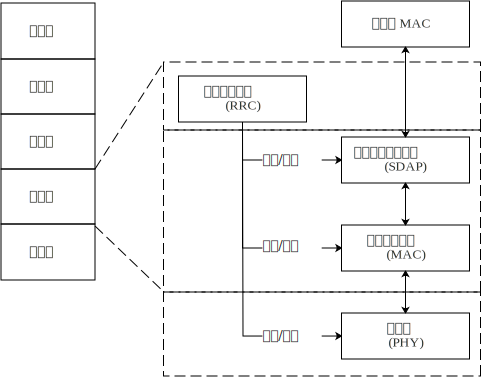
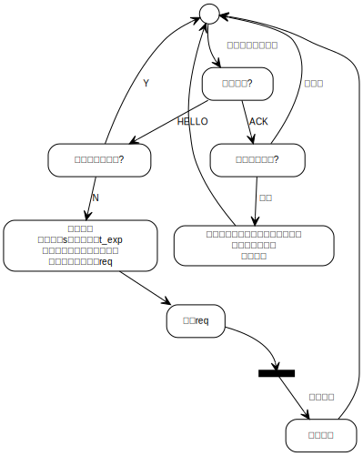
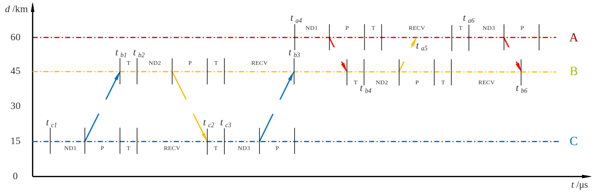

# 版本修订


|版本号  |       日期     |     修订内容                  |
|:-----:|:-------------:|:------------------------------|
|0.1    | 2019年12月01日 |1. 总体方案初版                |
|0.2    | 2020年01月06日 |1. 添加OPNET仿真数据            |
|       |               |2. 调整网络协议栈结构            |
|       |               |3. 细化MAC层设计               |
|       |               |4. 细化网络层设计               |
|       |               |5. 细化RRC层设计               |
|0.3    | 2020年3月14日  |1. 添加时间同步策略说明          |
|       |               |2. 添加无时统节点时间同步性能仿真  |
|       |               |3. 修复部分文字性错误            |


# 技术需求

本项目基于数字相控阵体制，实现探测与通信的功能一体集成。
在协同组网功能方面其研究目标为:研究基于多功能数字相控阵体制的多节点组网解决方案;
完成节点的动态无中心自组织随遇入网，实现节点间高速低延迟稳定信息分发;
根据技术方案，研制硬件设备，并结合配套模拟器构成组网节点，完成试验验证。


## 参数约束

### 时间参数

1. 组网建立时段,每100ms占用时间:20ms
2. 网络维持阶段,每100ms占用时间:10ms
3. 单次发射时长:$50\mu s$ ~ $2.5ms$
4. 发射信号最大占空比$\eta_{TX}\le50\%$
5. 收-发,发-收转换时间$T_{trans}\le50\mu s$,固定延迟不大于50ns
6. 最大单跳通信距离$D_{hop}=30km$

### 带宽参数

1. 瞬时带宽$BW=100MHz$

### 波束参数

1. 发射波束宽度:$\Omega_{TX}=4.4\deg$
2. 接收波束宽度:$\Omega_{RX}=5.0\deg$
3. 发射波束数目:$N_{BTX}=1$
4. 接收波束数目:窄带波束$N_{BNRX}=8$,宽带波束$N_{BWRX}=1$

## 技术指标要求

为适应协同网络的复杂场景应用需求，所研协同网络应具备如下主要功能及能力。

### 功能要求

1. 网络链路快速发现，节点入网响应延时短，编队网络自组织无中心建立，无中心化运维，支持子网络间的合并。
2. 能够同时支持外授时辅助及无外授时辅助的节点搜索与组网模式。
3. 网络能够自主根据链路传输负荷，动态均衡调整网络资源保障QoS。
4. 网络能够响应低延时数据传输请求，快速建立低延时数据通道。
5. 网络能够合成统一的节点拓扑图，并能够及时定期在全网共享信息。
6. 网络具备一定的抗攻击和抗干扰能力，具有网络身份验证、信息安全传输功能。
7. 网络具备强鲁棒性：在某节点发生故障或遭遇大流量网络数据时，能正常工作。
8. 多媒体及通用以太网支持特性：语音/视频、文电、IP数据包。
9. 具备物理层信道质量评估指示功能。

### 网络组织能力

1. 网络容量$N_{node}\ge48$
2. 支持跳数$N_{hop}\ge8$
3. 定向链路发现时间(借助外部时统):$T_{LD}\le1s$;
4. 网络组建时间:
   
   - 借助外部时统:$T_{NE}<60s$
   - 无外部时统:$T_{NE}<240s$

### 链路传输能力

1. 信息传输速率:5Mbps/50Mbps/150Mbps,链路支持多速率自适应切换
2. 基本调制波形:SCFDE/OFDM
3. 误码率:$1\times10^{-6}$
4. 时间同步精度(点对点):<40ns

### 网络服务能力

1. 路由代价(窄带):$\eta_{rte}<5\%$
2. 端端延时(1-Hop):$\tau_{hop}\le100ms$(仅用于强实时优先级数据)
3. 传输延时:

    - 应用层->物理层发出:<50us
    - 物理层接收->应用层:<50us

4. 分组投递率:>90%
5. 广播更新周期:<2s
6. 重传控制:支持HARQ重传机制,重发次数$\le3$
7. 网络吞吐量:$\ge(N_{node}/4)BW$
8. 业务负荷过载能力:链路业务负载网络自主均衡,响应时间不大于1s
9. 网络流量统计上报周期:<5s


# 总体设计

本设计运用移动通信核心技术结合相控阵雷达体制，提出了一种面向QoS的探测通信一体化解决方案，详细描述了系统的组成和功能模块及其对应的接口，对方案中所涉及的关键技术进行了理论论证和仿真验证，对整个系统的性能进行了仿真验证。

系统在逻辑上采用了严格的分层设计，在逻辑层面，本方案实现了控制面和数据面的分离，降低功能耦合可能带来的不可控风险；在传输层面，控制信令和数据传输共享链路资源，实现了链路资源利用的优化。

本设计借鉴了软件定义网络(SDN)的主要思想和方法，所有功能层都可进行动态配置，从而实现了较高的灵活性和可扩展性。

## 网络结构

{#fig:network}

本方案所设计的探测通信一体化移动自组织网络结构如\ref{fig:network}所示。
整个网络为工作在OSI模型的数据链路层的数据交换网络，网络对于工作在OSI第三层及以上的设备和应用而言是透明的。
终端局域网采用有线以太网接口与接入节点进行连接；终端数据发送时，接入节点完成以太网MAC协议和PCI-MANET协议的转换，并按照一定的路由规则将数据投递至目的节点；目的节点完成PCI-MANET协议与以太网MAC协议的转换，将数据送至目的终端所在的局域网交换设备(路由器、交换机)；局域网交换设备将数据投递至目的终端，完成数据传输过程。
本方案所设计的网络架构具备较强的可拓展性，可以与现有的以太网系统进行融合。

## 协议栈结构

针对项目的实际需求，本方案设计了一种协议栈结构，其分层设计、层间信息传递、与OSI模型的对应关系如[@fig:arch]所示。

{#fig:arch}

**1. 服务数据适配协议(SDAP)**

服务数据适配协议的SDU为以太网MAC数据包

服务数据适配协议用于将业务数据按照业务对QoS的不同要求,划分为具有不用QFI的数据流。
针对具有相同QFI的数据流，采取相同的数据处理流程，从而提升处理效率。MAC数据包的QFI级别标注可由RRC进行动态配置，用户可根据不同业务需求按照协议类型、端口号、IP地址等参数设立QFI级别标注规则。

**2. 无线资源控制层(RRC)**

无线资源控制层包一系列控制面协议组成的协议簇。它的主要功能有：

1. 时隙资源管理
2. 链路状态感知
3. 路由与转发管理
4. 波束管理

## 硬件与接口

{#fig:hardware}

结合所提供的硬件资源，本方案设计了如[@fig:hardware]所示的顶层模块划分方案。
图中粗线代表用户面数据流，细线代表控制面数据流。
自左向右依次为用户业务网络，协同信号处理板、雷达控制设备。
用户业务平台通过10G以太网方式接入协同信号处理板；协同信号处理分机通过RapidIO连接DFB。

图中协同信号处理板部分自下而上分别为FPGA、CPU端Linux内核层、CPU端Linux用户层。其中用户网络数据通过以太网接口和位于FPGA中的以太网适配模块接入协同信号处理板；RRC模块在Linux用户层实现，它通过与FPGA之间的PCIe接口完成控制信令的传输；CONF模块负责控制信令的分发和系统状态的收集以及与RRC之间信令交互的控制。

图中的ETHER、PCIe、RapidIO等模用户相关协议的传输控制，由FPGA IP核实现，其余FPGA中模块需进行定制化RTL设计和实现；
图中的RRC、UI、DRIVER为软件模块，均需要进行定制化软件工程开发和实现。

各模块对用户面数据帧的处理如下图所示。

```{id="lst:packets" caption="各层数据包格式"}

                              0           6           12  14      1514    1518 (byte)
                              +-----------+-----------+---+--- ~ ---+-------+
                              |    DST    |    SRC    |TYP|   DATA  |  CRC  |
                              +-----------+-----------+---+--- ~ ---+-------+
                              |<------------ETHERNET MAC PDU--------------->|
SDAP ================================================================================
                              ↓                                             ↓
                            +-*-----------+-----------+---+--- ~ ---+-------+
                            |Q|           |           |   |         |       |
                            |F|    DST    |    SRC    |TYP|   DATA  |  CRC  |
                            |I|           |           |   |         |       |
                            +-*-----------+-----------+---+--- ~ ---+-------+
                            |<-------------------SDAP PDU------------------>|
MAC =================================================================================
                            ↓                                               ↓ 
0                          15 16          22          28  30      1530    1534 (byte)
+---------------------------*-+-----------+-----------+---+--- ~ ---+-------+
|                           |Q|           |           |   |         |       |
|         MAC HEADER        |F|    DST    |    SRC    |TYP|   DATA  |  CRC  |
|                           |I|           |           |   |         |       |
+---------------------------*-+-----------+-----------+---+--- ~ ---+-------+
|<---------------------------------MAC PDU--------------------------------->|

```

本方案协议栈各层级间数据包格式及其数据长度如[@lst:packets]所示。其中SDAP层数据帧格式定义见第[@sec:SDAP]章;
MAC数据包头定义见[@sec:mac_frame]。


# 物理层 {#sec:PHY}

## OFDM物理层波形设计方案

### 帧结构设计
应对物理层传输需求，本节分别对10MHz传输带宽和100MHz传输带宽进行帧结构设计。

#### 10MHz

该带宽条件下，综合设计需求、效率等因素考量，OFDM基于64点FFT，采用QPSK调制方式。本系统采用帧结构如下：


其中N=64。训练序列长度以及数据部分长度为64。

1.  训练序列，频域有效数据点数为53。左右分别保留6个子载波和5个子载波，分量为0。频域训练序列如下：

```{caption="OFDM波形10MHz频域训练序列"}
L[−26:26] =
{1,1,−1,−1,1,1,−1,1,−1,1,1,1,1,1,1,−1,−1,1,1,−1,1,−1,1,1,1,1,0,1,−1,−1,1,1,
−1,1,−1,1,−1,−1,−1,−1,−1,1,1,−1,−1,1,−1,1,−1,1,1,1,1}
```

2.  数据部分，有效数据点48，4个导频点，1个0频点，频谱左右分别保留6个和5个频点。导频处于位置{
    -21, -7, 7, 21 },
    分量为1或-1。同时为不同导频引入极性因子P。导频数据为：

Pilot {-21,-7,7,21} = {1,1,1,-1}

每个符号导频的极性因子为以下序列的循环扩展：

```{caption="OFDM波形10MHz符号导频极性因子"}

P[0,…,126]=
{1,1,1,1,−1,−1,−1,1,−1,−1,−1,−1,1,1,−1,1,−1,−1,1,1,−1,1,1,−1,1,1,1,1,1,1,−1,
1,1,1,−1,1,1,−1,−1,1,1,1,−1,1,−1,−1,−1,1,−1,1,−1,−1,1,−1,−1,1,1,1,1,1,−1,−1,
1,1,−1,−1,1,−1,1,−1,1,1,−1,−1,−1,1,1,−1,−1,−1,−1,1,−1,−1,1,−1,1,1,1,1,−1,1,
−1,1,−1,1,−1,−1,−1,−1,−1,1,−1,1,1,−1,1,−1,1,1,1,−1,−1,1,−1,−1,−1,1,1,1,−1,−1,
−1,−1,−1,−1,−1}

```

1.  为避免符号间干扰（ISI）和子载波间干扰（ICI）,引入循环前缀（CP），考虑传输环境的多径影响，数据点的循环前缀长度为8个点（0.8
    us）。

2.  CP2是时域训练符号的循环前缀，数据长度为8。

帧长限制为100us和200us时，系统传输信息如下：
                                                                                                                                                
|帧长(实际帧长)/$\mu s$|前序数据长度|前序时长|符号时长/CP时长 ($\mu s$)|数据符号数|数据部分点数|数据部分有效点数(字节)|数据部分时长/$\mu s$|传输比特数(字节)|数据率 Mb/s|
|:---------:|:-:|:--:|:-----:|:-:|:--:|:--:|:-----:|:-------:|:---:|
| 100(98.4) |264|26.4|6.4/0.8|10 |720 |480 |72us   |960(120) |9.60 |
| 200(199.2)|264|26.4|6.4/0.8|24 |1728|1152|172.8us|2304(288)|11.52|

Table: OFDM波形10MHz系统传输信息

(另外：前序填充8个无作用SP符号，每个SP符号的长度为16。故前序总长为16\*8+8+64\*2
= 264)

#### 100MHz传输模式帧结构设计

该带宽条件下，综合设计需求、效率等因素考量，OFDM基于512点FFT，帧长限制为200us。支持BPSK，QPSK，16QAM三种调制方式。系统采用帧结构如下：

{width="8cm"}

其中N = 512，训练序列长度以及数据部分长度为512。

1.  训练序列，频域有效数据点数为499。左右分别保留7个子载波和6个子载波，分量为0。频域训练序列如下：

```{caption="OFDM波形100MHz频域训练序列"}
L[−249:249] =
{1,−1,−1,1,1,−1,1,−1,1,1,1,1,1,1,−1,−1,1,1,−1,1,−1,1,1,1,1,1,1,1,1,−1,−1,1,1,
−1,1,−1,1,1,1,1,1,1,−1,−1,1,1,−1,1,−1,1,1,1,1,1,1,1,1,−1,−1,1,1,−1,1,−1,1,1,
1,1,1,1,−1,−1,1,1,−1,1,−1,1,1,1,1,1,1,1,1,−1,−1,1,1,−1,1,−1,1,1,1,1,1,1,−1,
−1,1,1,−1,1,−1,1,1,1,1,1,1,1,1,−1,−1,1,1,−1,1,−1,1,1,1,1,1,1,−1,−1,1,1,−1,1,
−1,1,1,1,1,1,1,1,1,−1,−1,1,1,−1,1,−1,1,1,1,1,1,1,−1,−1,1,1,−1,1,−1,1,1,1,1,1,
1,1,1,−1,−1,1,1,−1,1,−1,1,1,1,1,1,1,−1,−1,1,1,−1,1,−1,1,1,1,1,1,1,1,1,−1,−1,
1,1,−1,1,−1,1,1,1,1,1,1,−1,−1,1,1,−1,1,−1,1,1,1,1,1,1,1,1,−1,−1,1,1,−1,1,−1,
1,1,1,1,1,1,−1,−1,1,1,−1,1,−1,1,1,1,1,0,1,−1,−1,1,1,−1,1,−1,1,−1,−1,−1,−1,−1,
1,1,−1,−1,1,−1,1,−1,1,1,1,1,-1,-1,1,−1,−1,1,1,−1,1,−1,1,−1,−1,−1,−1,−1,1,1,
−1,−1,1,−1,1,−1,1,1,1,1,-1,-1,1,−1,−1,1,1,−1,1,−1,1,−1,−1,−1,−1,−1,1,1,−1,−1,
1,−1,1,−1,1,1,1,1,-1,-1,1,−1,−1,1,1,−1,1,−1,1,−1,−1,−1,−1,−1,1,1,−1,−1,1,−1,
1,−1,1,1,1,1,-1,-1,1,−1,−1,1,1,−1,1,−1,1,−1,−1,−1,−1,−1,1,1,−1,−1,1,−1,1,−1,
1,1,1,1,-1,-1,1,−1,−1,1,1,−1,1,−1,1,−1,−1,−1,−1,−1,1,1,−1,−1,1,−1,1,−1,1,1,1,
1,-1,-1,1,−1,−1,1,1,−1,1,−1,1,1,−1,−1,−1,−1,1,1,−1,−1,1,−1,1,−1,1,1,1,1,-1,
-1,1,−1,−1,1,1,−1,1,−1,1,−1,−1,−1,−1,−1,1,1,−1,−1,1,−1,1,−1,1,1,1,1,-1,-1,1,
−1,−1,1,1,−1,1,−1,1,−1,−1,−1,−1,−1,1,1,−1,−1,1,−1,1,−1,1,1,1}
```

1.  数据部分，有效点数466，导频数目为32，1个零频点，频谱左右分别保留7个和6个子载波。

导频处于位置:

{-248, -232, -216, -200, -184, -168, -152, -136, -120, -104, -88, -72,
-56, -40, -24, -8, 8, 24, 40, 56, 72, 88, 104, 120, 136, 152, 168,
184, 200, 216, 232,
248}，分量为1或-1。同时为不同导频引入极性因子P。导频数据为：

Pilot {-248, -232, -216, -200, -184, -168, -152, -136, -120, -104,
-88, -72, -56, -40, -24, -8, 8, 24, 40, 56, 72, 88, 104, 120, 136,
152, 168, 184, 200, 216, 232, 248}

= {1,1,1,-1,
1,1,1,-1,1,1,1,-1,1,1,1,-1,1,1,1,-1,1,1,1,-1,1,1,1,-1,1,1,1,-1}

每个符号导频的极性因子为以下序列的循环扩展：

```{caption="OFDM波形100MHz符号导频极性因子"}

P[0,…,126]=
{1,1,1,1,−1,−1,−1,1,−1,−1,−1,−1,1,1,−1,1,−1,−1,1,1,−1,1,1,−1,1,1,1,1,1,1,−1,
1,1,1,−1,1,1,−1,−1,1,1,1,−1,1,−1,−1,−1,1,−1,1,−1,−1,1,−1,−1,1,1,1,1,1,−1,−1,
1,1,−1,−1,1,−1,1,−1,1,1,−1,−1,−1,1,1,−1,−1,−1,−1,1,−1,−1,1,−1,1,1,1,1,−1,1,
−1,1,−1,1,−1,−1,−1,−1,−1,1,−1,1,1,−1,1,−1,1,1,1,−1,−1,1,−1,−1,−1,1,1,1,−1,−1,
−1,−1,−1,−1,−1}

```

1.  为避免符号间干扰（ISI）和子载波间干扰（ICI）,引入循环前缀（CP），考虑传输环境的多径影响以及设计需求，数据点的循环前缀长度为64个点（0.64
    us）。

2.  CP2是训练序列的循环前缀，数据长度为64。

不同调制方式（BPSK，QPSK，16QAM）下，系统传输信息为：

参数/调制|BPSK|QPSK|16QAM
:--|:---|:---|:---
帧长(实际帧长)/$\mu s$|200(195.2)|200(195.2)|200(195.2)
前序数据长度|1088|1088|1088
前序时长/CP时长($\mu s$)|10.88|10.88|10.88
符号时长|5.12/0.64|5.12/0.64|5.12/0.64
数据符号数|32|32|32
数据部分点数|18432|18432|18432
数据部分有效点数|14912[^1]|14912|14912
编码码率(字节)|(198,232)|(198,232)|(198,232)
传输比特数|12672(1584)|25344(3168)|50688(6336)
数据率Mb/s|64.9|129.8|259.6

Table: 100MHz系统传输信息

[^1]: 其中前64符号用于速率自适应，后14848用于数传

|带宽MHz|帧长us|调制方式|每帧总码元|有效码元|有效数据比特数|编码方式|有效信息比特数(字节数)|净荷速率Mbps|
|:--:|:-:|:----|:----|:----|:----|:--------|:----------|----:|
| 10 |100|QPSK |984  |480  |960  |(96,120) |768(96)    |7.8  |
|    |200|QPSK |1992 |1152 |2304 |(76,96)  |1824(228)  |9.1  |
| 100|200|BPSK |19520|14848|14848|(198,232)|12672(1584)|63.8 |
|    |   |QPSK |19520|14848|29696|(198,232)|25344(3168)|127.6|
|    |   |16QAM|19520|14848|59392|(198,232)|50688(6336)|255.2|

Table: OFDM波形信息汇总表

### 发送端设计

发送端原理框图如下：


#### 调制模块

本模块对二进制数据流进行星座映射，10MHz传输带宽下支持QPSK调制方式，100MHz传输带宽下支持BPSK、QPSK和16QAM三种调制方式。不同调制模式星座映射图如下：

{width="4cm"}

{width="4cm"}

{width="4cm"}

不同调制方式的归一化因子如下表所示：

| 调制方式  |归一化因子               |
|:----------|:------------------------|
| BPSK      |1                        |
| QPSK      |$$\frac{1}{\sqrt{}2}$$   |
| 16QAM     |$$\frac{1}{\sqrt{}10}$$  |

Table: 调制方式归一化因子

#### 插入导频和保留位

向频域串行数据流中插入导频子载波和左右保留子载波，形成串行OFDM符号。

#### IFFT

并行获取固定长度数据流，进行逆傅里叶变换（IFFT），频域数据转换为时域数据，频率分量叠加发送。64点IFFT模块和512点IFFT模块接口如下，其中DC表示直流子载波，NULL表示保留子载波。

{#fig:64_ifft width="4cm"}

{#fig:512_ifft width="4cm"}


#### 插入CP

每个时域数据块之前添加固定长度的循环前缀。

#### 组帧

当已完成处理等待发送的OFDM符号数达到固定数目时，在数据头部加入训练序列，按照帧结构进行组帧发送。

### 接收端设计


#### 帧检测

给定本地时域训练序列 $\text{TS}$，长度为 $L$
(10MHz传输下$L = 64$，100MHz传输下$L = 512$)。帧检测采用互相关方法，每次将长度为L的输入信号与本地时域训练序列进行互相关运算，互相关相对值$P$计算如下：

$$Y\lbrack i\rbrack = \sum_{k = 0}^{L - 1}{S\left\lbrack i + k \right\rbrack*\overline{TS\lbrack k\rbrack}}$$

$$M\lbrack i\rbrack = \sum_{k = 0}^{L - 1}\left| S\left\lbrack i + k \right\rbrack \right|^{2}$$

$$P\lbrack i\rbrack = \frac{\left| Y\left\lbrack i \right\rbrack \right|^{2}}{\left( M\left\lbrack i \right\rbrack \right)^{2}}$$

帧检测框图如下：

{width="8cm"}

根据上图，当系统互相关检测到两个较大峰值，且峰值间隔约为$L$时，表示成功完成帧同步。

#### 载波估计

该模块对载波偏差进行估计和补偿，载波估计通过两个TS进行实现，载波估计结果如下：

$$\alpha = \ \frac{1}{L}\angle(\sum_{k = 0}^{k = L - 1}{\overline{S\lbrack k\rbrack}*S\lbrack k + L\rbrack})$$

其中$\angle(*)$
表示取相位操作，硬件实现上，相位通过$\tan$值和对应相位的查找表查找得到。得到载波偏差估计结果后，进一步对载波进行恢复：

$$S^{'}\left\lbrack m \right\rbrack = \ S\left\lbrack m \right\rbrack*e^{- jm\alpha},\ m = 0,1,2,\ldots$$

在实现中，通过查找表可以获取相位的$\cos$值和$\sin$值，然后进行乘法操作以实现相位旋转。

载波估计范围$\lbrack - f,f\rbrack$计算如下：

$$f = \ \frac{B}{2L}$$

其中B是传输带宽，10MHz传输带宽下，$f = 78.1K\text{Hz}$。100MHz传输带宽下，$f = 97.7K\text{Hz}$。

#### 信道估计

由于频域训练序列$\text{TSF}$在数据部分的频率分量为1或-1，频域信道估计结果$H$可以通过频域训练序列$\text{TS}F$，和接收到的两个频域训练序列$SF_{1}$和$SF_{2}$简易计算得到：

$$H\left\lbrack i \right\rbrack = \ \frac{1}{2}\left( SF_{1}\left\lbrack i \right\rbrack + SF_{2}\left\lbrack i \right\rbrack \right)*TSF\lbrack i\rbrack$$

10MHz传输带宽下，$i \in \lbrack - 26,\ 26\rbrack$，100MHz传输带宽下，$i \in \lbrack - 249,\ 249\rbrack$。

#### 信道均衡

在删除循环前缀，以及进行FFT变换后得到频域数据$X\left\lbrack i \right\rbrack$，对$X\left\lbrack i \right\rbrack$进行子载波信道均衡结果如下：

$$Y\left\lbrack i \right\rbrack = \ \frac{X\lbrack i\rbrack}{H\lbrack i\rbrack}$$

10MHz传输带宽下，$i \in \lbrack - 26,\ 26\rbrack$，100MHz传输带宽下，$i \in \lbrack - 249,\ 249\rbrack$。

#### 导频旋转

导频旋转用于补偿频域残留相位偏差，相位偏差计算如下：

$$\theta = \angle(\sum_{i \in \left\{ - 21, - 7,7,21 \right\}}^{}{\overline{X\lbrack i\rbrack}*H\left\lbrack i \right\rbrack*P\lbrack i\rbrack})$$

其中$P\lbrack i\rbrack$为发送导频符号。

10MHz传输带宽下：

$$i \in \left\{ - 21, - 7,7,21 \right\}$$

100MHz传输带宽下：

$$i \in \ \begin{Bmatrix}
 - 248,\  - 232,\  - 216,\  - 200,\  - 184,\  - 168,\  - 152,\  \\
 - 136,\  - 120,\  - 104,\  - 88,\  - 72,\  - 56,\  - 40,\  - 24, \\
 - 8,\ 8,\ 24,\ 40,56,72,\ 88,\ 104,\ 120, \\
\ \ \ \ \ \ \ 136,\ 152,\ 168,\ 184,\ 200,\ 216,\ 232,\ 248 \\
\end{Bmatrix}$$

综合信道均衡和导频旋转，计算如下：

$$Y\left\lbrack i \right\rbrack = \ \frac{X\lbrack i\rbrack}{H\lbrack i\rbrack}e^{\text{jθ}}$$

#### 解调模块

根据调制方式和相应星座映射，用最大似然方法进行星座解映射。

#### 时钟要求

保证信号一帧内偏差不超过1/32。

带宽 10MHz，100us帧长下，一帧数据长度：984。时钟要求：

$$\frac{1}{32*(984)} = 31.76\ ppm$$

带宽 10MHz，200us帧长下，一帧数据长度：1992。时钟要求：

$$\frac{1}{32*(1992)} = 15.69\ ppm$$

带宽 100MHz，200us帧长下，一帧数据长度：19520。时钟要求：

$$\frac{1}{32*(19520)} = 1.60\ ppm$$

## 单载波波形设计方案

### 发射模块

发射模块处理的原理框图如图所示：


发射模块的处理流程为输入数据与导频按照设计帧结构进行组帧，然后进行星座点映射（导频部分：BPSK；数据部分：BPSK、QPSK、16QAM），再进行成形和插值滤波至DA输出。

### 信号帧结构

针对突发系统的需求，本方案在设计帧结构时综合考虑了快速解调，抗多径能力及算法复杂度的基础上设计了以下帧结构。

#### 10M带宽

##### 100微秒帧结构

{width="8cm"}

波形信息：

* 符号率为7.8125Msps，成形因子0.25，带宽9.765MHz；
* 帧长：97us（758符号/7.8125M）；
* 业务信息：QPSK，RS(96,120)，净荷速率7.9Mbps；


##### 200微秒帧结构

{width="8cm"}

波形信息：

* 符号率为7.8125Msps，成形因子0.25，带宽9.765MHz；
* 帧长：195us（1526符号/7.8125M）；
* 业务信息：QPSK，RS(76,100)，净荷速率9.3Mbps；

#### 100M带宽

{width="10cm"}

波形信息：

* BPSK

  - 符号率为78.125Msps，成形因子0.25，带宽97.65MHz；
  - 帧长：198.6us（15518符号/78.125M）；
  - 业务信息：BPSK，RS(198,217)编码，净荷速率63.8Mbps；

* QPSK

  - 符号率为78.125Msps，成形因子0.25，带宽97.65MHz；
  - 帧长：198.6us（15518符号/78.125M）；
  - 业务信息：QPSK，RS(198,217)编码，净荷速率127.6Mbps；

* 16QAM

  - 符号率为78.125Msps，成形因子0.25，带宽97.65MHz；
  - 帧长：198.6us（15518符号/78.125M）；
  - 业务信息：16QAM，RS(198,217)编码，净荷速率255.2Mbps；

#### 帧结构信息汇总
                                                                                                
|带宽/MHz|帧长/$\mu s$|调制方式|每帧总码元数|有效码元数|有效数据比特数|编码方式|有效信息比特数(字节数)|净荷速率/Mbps|
|:-:|:-:|:---:|:---:|:---:|:---:|:-------:|:----------:|:----:| 
|10 |100|QPSK |758  |480  |960  |(96,120) |768（96）    |7.9   |
|   |200|QPSK |1526 |1200 |2400 |(76,100) |1824（228）  |9.3   |
|100|200|BPSK |15518|13888|13888|(198,217)|12672（1584）|63.8  |
|   |   |QPSK |15518|13888|27776|(198,217)|25344（3168）|127.6 |
|   |   |16QAM|15518|13888|55552|(198,217)|50688（6336）|255.2 |

Table: 单载波波形帧结构信息汇总

### 接收模块

接收模块的原理框图如所示：


# 媒介访问控制层 {#sec:MAC}


媒介访问控制层主要负责为上层数据流安排恰当的物理信道进行传输。
媒介访问控制层还需要对信道资源进行恰当的分配，以保证数据传输的及时性、可靠性、有效性；
在窄波束定向无线网络中，一条物理信道由时间参数和空间参数共同确定，在本方案中，我们将时间资源划分为了40个通用数据信道和4个链路发现信道；
媒介访问控制层需要采用恰当的路由策略，将来自不同节点的数据正确地传输到相应的目的节点，本方案采取由软件模块更新的转发表形式实现数据包的转发；
媒介访问控制层还应具备优先级处理能力，以适应紧急业务的传输需求。


{#fig:mac_struct}

图[@fig:mac_struct]所示为MAC层架构图。图中粗箭头线为上下行数据流，细箭头代表内部控制信令流，虚线为层与层间的分割线。MAC层所有模块均在FPGA中实现，但其配置由运行于CPU中的RRC进行。

RRC与MAC层各模块之间控制信令主要有:

1. RRC下发时隙划分表
2. RRC下发天线指向表
3. RRC下发路由转发表
4. MAC上报队列拥塞情况

## 时隙控制

本设计采用定向时分复用技术,对于采用窄波束的定向天线的通信系统而言,对于其中的某个节点,天线指向、收发模式、收发时隙共同确定了一条通信链路资源。本节主要研究目的在于确定链路资源分配和管理的合理策略,以尽可能地优化通信系统的整体性能。

节点是否有时间同步源对时分复用系统的性能有至关重要的影响。按照时间同步源的有无我们将节点划分为以下两类:

1. 有时统节点
  * 时间同步源:自身
  * 组网策略:网络组建－网络维持 2个阶段

2. 无时统节点
  * 时间同步源:其他节点
  * 组网策略:时间同步－网络组建－网络维持 3个阶段


{#fig:stage}


根据节点类型和阶段任务的区别,我们把划分为3个阶段:

1. 时间同步阶段
   * 主要功能:无时统节点完成时间同步
   * 持续时间:
     - 无时统节点:从 节点开机 至 与有时统节点完成同步(最长180s)
   * 时隙划分:
     - 每1000ms为一长帧
     - 每50ms为一短帧
     - 每一短帧中前10ms为通信业务占用，后40ms为雷达业务占用

2. 网络组建阶段
   * 主要功能:未入网节点完成初始链路发现
   * 持续时间:
     - 有时统节点:从 节点开机或节点脱网 至 发现首个邻居后10s
     - 无时统已同步节点:从 时间同步完成 至 时间同步完成后10s
   * 时隙划分:
     - 每1000ms为一长帧
     - 每50ms为一短帧
     - 每一短帧中前10ms为通信业务占用，后40ms为雷达业务占用

3. 网络维持阶段
   * 主要功能:业务数据传输、链路状态维持、延迟入网节点链路发现
   * 持续时间:从 链路发现阶段完成 至 节点脱网
   * 时隙划分:
     - 每1000ms为一长帧
     - 每100ms为一短帧
     - 每一短帧中前10ms为通信业务占用，后90ms为雷达业务占用

各阶段之间的关系和相互转化如图下图所示。

{#fig:stage2}


依照设计目标，本章设计了一种D-TDMA时帧结构,该结构的主要特性如下:

1. 每个长帧为1000ms，由秒脉冲对齐。
2. 网络组建阶段中，每个长帧分为等长的20个短帧，每个短帧前10ms为通信时隙，后40ms为探测时隙。
3. 网络维持阶段中，每个长帧分为等长的10个短帧，每个短帧前10ms为通信时隙，后90ms为探测时隙。
4. 每个通信时隙由4个链路发现时隙和一个数据传时隙段组成。
5. 每个数据传输时隙划分为20个通用时隙。从每个长帧的第一个通信时隙开始，每连续的两个通信时隙中的通用时隙构成一个含有40个通用时隙的通用时隙组，从而满足邻居数最大为20的网络双向通信的基本需求。
6. 在链路发现时隙中，互相发现的2个节点直接协商数据传输时隙的分配，以保证这两个节点能够在通用时隙组中分配到2个通用时隙，这2个时隙称为基本时隙。
7. 链路发现时隙中交互的信息:

   * 本节点信息:id,链路资源分配情况,时间同步信息，节点地理坐标
   * 基本时隙申请/确认信息

8. 在基本时隙中，根据业务传输需求和信道资源利用率分配剩余通用时隙，被分配的时隙称为扩展时隙。
9. 基本时隙中传输的信息及其优先级:

   * 时敏业务信息
   * 时隙控制信息
   * 送达确认信息
   * 普通业务信息


为了便于理解,我们对时隙的符号做了如下规定,后续内容中使用的符号除有特别说明者外,其含义均与下表定义相同。

|符号|含义|作用|
|:--:|:-------|:---------------------------------------------------|
|$S$|同步时隙|短帧中用于时间同步的时间段(仅适用于无时统节点)|
|$C$|通信时隙|短帧中用于通信业务的时间段|
|$R$|探测时隙|短帧中用于雷达探测的时间段(本方案不与讨论)|
|$N$|链路发现时隙组|C时隙、S时隙中用于链路发现的时隙组,包含若干个链路发现时隙(Ni)|
|$D$|数据传输时隙组|C时隙中用于数据传输的时隙组,包含若干个数据传输时隙(Di)|
|$N_i$|链路发现时隙|N时隙组中用于定向发现链路的时隙,包含三个链路发现子时隙(ND1~ND3),该时隙中天线指向将保持不变。|
|$D_i$|数据传输时隙|D时隙组中用于定向传输数据的时隙,包含一个数据传输子时隙DT,该时隙中天线指向将保持不变。|
|$ND_j$|链路(发现)子时隙|Ni时隙中用于与邻居节点进行握手并完成基本时隙分配和时间同步的子时隙。|
|$DT$|数据传输子时隙|Di时隙中用于通用数据传输的子时隙|
|$P$|保护时隙|为无线电传播延时而预留的时间段|
|$T$|收发转换时隙|根据[时间参数]提出的要求预留的雷达收-发、发-收转换时间段。|

根据上述设计说明和符号定义,每个长帧的时隙划分情况如[@lst:beacon_div]所示。
在时间完成同步的情况下,对于三个不同的阶段,每个长帧的起始时刻均为秒脉冲时刻。

```{id="lst:beacon_div" caption="TDMA长帧时隙划分"}

长帧时隙划分


时间同步阶段:
0      50    100    150    200    250    300    350    400    450    500(ms)
|+|++++|+|++++|+|++++|+|++++|+|++++|+|++++|+|++++|+|++++|+|++++|+|++++|
|S|  R |S|  R |S|  R |S|  R |S|  R |S|  R |S|  R |S|  R |S|  R |S|  R |
|+|++++|+|++++|+|++++|+|++++|+|++++|+|++++|+|++++|+|++++|+|++++|+|++++|

500   550    600    650    700    750    800    850    900    950   1000(ms)
|+|++++|+|++++|+|++++|+|++++|+|++++|+|++++|+|++++|+|++++|+|++++|+|++++|
|S|  R |S|  R |S|  R |S|  R |S|  R |S|  R |S|  R |S|  R |S|  R |S|  R |
|+|++++|+|++++|+|++++|+|++++|+|++++|+|++++|+|++++|+|++++|+|++++|+|++++|


网络组建阶段:
0      50    100    150    200    250    300    350    400    450    500(ms)
|+|++++|+|++++|+|++++|+|++++|+|++++|+|++++|+|++++|+|++++|+|++++|+|++++|
|C|  R |C|  R |C|  R |C|  R |C|  R |C|  R |C|  R |C|  R |C|  R |C|  R |
|+|++++|+|++++|+|++++|+|++++|+|++++|+|++++|+|++++|+|++++|+|++++|+|++++|

500   550    600    650    700    750    800    850    900    950   1000(ms)
|+|++++|+|++++|+|++++|+|++++|+|++++|+|++++|+|++++|+|++++|+|++++|+|++++|
|C|  R |C|  R |C|  R |C|  R |C|  R |C|  R |C|  R |C|  R |C|  R |C|  R |
|+|++++|+|++++|+|++++|+|++++|+|++++|+|++++|+|++++|+|++++|+|++++|+|++++|


网络维持阶段:
0            100           200           300           400          500(ms)
|+|+++++++++++|+|+++++++++++|+|+++++++++++|+|+++++++++++|+|+++++++++++|
|C|     R     |C|     R     |C|     R     |C|     R     |C|     R     |
|+|+++++++++++|+|+++++++++++|+|+++++++++++|+|+++++++++++|+|+++++++++++|

500          600           700           800           900         1000(ms)
|+|+++++++++++|+|+++++++++++|+|+++++++++++|+|+++++++++++|+|+++++++++++|
|C|     R     |C|     R     |C|     R     |C|     R     |C|     R     |
|+|+++++++++++|+|+++++++++++|+|+++++++++++|+|+++++++++++|+|+++++++++++|


```


```{caption="TDMA短帧时隙划分"}
短帧时隙划分

时间同步阶段(无外部时统):

0     10ms                50ms  60ms                 100ms
|+++++|++++++++++++++++++++|+++++|++++++++++++++++++++|
|  S  |         R          |  S  |         R          |
|+++++|++++++++++++++++++++|+++++|++++++++++++++++++++|


网络组建阶段:
0     10ms                50ms  60ms                 100ms
|+++++|++++++++++++++++++++|+++++|++++++++++++++++++++|
|  C  |         R          |  C  |         R          |
|+++++|++++++++++++++++++++|+++++|++++++++++++++++++++|

网络维持阶段:
0     10ms                                           100ms
|+++++|+++++++++++++++++++++++++++++++++++++++++++++++|
|  C  |                     R                         |
|+++++|+++++++++++++++++++++++++++++++++++++++++++++++|
```

### 通信时隙

通信时隙(C)分为两组时隙
   * 链路发现时隙组(N)
   * 数据传输时隙组(D)

N时隙组由4个长度分别为750us的链路发现时隙(N1,N2,N3,N4)构成;D时隙组由20个长度分别为350us的数据传输时隙(D1~D20)构成,每个数据传输时隙的收发状态是确定的。

```{caption="通信时隙划分"}

通信时隙(C)划分
0   0.75 1.5  2.25  3  3.35  ~  9.65 10 (ms)     
|++++|++++|++++|++++|+++|+......+|+++|
| N1 | N2 | N3 | N4 |D1 | ...... |D20|
|++++|++++|++++|++++|+++|+......+|+++|
|<--------N-------->|<-......D.....->|
|<----------------C-...............->|

```

在每个链路发现时隙中,能够互相通信的两个节点通过三次握手机制完成链路发现,并在双方共同的空闲数据传输时隙(Di)中选取2个时隙作为基本时隙;

基本时隙优先传输时敏业务信息、时隙控制信息、送达确认信息；
当无此类传输需求时，可用于普通业务信息传输;

除已分配的基本时隙外的共同空闲时隙将根据业务需求,在基本时隙中协商分配,经该种方式分配的时隙称为扩展时隙。
链路发现机制和基本时隙、扩展时隙的其分配方法及传输内容将在[链路发现策略]和[链路资源分配]中予以讨论。


#### 链路发现时隙组(N)

```{id="lst:n_beacon" caption="链路发现时隙划分"}

链路发现时隙划分

0   50    150    250 300    400    500 550    650    750(us) 
|+++|++++++|++++++|+++|++++++|++++++|+++|++++++|++++++|
| T |  ND1 |  P1  | T | ND2  |  P2  | T | ND3  |  P3  |
|+++|++++++|++++++|+++|++++++|++++++|+++|++++++|++++++|
|<------------------------Ni------------------------->|

广播节点工作模式

|+++|++++++|++++++|+++|+++++++++++++|+++|++++++|++++++|
| T | ND1  | IDLE | T |   RECV      | T | ND3  | IDLE |
|+++|++++++|++++++|+++|+++++++++++++|+++|++++++|++++++|
     ↘                 ↗                 ↘
|+++|+++++++++++++|+++|++++++|++++++|+++|+++++++++++++|
| T |     RECV    | T |  ND2 | IDLE | T |     RECV    |
|+++|+++++++++++++|+++|++++++|++++++|+++|+++++++++++++|

侦听节点工作模式

```

链路发现时隙组(N)全长3ms,由等长的四个链路发现时隙(N1,N2,N3,N4)组成;每个链路发现时隙全长750us,共由三个长度分别为100us的链路发现子时隙(ND1,ND2,ND3),三个长度分别为100us的保护时隙(P1,P2,P3)和三个长度分别为50us收发转换时隙(T)。

其中收发转换时隙的长度$T_{trans}$由[时间参数]规定;保护时隙的长度应满足[时间参数]中最大单跳通信距离的规定,计算方法如下:

$$
T_{P}=\frac{D_{hop}}{c}=100\times10^{-6}\text{(s)}
$$

#### 数据传输时隙组(D)

```{id="lst:d_beacon" caption="数据传输时隙划分"}

0   50          250          350(us)
|+++|++++++++++++|++++++++++++|
| T |     DT     |     P      |
|+++|++++++++++++|++++++++++++|
|<------------Di------------->|

```

数据传输时隙组(D)由20个等长的数据传输时隙(D1~D20)组成;
每个数据传输时隙($D_i$)全长350us,由一个长度为50us的收发转换时隙,一个长度为200us的数据传输子时隙(DT)组成和一个长度为100us的保护时隙(P)组成。
数据传输时隙的收发状态、天线控制策略、交互信息内容等将在后续章节予以讨论。

### 同步时隙(S)

同步时隙(S)由12个链路发现时隙(N1~N12)构成,其中前4个时隙与C时隙中的(N1~N4)完全对齐。
同步时隙用于在无外部时统的情况下通过节点间的信息交互进行时间同步。
在每次同步周期开始前,节点随机确定工作模式(广播或侦听),并在整个同步周期中按下图所示的时隙进行扫描。
同步策略详见后续章节。

```{caption="同步时隙划分"}

同步时隙(S)划分

广播节点
0   0.75  1.5  2.25 3.0 3.75  ~  8.25  9  10(ms)     
|++++|++++|++++|++++|++++|+......+|++++|++|
| N1 | N2 | N3 | N4 | N5 | ...... |N12 |  |
|++++|++++|++++|++++|++++|+......+|++++|++|
|<-------------------S-.................->|

侦听节点:
0                                         10(ms)     
|+|+++++++++++++++++++++++++++++++++++++++|
|T|                RECV                   |
|+|+++++++++++++++++++++++++++++++++++++++|
|<-------------------S------------------->|

```
### 性能分析

根据上述设计,时隙的详细分配情况如下表所示。

代号|时长(us)|开始时刻(us)|结束时刻(us)
:-:|:-:|:-:|:-:
N1.ND1|100|0|250
N1.ND2|100|250|500
N1.ND3|100|500|750
N2.ND1|100|750|1000
N2.ND2|100|1000|1250
N2.ND3|100|1250|1500
N3.ND1|100|1500|1750
N3.ND2|100|1750|2000
N3.ND3|100|2000|2250
N4.ND1|100|2250|2500
N4.ND2|100|2500|2750
N4.ND3|100|2750|3000
D1|200|3000|3350
D2|200|3350|3700
D3|200|3700|4050
D4|200|4050|4400
D5|200|4400|4750
D6|200|4750|5100
D7|200|5100|5450
D8|200|5450|5800
D9|200|5800|6150
D10|200|6150|6500
D11|200|6500|6850
D12|200|6850|7200
D13|200|7200|7550
D14|200|7550|7900
D15|200|7900|8250
D16|200|8250|8600
D17|200|8600|8950
D18|200|8950|9300
D19|200|9300|9650
D20|200|9650|10000


Table: 通信时隙(C)分配表

总计10.0ms的通信时隙分配率达到了100%。

1. 定向链路发现时间
    * 网络组建阶段中每秒有20个短帧，每帧有4个链路发现时隙，共80个链路发现时隙,完成一次全扫描所用时间为1秒。满足技术指标要求中规定的定向链路发现时间<1s的要求
    * 网络维持阶段中每秒有10个短帧，每帧有4个链路发现时隙，共40个链路发现时隙,完成一次全扫描所用时间为2s，定向链路发现时间为2s
    * 时间同步阶段的链路发现时间在后续章节中进行分析。

2. 传输延时
    * 基本时隙分配后,每对相邻节点在每2个短帧周期内有1次双向通信的机会。对于普通业务数据,可保证200ms/hop传输延时
    * 时敏业务情况下需首先调整数据时隙分配，为时敏业务分配扩展时隙,使得每1个短帧周期内节点有1次双向通信机会。该情况下,首个时敏业务包延时为200ms/hop，后续时敏业务包延时为100ms/hop,满足技术指标要求中对网络服务能力的要求。

3. 发射占空比

$$
    \eta_{TX}=\frac{N_{DTX}T_D+N_{NTX}T_N}{T_C}
$$

  其中$N_{DTX}$表示20个通用时隙中发送时隙的个数。则在最差情况下，节点有且只有一个邻居，除基本时隙外，全部19个空闲通用时隙均被用于发送数据$N_{DTX}=19$；且节点为广播节点，用于发送的链路发现子时隙个数为$N_N=8$，则此时$\eta_{TX}=48\%$。满足[时间参数]中对发射信号最大占空比$\eta_{TX}<50\%$的设计要求。


### 数据传输时隙分配表 {#sec:beacon_mapping}

```{.c caption="数据传输时隙分配表数据结构"}

//常量定义

typedef enum mode //收发模式
{
    INVALID,   //无效
    RECV,      //接收模式
    SEND       //发送模式
} mode_t;

typedef enum beacon_type  //时隙类型
{
    VACCANT,     //空闲时隙
    PREORDAINED, //预分配时隙
    EXTENDED,    //已分配扩展时隙
    PRIMARY,     //已分配基本时隙
} beacon_type_t;

//时隙分配表条目数据结构

typedef struct beacon
{
    mode_t mode;          //收发模式
    beacon_type_t type;   //时隙类型
    unsigned int id;      //节点id
} beacon_t;

//时隙分配表

beacon_t beacon_mapping[40];

```
时隙分配表所涉及常量及基本数据结构如上图所示。本方案设计的数据时隙数为40，故在计算机操作系统端可采用数组形式的存储结构。在FPGA端，可采用类似的线性存储单元进行存储。
时隙分配表中索引为$i$的条目代表数据时隙$i+1$的分配情况，其中id为当前时隙的通信对象，mode表示本节点在当前时隙的工作方式，type为当前时隙类型。

数据传输时隙分配表由RRC下发至媒介访问控制层，媒介访问控制层只负责存储并按时隙分配控制表执行收发操作，无权对该表进行任何修改。


## 天线控制

### 相关数据结构

#### 雷达坐标

```{.c #lst:antenna_pointing caption="雷达坐标数据结构"}
typedef struct
{
    double gamma; //航向角 (0-360)
    double alpha; //俯仰角 (-90~+90)
}coord_t;
```
使用[@lst:antenna_pointing]所示的数据结构表示雷达坐标系下某个目标或某个探测波束的坐标。其中航向角0°平面与测量平台所在经线圈重合。俯仰角0°平面垂直于地心引力方向。

#### 雷达波束映射

```{.c id="lst:target_coord" caption="雷达波束映射数据结构"}
typdef struct
{ 
  int id:6; //节点id
  coord_t coord; //雷达坐标
}target_coord_t;
```
采用[@lst:target_coord]所示的的数据结构表示节点id与无线电波束的对应关系。

#### 雷达波束映射表 {#sec:beam_mapping}

```{.c id="lst:beam_mapping" caption="雷达波束映射表"}
  target_coord_t beam_mapping[48];
```

采用[@lst:beam_mapping]所示的数据结构表示某个节点的所有单跳邻居在该节点雷达坐标系下的坐标。系统设计指标要求最大支持48个节点，故采用长度为48的数组作为该映射关系的数据结构。访问id为$i$的节点的波束映射只需要访问数组的第$i-1$个元素即可。

### 天线控制流程

#### 链路发现时隙天线控制

链路发现天线扫描策略在[@sec:scanning_strategy]中进行了详细分析。本节只讨论媒介访问控制层中天线扫描策略的实现机制。
链路发现天线指向控制所涉及的主要变量如下表所示。

|符号|含义|类型|
|:--:|:--:|:--|
|rti|收发模式|bool|
|seq[640]|扫描扇区序列|int [64]|
|si|扇区计数|unsigned int|
|ci|圈计数|unsigned int|
|ri|轮计数|unsigned int|
|mode|工作模式|enum{UNSYNC,OFFNET,INNET}|
|s_offset|扇区计数偏置|unsigned int[3]|
|num_n|每个通信时隙中链路发现时隙数目|unsigned int[3]|
|c_nos|每圈扇区数|unsigned int [3]|
|r_noc|每轮圈数|unsigned int [3]|
|m_nor|各模式最大轮数|unsigned int [3]|

Table: 链路发现时隙天线控制参数

其中seq为常量数组，确定方法详见[@sec:scanning_strategy]，取值如下表所示:

序号|未同步|未入网|已入网|序号|未同步|未入网|已入网|序号|未同步|未入网|已入网
:-:|:---:|:---:|:---:|:-:|:---:|:---:|:---:|:-:|:---:|:---:|:---:
1|1|1|1|81|1|X|X|161|1|X|X
2|2|2|2|82|2|X|X|162|2|X|X
3|3|3|3|83|3|X|X|163|3|X|X
4|4|4|4|84|4|X|X|164|4|X|X
5|17|X|X|85|53|53|X|165|5|X|X
6|18|X|X|86|54|54|X|166|6|X|X
7|19|X|X|87|55|55|X|167|7|X|X
8|20|X|X|88|56|56|X|168|8|X|X
9|21|X|X|89|5|X|X|169|29|29|29
10|22|X|X|90|6|X|X|170|30|30|30
11|23|X|X|91|7|X|X|171|31|31|31
12|24|X|X|92|8|X|X|172|32|32|32
13|41|41|X|93|9|X|X|173|9|X|X
14|42|42|X|94|10|X|X|174|10|X|X
15|43|43|X|95|11|X|X|175|11|X|X
16|44|44|X|96|12|X|X|176|12|X|X
17|25|X|X|97|17|17|17|177|13|X|X
18|26|X|X|98|18|18|18|178|14|X|X
19|27|X|X|99|19|19|19|179|15|X|X
20|28|X|X|100|20|20|20|180|16|X|X
21|29|X|X|101|13|X|X|181|69|69|X
22|30|X|X|102|14|X|X|182|70|70|X
23|31|X|X|103|15|X|X|183|71|71|X
24|32|X|X|104|16|X|X|184|72|72|X
25|5|5|5|105|29|X|X|185|17|X|X
26|6|6|6|106|30|X|X|186|18|X|X
27|7|7|7|107|31|X|X|187|19|X|X
28|8|8|8|108|32|X|X|188|20|X|X
29|33|X|X|109|57|57|X|189|21|X|X
30|34|X|X|110|58|58|X|190|22|X|X
31|35|X|X|111|59|59|X|191|23|X|X
32|36|X|X|112|60|60|X|192|24|X|X
33|37|X|X|113|33|X|X|193|33|33|33
34|38|X|X|114|34|X|X|194|34|34|34
35|39|X|X|115|35|X|X|195|35|35|35
36|40|X|X|116|36|X|X|196|36|36|36
37|45|45|X|117|37|X|X|197|25|X|X
38|46|46|X|118|38|X|X|198|26|X|X
39|47|47|X|119|39|X|X|199|27|X|X
40|48|48|X|120|40|X|X|200|28|X|X
41|53|X|X|121|21|21|21|201|41|X|X
42|54|X|X|122|22|22|22|202|42|X|X
43|55|X|X|123|23|23|23|203|43|X|X
44|56|X|X|124|24|24|24|204|44|X|X
45|57|X|X|125|41|X|X|205|73|73|X
46|58|X|X|126|42|X|X|206|74|74|X
47|59|X|X|127|43|X|X|207|75|75|X
48|60|X|X|128|44|X|X|208|76|76|X
49|9|9|9|129|45|X|X|209|45|X|X
50|10|10|10|130|46|X|X|210|46|X|X
51|11|11|11|131|47|X|X|211|47|X|X
52|12|12|12|132|48|X|X|212|48|X|X
53|61|X|X|133|61|61|X|213|49|X|X
54|62|X|X|134|62|62|X|214|50|X|X
55|63|X|X|135|63|63|X|215|51|X|X
56|64|X|X|136|64|64|X|216|52|X|X
57|65|X|X|137|49|X|X|217|37|37|37
58|66|X|X|138|50|X|X|218|38|38|38
59|67|X|X|139|51|X|X|219|39|39|39
60|68|X|X|140|52|X|X|220|40|40|40
61|49|49|X|141|69|X|X|221|53|X|X
62|50|50|X|142|70|X|X|222|54|X|X
63|51|51|X|143|71|X|X|223|55|X|X
64|52|52|X|144|72|X|X|224|56|X|X
65|69|X|X|145|25|25|25|225|57|X|X
66|70|X|X|146|26|26|26|226|58|X|X
67|71|X|X|147|27|27|27|227|59|X|X
68|72|X|X|148|28|28|28|228|60|X|X
69|73|X|X|149|73|X|X|229|77|77|X
70|74|X|X|150|74|X|X|230|78|78|X
71|75|X|X|151|75|X|X|231|79|79|X
72|76|X|X|152|76|X|X|232|61|61|X
73|13|13|13|153|77|X|X|233|62|X|X
74|14|14|14|154|78|X|X|234|63|X|X
75|15|15|15|155|79|X|X|235|64|X|X
76|16|16|16|156|80|X|X|236|65|X|X
77|77|X|X|157|65|65|X|237|66|X|X
78|78|X|X|158|66|66|X|238|67|X|X
79|79|X|X|159|67|67|X|239|68|X|X
80|80|X|X|160|68|68|X|240|80|X|X

Table: 不同模式节点扫描扇区序列(1-240部分)


序号|未同步|未入网|已入网|序号|未同步|未入网|已入网|序号|未同步|未入网|已入网
:-:|:---:|:---:|:---:|:-:|:---:|:---:|:---:|:-:|:---:|:---:|:---:
241|41|41|41|321|1|X|X|401|1|X|X
242|42|42|42|322|2|X|X|402|2|X|X
243|43|43|43|323|3|X|X|403|3|X|X
244|44|44|44|324|4|X|X|404|4|X|X
245|13|X|X|325|13|13|X|405|5|X|X
246|14|X|X|326|14|14|X|406|6|X|X
247|15|X|X|327|15|15|X|407|7|X|X
248|16|X|X|328|16|16|X|408|8|X|X
249|17|X|X|329|5|X|X|409|69|69|69
250|18|X|X|330|6|X|X|410|70|70|70
251|19|X|X|331|7|X|X|411|71|71|71
252|20|X|X|332|8|X|X|412|72|72|72
253|1|1|X|333|9|X|X|413|9|X|X
254|2|2|X|334|10|X|X|414|10|X|X
255|3|3|X|335|11|X|X|415|11|X|X
256|4|4|X|336|12|X|X|416|12|X|X
257|21|X|X|337|57|57|57|417|13|X|X
258|22|X|X|338|58|58|58|418|14|X|X
259|23|X|X|339|59|59|59|419|15|X|X
260|24|X|X|340|60|60|60|420|16|X|X
261|25|X|X|341|29|X|X|421|29|29|X
262|26|X|X|342|30|X|X|422|30|30|X
263|27|X|X|343|31|X|X|423|31|31|X
264|28|X|X|344|32|X|X|424|32|32|X
265|45|45|45|345|33|X|X|425|17|X|X
266|46|46|46|346|34|X|X|426|18|X|X
267|47|47|47|347|35|X|X|427|19|X|X
268|48|48|48|348|36|X|X|428|20|X|X
269|29|X|X|349|17|17|17|429|21|X|X
270|30|X|X|350|18|18|18|430|22|X|X
271|31|X|X|351|19|19|19|431|23|X|X
272|32|X|X|352|20|20|20|432|24|X|X
273|33|X|X|353|37|X|X|433|73|73|73
274|34|X|X|354|38|X|X|434|74|74|74
275|35|X|X|355|39|X|X|435|75|75|75
276|36|X|X|356|40|X|X|436|76|76|76
277|5|5|5|357|41|X|X|437|25|X|X
278|6|6|6|358|42|X|X|438|26|X|X
279|7|7|7|359|43|X|X|439|27|X|X
280|8|8|8|360|44|X|X|440|28|X|X
281|37|X|X|361|61|61|61|441|41|X|X
282|38|X|X|362|62|62|62|442|42|X|X
283|39|X|X|363|63|63|63|443|43|X|X
284|40|X|X|364|64|64|64|444|44|X|X
285|57|X|X|365|45|X|X|445|33|33|X
286|58|X|X|366|46|X|X|446|34|34|X
287|59|X|X|367|47|X|X|447|35|35|X
288|60|X|X|368|48|X|X|448|36|36|X
289|49|49|49|369|49|X|X|449|45|X|X
290|50|50|50|370|50|X|X|450|46|X|X
291|51|51|51|371|51|X|X|451|47|X|X
292|52|52|52|372|52|X|X|452|48|X|X
293|61|X|X|373|21|21|21|453|49|X|X
294|62|X|X|374|22|22|22|454|50|X|X
295|63|X|X|375|23|23|23|455|51|X|X
296|64|X|X|376|24|24|24|456|52|X|X
297|65|X|X|377|53|X|X|457|77|77|77
298|66|X|X|378|54|X|X|458|78|78|78
299|67|X|X|379|55|X|X|459|79|79|79
300|68|X|X|380|56|X|X|460|80|80|80
301|9|9|X|381|69|X|X|461|53|X|X
302|10|10|X|382|70|X|X|462|54|X|X
303|11|11|X|383|71|X|X|463|55|X|X
304|12|12|X|384|72|X|X|464|56|X|X
305|69|X|X|385|65|65|65|465|57|X|X
306|70|X|X|386|66|66|66|466|58|X|X
307|71|X|X|387|67|67|67|467|59|X|X
308|72|X|X|388|68|68|68|468|60|X|X
309|73|X|X|389|73|X|X|469|37|37|X
310|74|X|X|390|74|X|X|470|38|38|X
311|75|X|X|391|75|X|X|471|39|39|X
312|76|X|X|392|76|X|X|472|40|40|X
313|53|53|53|393|77|X|X|473|61|X|X
314|54|54|54|394|78|X|X|474|62|X|X
315|55|55|55|395|79|X|X|475|63|X|X
316|56|56|56|396|80|X|X|476|64|X|X
317|77|X|X|397|25|25|X|477|65|X|X
318|78|X|X|398|26|26|X|478|66|X|X
319|79|X|X|399|27|27|X|479|67|X|X
320|80|X|X|400|28|28|X|480|68|X|X

Table: 不同模式节点扫描扇区序列(241-480部分)


其中涉及三种工作模式下的参数取值见下表。

|符号|模式|s_offset|c_nos|r_noc|m_nor|num_n|
|:--:|:--:|:--:|:--:|:--:|:--:|:--:|
|UNSYNC|未同步|0|80|72|2|12|
|OFFNET|未入网|12|320|1|60|4|
|INNET|已入网|28|640|1|∞|4|

Table: 不同模式下链路发现时隙天线控制参数取值

{#fig:nd_ant_ctrl}

链路发现阶段的天线指时按照预定序列周期性可重复的，无需RRC层的干预。

#### 数据传输时隙天线控制

数据时隙天线控制依赖数据传输时隙分配表(见[@sec:beacon_mapping])和雷达波束映射表(见[@sec:beam_mapping])。

当时隙$D_i$开始时，按照如下流程确定天线的指向和收发模式:

1. 访问数据时隙分配表中$[i]$元素，如果时隙类型为空闲，结束该流程，否则执行步骤2
2. 访问数据时隙分配表中$[i]$元素，按照表中收发模式设定天线收发模式
3. 访问数据时隙分配表中$[i]$元素，获取当前时隙通信对象$id[i]$
4. 访问雷达波束映射表中$[id[i]-1]$元素，按照表中雷达坐标设定波束指向
5. 将收发模式和波束指向通知天线调度模块

### 波束映射表的更新

波束映射表由RRC的波束控制模块进行更新，媒介访问控制层仅拥有读取该表的权限。

## 传输队列

以目的地址区分，媒介访问控制层最多支持48个优先级传输队列。队列优先级定义见[@lst:priority]。
队列优先级总体设计原则为:

* 紧急业务 > 非紧急业务
* 单播业务 > 广播业务
* 控制信令 > 业务信令

### 相关数据结构与变量

```{.c id="lst:priority" caption="队列传输优先级定义"}
typedef enum prio
{
  DBCH = 0x00,  //业务广播
  CBCH = 0x01,  //控制广播
  DUCH = 0x02,  //业务单播
  CUCH = 0x03,  //控制单播
  UDBCH = 0x04, //紧急业务广播
  UCBCH = 0x05, //紧急控制广播
  UDUCH = 0x06, //紧急业务单播
  UCUCH = 0x07  //紧急控制单播
} prio_t;
```

```{.cpp id="lst:queue" caption="队列传输相关数据结构"}

unsigned long long queue_size_by_priority[8]; //按优先级计的传输队列长度
unsigned long long total_queue_size;          //传输队列数据总长度


typedef struct queue_msg  //传输队列长度统计上报信数据结构
{
  unsigned long long timestamp;                      //以纳秒计的时钟
  unsigned long long total_queue_size[48];           //所有按优先级计的传输队列长度
  unsigned long long queue_size_by_priority[48][8];  //所有传输队列数据总长度
  unsinged long long mtu[48];                        //以比特计的所有队列的最大传输单元
}queue_msg_t;

```

### 入队与出队流程

输入参数:

  * MAC PDU

输出结果:无

当数据包被加入优先级队列时，需要执行如下操作:

1. 根据SDAP数据包头确定优先级队列中的传输优先级

| D/C|  QFI | 目的地址 | 业务类型 | 优先级 |
|:--:|:----:|:--------:|:--------:|:------:|
|0x01| 0x01 | 单播地址 |  UCUCH   |    7   |
|0x00| 0x01 | 单播地址 |  UDUCH   |    6   |
|0x01| 0x01 | 广播地址 |  UCBCH   |    5   |
|0x00| 0x01 | 广播地址 |  UDBCH   |    4   |
|0x01| 0x00 | 单播地址 |   CUCH   |    3   |
|0x00| 0x00 | 单播地址 |   DUCH   |    2   |
|0x01| 0x00 | 广播地址 |   CBCH   |    1   |
|0x00| 0x00 | 广播地址 |   DBCH   |    0   |

Table: QFI/地址类型与传输优先级映射关系

其中QFI的定义详见[@sec:SDAP]。

2. 按照优先级和数据包到达的先后顺序将数据包加入队列，以保证以下两点得以满足:
   
   * 优先级高的数据包排在优先级低的数据包之前
   * 先进入队列的数据包排在后进入队列的数据包之前
3. 记当前数据包的优先级和以比特计算的数据量为$(prio,size)$，按照如下方法分别更新[@lst:queue]中的两个参数:

```c
queue_size_by_priority[prio]+=size;
total_queue_size+=size;
```

当数据包退出优先级队列时，需执行如下操作:

1. 记当前数据包的优先级和以比特计算的数据量为$(prio,size)$，按照如下方法分别更新[@lst:queue]中的两个参数:

```c
queue_size_by_priority[prio]-=size;
total_queue_size-=size;
```
2. 将位于队列头部的数据包从队列中移除

### 传输队列长度统计上报流程

在如下情况下当前传输队列长度需要上报给RRC层:

* 当任意一个传输队列长度与当前队列最大传输单元比值变化时

上报队列信息采用[@lst:queue]中定义的数据结构。

## 路由与转发控制

### 单播转发处理流程

单播转发处理时执行如下流程:

1. 在转发表中查询下跳地址，从而确定传输队列id
3. 将数据包送至相应队列的重传控制模块，添加重传控制包头
4. 将添加重传控制包头后的数据包加入优先级队列

### 广播发送流程

1. 设定HTL字段为10跳
2. 设定SEQ字段为最新自增序列号
3. 在转发表中查询广播MPR节点id,将数据包M字段设置为1
4. 将数据包送至所有传输队列的重传控制模块，添加重传控制包头
5. 添加重传控制包头后数据加入优先级队列


### 广播接收流程

1. 与本地已接收来自SRC节点最新广播SEQ进行对比，若SEQ较旧，丢弃数据包；否则接收数据包并更新本地记录的来自SRC节点的最新广播SEQ

2. 去除MAC包头，将数据包送至SDAP层

### 广播转发处理流程

1. 判断HTL字段是否为0,是则不再转发;判断M字段是否为0，若是则不再转发
2. HTL字段减1
3. SEQ号维持不变
4. 设定PRE为自身id
5. 在转发表中查询广播MPR节点id,将数据包M字段设定为1并送至对应优先队列的重传控制模块
6. 非MPR节点，M字段设置为0，并送至对应优先队列的重传控制模块

## 重传控制

重传控制在可以直接通信的一对节点之间进行，节点为发送至每个邻居的下行数据包分配了单独的递增序列号，同时记录了接收自每个邻居的上行数据包的序列号。为了提高系统工作效率，仅针对用户面单播数据包进行重传控制。

重传控制的主要功能模块:

* 重传定时器
* 发送窗口
* 接收窗口
* 重传队列

[@fig:retrans]展示了重传控制模块的工作原理:

{#fig:retrans}


1. $t = t_0$

发射窗口位于k处，其中k已发送且确认送达。k+1~k+5尚未发送。
接收窗口位于k处。

2. $t = t_1$

发射端发送了k+1和k+2，接收端只正确接收到了k+2，未收到k+1，启动定时器。
定时器超时，仍未收到k+1，接收端执行重传请求流程;
发射端收到重传请求流程，执行重传响应流程，重新发送k+1。

1. $t = t_2$

接收端正确接收到k+1，此时接收窗口中前3个数据包均已正确接收，执行接收窗口移动流程，窗口移动至k+2处。

4. $t = t_3$

发射端发送k+3,k+4,k+5。
接收端正确收到了k+5，检测到k+3，k+4丢失，启动重传定时器。
发送窗口所有数据包均已发送，发送端向接收端请求传输状态报告。

5. $t = t_4$

接收端汇报正确接收到k,k+1,k+2数据包，发送端执行发送窗口移动流程，发送窗口移动至k+3处

6. $t = t_5$

定时器超时前，接收端收到了延迟到达的k+3,k+4数据包，定时器停止计时。


### 相关参数与数据结构

* 重传超时$t_{exp}$ - 当检测到可能的丢包时，启动定时器，若在重传超时前数据包仍未到达，则认为该包丢失。
* 发射窗口长度$W_{TX}$ - 以数据包数为单位计算的滑动发送窗口大小
* 接收窗口长度$W_{RX}$ - 以数据包数为单位计算的滑动接收窗口大小


#### 重传控制头{#sec:rlc_header}

{#fig:rlc_header}

RLC重传控制头结构如[@fig:rlc_header]所示，其中字段参数在[@sec:rlc_attribute]中进行解释。

#### 传输状态报告包结构{#sec:rlc_status}

{#fig:rlc_status}


RLC传输状态报告数据包结构如[@fig:rlc_status]所示。
其中数据包1~2字节为必须字段。剩余字段为可选字段。

可选字段以如下组合为一组出现:

```

[NACK_SN|E1|E2|E3|R|[SOStart|SOEnd]|[NACK_range]]

```

其中[]中内为可选字段，且成组出现。可选字段组的构成，由E1,E2,E3三个扩展标志位控制。


#### 字段参数说明{#sec:rlc_attribute}

**D/C - 控制/数据标志位:**

* 0 - 表示该包为带有RLC头的业务数据包
* 1 - 表示该包为RLC控制信令


**P - 传输状态报告请求标志位:**

* 0 - 表示无需传输状态报告
* 1 - 表示请求接收端的传输状态报告

**SI - 拆分传输标志位:**

* 00 - 表示该数据包未经拆分传输
* 01 - 表示该数据包经过拆分，且当前数据包为拆分后的最后一个数据包
* 10 - 表示该数据包经过拆分，且当前数据包为拆分后的第一个数据包
* 11 - 表示该数据包经过拆分，且当前数据包为拆分后的中间数据包

**SO - 地址偏置:**

* 长度:16bit
* 内容:取决于SI
  - SI = 0x00 :表示数据包总长度
  - 其他: 表示地址偏置

**SN - 传输序列号**

* 长度:12bit

**CPT - RLC控制信令类型:**

* 000 - RLC传输状态报告
* 其他 - 预留

**ACK_SN - 已正确接收的最大序列号+1**

* 长度:12bit

**E1 - 扩展标志位**

* 0 - 不存在可选字段组[NACK_SN|E1|E2|E3|R|[SOStart|SOEnd]|[NACK_range]]
* 1 - 存在可选字段组[NACK_SN|E1|E2|E3|R|[SOStart|SOEnd]|[NACK_range]]


**E2 - 扩展标志位**

* 0 - 不存在[SOStart|SOEnd]可选字段组
* 1 - 存在[SOStart|SOEnd]可选字段组

**E3 - 扩展标志位**

* 0 - 不存在[NACK_range]可选字段
* 1 - 存在[NACK_range]可选字段

**NACK_SN - 未正确收到的包序列号**

* 长度:12bit

**SOStart - 未能正确接收的数据包数据起始地址(适用于拆分传输的情况,本期暂不实现)**

* 长度:16bit
* 单位:字节
* 含义:从被拆分数据包起始位置算起,当前数据包起始位置的偏移量。

**SOEnd - 未能正确接收的数据包数据终止地址(适用于拆分传输的情况,本期暂不实现)**

* 长度:16bit
* 单位:字节
* 含义:从被拆分数据包起始位置算起,当前数据包终止位置的偏移量。

**NACK_range - 从NACK_SN起算连续未能正确接收到的数据包数**


### 重传响应流程

当发送端收到重传请求时,应执行如下操作:

1. 在重传队列中找到序列号与请求匹配的数据包
2. 执行传输队列入队流程

### 传输状态报告响应流程

当接收端收到传输状态报告请求时，应执行如下操作:

1. 收集当前接收窗口中已正确接收的数据包序列号
2. 按照[@sec:rlc_status]中确定的格式生成传输状态报告
3. 执行MAC包头生成流程,指定业务优先级为UCUCH(紧急控制单播)
4. 执行单播传输流程

## 解包流程

1. 按顺序读取带有RLC头的MAC数据包，数据包长度可从RLC头的SO字段中获取
2. 将带有RLC头的MAC数据包送至按PREV区分的重传控制模块接收单元

## 组包流程

1. 按顺序从传输队列中读取出MAC数据包，并累加RLC头中SO字段直至取出的数据包刚好未超过物理层MTU。
2. 全部取出的带有RLC头的MAC数据包构成送至物理层的传输单元。
3. 将传输单元发送至物理层


## 上行数据处理流程


## 下行数据处理流程


## 相关数据结构

### MAC帧格式 {#sec:mac_frame}

```{id="lst:mac_header" caption="MAC帧格式"}

      0   1   2   3   4   5   6   7   8 (bit)
0x00  +---+---+-------+---------------+
      |D/C| P |  SI   |      SN       |
0x01  +---+---+-------+---------------+
      |              SN               |
0x02  +-------------------------------+
      |                               |
0x03  +              SO               +
      |                               |
0x04  +-------------------------------+
      |                               |
0x05  +              DID              +
      |                               |
0X06  +-------------------------------+
      |                               |
0x07  +              SID              +
      |                               |
0x08  +-------------------------------+
      |                               |
0x09  +              NID              +
      |                               |
0x0a  +-------------------------------+
      |                               |
0x0a  +              PID              +
      |                               |
0x0b  +---+---------------------------+
      | M |          HTL              |
0x0c  +---+---------------------------+
      |                               |
0x0d  +              SEQ              +
      |                               |
0x0e  +-------------------------------+
      |            RESERVED           |
0x0f  +-------------------------------+

(byte)

```


**DID - 目的节点ID:**

* 长度:16bit

**SID - 源节点ID:**

* 长度:16bit

**PID - 上跳节点ID:**

* 长度:16bit

**M -  广播扩散标志位:**

* 0:下跳节点无需继续扩散该广播包
* 1:下跳节点需要继续扩散该广播包

**HTL - 广播生命周期:**

* 长度:7bit
* 取值范围:0~127
* 作用:以跳数计算的广播包生命周期


**SEQ - 广播序列号**

* 长度:16bit
* 取值范围:0~65535
* 作用:用于消除重复接收的广播

# 服务数据适配层 {#sec:SDAP}

## 主要功能

SDAP子层的主要服务和功能包括:

* 定义QoS流和DRB之间的映射关系
* 为上行和下行数据包标注QFI

## QFI定义 {#sec:qfi_def}

本方案中使用6位QFI中的低2位表示对服务质量的需求。

```{caption="QFI结构"}
0   1   2   3   4   5   6 (bit)
+---+---+---+---+---+---+
| R | R | R | R | R | U |
+---+---+---+---+---+---+

```
R - 预留(Reserved)

  * 始终为0

U - 紧迫性(Urgency)

  * 0 - 业务对传输延时不敏感
  * 1 - 业务对传输延时敏感

各QFI所代表的典型业务应用场景见下表。

QFI|典型业务
:--|:--
0x00|普通数据业务
0x01|时间敏感数据业务

Table: QFI所代表的典型业务应用场景

## 数据包格式定义


```{caption="SDAP控制头格式定义"}
   0   1   2                        8 (bit)
   +---+---+------------------------+
 0 |D/C| R |         QFI            |      
   +---+---+------------------------+
 1 |             DATA               |
 . +--------------------------------+
 . |              ....              |
 . +--------------------------------+
 N |             DATA               |
   +--------------------------------+
(byte)
```
D/C - 用户/控制标记

  * 长度:1 bit
  * 0 - 用户面数据
  * 1 - 控制面数据

R - 预留(Reserved)

  * 长度:1 bit
  * 永远为0

QFI - QoS流识别符(QoS flow index)

  * 长度:6 bit
  * 内容:参考[@sec:qfi_def]


# 无线资源控制层 {#sec:RRC}

无线资源控制器的主要功能模块如[@fig:arch]所示。

{#fig:rrc_arch}

图中RRC功能模块均以软件模块的形式实现。RRC功能模块之间采用软件接口的形式进行信令交互；RRC模块与FPGA中功能层之间采用数据包的形式进行数据交互。

## 时隙资源控制模块

时隙资源控制模块负责时隙资源的分配、申请、释放等功能。模块通过链路发现信道或数据传输信道从其直接邻居获取对方的时隙资源分配信息，在有时隙申请需求时，根据自身和邻居节点时隙资源分配情况恰当地选取时隙，通过邻居发现信道或数据传输信道发送申请信令。接收到申请信令后，邻居节点根据自身时隙占用情况，通过相应信道给出回复。

### 基本时隙管理

{#fig:balloc_prim}

基本时隙申请通过链路发现信道进行，时隙申请均由ND1时隙中收到时隙占用广播数据包的节点发起。发起节点的时隙控制信令处理流程图见[@fig:balloc_prim]。

基本数据时隙选取时遵照[@sec:base_alloc]中叙述的分配算法进行。


### 扩展时隙管理 {#sec:ext_mng}


扩展时隙的申请信令通过控制单播信道(CUCH)进行传输，时隙申请数量根据传输队列中待传数据量等因素确定。
对于同一个通信对象，只能同时存在一个扩展时隙申请会话，在会话完成或者超时前，对该通信对象的新的扩展时隙请求都会被拒绝。

{#fig:balloc_ext}

发起扩展时隙申请的节点处理流程如图[@fig:balloc_ext]所示。其中扩展时隙的选取按照[@sec:ext_alloc]中确定的方法进行。

### 紧急时隙管理

紧急业务时隙的申请信令通过紧急控制单播信道(UCUCH)进行传输，时隙申请数量根据传输队列中紧急业务数据量等因素确定。
对于同一个通信对象，只能同时存在一个紧急时隙申请会话，在会话完成或超时前，对该通信对象的新的紧急业务时隙请求都会被拒绝。

发起紧急业务时隙申请的节点处理流程同[@fig:balloc_ext]。但其中时隙选取流程采用[@sec:urg_alloc]中确定的方法。

### 时隙请求响应

时隙资源控制模块采用统一的流程处理时隙申请。处理申请时，需遍历时隙控制信令中的所有申请，对每个申请采用[@fig:balloc_ack]所示的处理流程。

{#fig:balloc_ack}

申请中涉及到部分扩展时隙的解除占用，该过程通过[@sec:ext_mng]中叙述的方法实现。

### 数据结构

1. 时隙控制信令数据结构

```{.cpp id="lst:balloc" caption="时隙控制信令数据结构"}

typedef enum phase  //时隙控制信令类型
{
    HELLO,          //广播时隙占用情况
    REQ,            //申请
    ACK,            //回复
} phase_t;

typedef enum cmd  //申请类型
{
    MAINTAIN,   //维持当前时隙
    ALLOCATE,   //申请占用
    RELEASE,    //申请释放
} cmd_t;

typedef enum ack  //回复类型
{
    NOP,        //无操作
    ACK,        //确认
    NACK        //拒绝
} ack_t;

typedef struct req   //单一时隙申请或回复
{
    union {             //申请或回复类型
        cmd_t command;
        ack_t ack;
    };
    mode_t mode;        //时隙收发模式
    beacon_type_t type; //时隙类型
    unsigned int id;    //时隙通信对象id
} req_t;


typedef struct balloc_msg   //时隙广播/申请/回复信令
{
    unsinged int src;       //源地址
    unsigned int dst;       //目的地址
    phase_t phase;          //时隙申请阶段
    unsigned int session;   //会话id
    req_t request[40];      //时隙申请
} balloc_msg_t;

```

2. 时隙控制会话数据结构

```{.cpp id="lst:session" caption="时隙控制会话数据结构"}

enum session_type
{
    EXTENDED_BALLOC,    //申请/释放扩展数据时隙
    PRIMARY_BALLOC,     //申请/释放基本数据时隙
    URGENT_BALLOC       //申请/释放紧急数据时隙
};

typedef class session   //时隙申请会话数据结构
{
    session_type type;                //类型
    unsigned int session_id;          //会话id
    unsigned long long create_time;   //会话创建时间(us)
    unsigned long long expire;        //会话超时(us)
    balloc_msg_t req;                 //时隙控制信令
} session_t;

```


## 链路状态感知模块

链路状态感知模块的主要功能如下:

1. 负责处理链路状态广播包
2. 负责更新链路状态并发送链路状态广播包
3. 负责链路的发现与维持
4. 负责统计本节点流量信息和队列长度
5. 负责流量信息的广播
6. 负责接收其他节的流量信息与队列长度
7. 为其他模块提供链路状态信息


链路状态广播模块每5s向全网播发一次链路状态数据。

### 链路状态广播流程

1. 设定ID字段为本节点ID
2. SEQ序列号为上次发送链路发现广播序列号+1
3. 有位置信息的情况下LAT,LON,ALT设定为节点当前的经纬度和海拔高度
4. 发送数据包(LOAD/NOB等字段在其它流程中设置)

### NOB字段更新流程

1. 如果时隙分配表中不再存在id=nid的节点，则在链路状态感知广播包中删除该nid所对应的条目
2. 如果时隙分配表中出现链路状态广播包中不存在的节点id,则新增相应条目
3. 统计时隙分配表中本节点与nid节点分配的发送模式时隙数量,并设定NOB字段的值

### LOAD字段更新流程

1. 计算nid传输队列中总数据量与单个时隙最大传输数据量的比值$NQ[nid]=LQ[nid]/MTU$，该值代表了传输完成所需时隙数目。
2. 将LOAD值设为$4NQ[nid]$

### 数据结构与包格式

```{id="lst:link_sensing" caption="链路状态感知数据包格式"}

      0   1   2   3   4   5   6   7   8 (bit)
0x00  +-------------------------------+
      |              ID               |
0x01  +-------------------------------+
      |              SEQ              |
0x02  +-------------------------------+
      |                               |
      ~              LAT              ~
      |                               |
0x0a  +-------------------------------+
      |                               |
      ~              LON              ~
      |                               |
0x12  +-------------------------------+
      |                               |
      ~              ALT              ~
      |                               |
0x1a  +---+---------------------------+
      | E |           LOAD            |                
0x1b  +---+---+-----------------------+
      | LOAD  |         NOB           |
0x1c  +-------+-----------------------+
      |              NID              |
0x1d  +-------------------------------+

(byte)

```

**ID - 本节点id**

  * 长度 - 8bit

**SEQ - 序列号**

  * 长度 - 8bit
  * 取值范围 - 0~255

**LAT - 纬度**

  * 长度 - 64bit
  * 类型 - double
  * 坐标 - WGS84
  * 单位 - 度

**LON - 经度**

  * 长度 - 64bit
  * 类型 - double
  * 坐标 - WGS84
  * 单位 - 度

**ALT - 高度**

  * 长度 - 64bit
  * 类型 - double
  * 坐标 - WGS84
  * 单位 - 米

**E - 扩展标志位**

  * 长度 - 1bit
  * 类型 - bool
  * 取值:
     - 0:不存在后续链路信息
     - 1:存在后续链路信息

**LOAD - 链路负载信息**

  * 长度 - 9bit
  * 类型 - unsigned int
  * 取值 - 0~512

**NOB - 分配给该链路时隙数**

  * 长度 - 6bit
  * 类型 - unsigned int
  * 取值 - 0~40

**NID - 邻居id**

  * 长度 - 6bit
  * 类型 - unsigned int

链路状态感知数据包在计算机内存中以链表的形式进行存储，其数据结构见[@lst:link_sensing_cpp]。

```{.cpp id="lst:link_sensing_cpp" caption="链路状态感知数据包存储结构"}

typedef struct linfo linfo_t;

struct
{
  bool e:1;
  unsigned short load:9;
  unsigned char nob:6;
  unsigned char nid:8;
  linfo_t *next;
}linfo;

typedef struct
{
    unsigned char id;
    unsigned char seq;
    double lat;
    double lon;
    double alt;
    linfo_t * links;
}rinfo_t;

```

## 波束控制模块

波束控制模块主要功能:

1. 根据目标地理坐标计算相控阵天线波束指向
2. 根据链路状态广播更新雷达波束映射表

## 路由控制模块

路由控制模块的主要功能:

1. 计算并维护单播转发表
2. 计算并维护广播MPR节点表

{#fig:route_mngr}

路由控制模块的工作流程图如[@fig:route_mngr]所示。

### 邻接矩阵更新流程

设$W_{i,j}$表示邻接矩阵中节点$N_i$至节点$N_j$的有向边权重。

设$NOB_{i,j}$表示收到的来自ID=i的链路数据包的NID=j的NOB字段值。

设$LOAD_{i,j}$表示收到的来自ID=i的链路数据包的NID=j的LOAD字段值。

权重更新:

$$W_{i,j} = \frac{LOAD_{i,j}}{4NOB{i,j}}$$

### Dijkstra计算流程

$$
[\mathbf{NEXT},\mathbf{D}] = Dijkstra(\mathbf{W})
$$

其中$\mathbf{NEXT}$为以本节点为源节点,至所节点的最短路径上的下一跳节点，$\mathbf{D}$表示到各结点跳数。

### 广播MPR节点计算流程

按照OLSR算法所描述的MPR节点计算方法[@clausenOptimizedLinkState2003]进行计算。

### 数据结构与包格式

```{id="lst:fwd_tbl_packet" caption="转发与MPR表数据包格式"}
     0   1   2   3   4   5   6   7   8 (bit)
0x00 +---+---+-----------------------+
     | E |MPR|         ID            |
0x01 +---+---+-----------------------+
     |              NEXT             |
0x02 +-------------------------------+

```

**E - 扩展标志位**

  * 长度 - 1bit
  * 类型 - bool
  * 取值:
     - 0:不存在后续转发信息
     - 1:存在后续转发信息

**MPR - MPR节点标志位**

  * 长度 - 1bit
  * 类型 - bool
  * 取值:
      - 0:表示节点号为ID的节点不是MPR节点
      - 1:表示节点号为ID的节点是MPR节点

**ID - 节点ID**

  * 长度 - 6bit
  * 类型 - unsigned int
  * 取值 - 0~63

**NEXT - 下跳节点**

  * 长度 - 8bit
  * 类型 - unsigned int
  * 取值 - 0~255


# 网络层

## 概述

本方案所设计的网络为链路交换网络,网络自身支持单播和广播功能。本章主要讨论ARP,DHCP,IP等网络层协议在本方案所设计的链路交换网络中的工作原理和适配性。

{#fig:ethernet}

[@fig:ethernet]中六边形节点代表本方案所设计的探测通信一体化移动自组网节点。用户业务网络通过以太网链路接入无线数据链路交换网络。节点的唯一标识符为6比特ID，取值范围为0x00~0x3f，最大支持63个节点接入；图中方形代表用户终端设备，与接入节点直接相连的终端设备应具有一个以太网接口；图中圆形代表用户业务网络的路由器，路由器与接入节点采用以太网接口进行连接。通过路由器用户可以扩展接入网络，接入方式可为有线接入或无线接入。与接入节点直接相连的设备构成相对意义上的广域网(WAN)；通过WAN设备扩展接入的终端构成局域网(LAN)。

WAN接入设备的IP地址可以通过预先确定的方式进行分配，也可以通过广域网中的动态主机设置协议(DHCP)进行自动分配。交换节点通过维护接入设备MAC地址表并将此信息通过广播信道向WAN中其它交换节点进行扩散。WAN接入设备通过向网络广播ARP请求的方式获取IP与以太网MAC地址之间的对应关系。

为了进一步说明网络工作原理，在后续章节中将通过举例的方法简要阐明网络层各协议在本方案所设计的无线数据链路交换网络中的工作过程。

## DHCP协议

在本方案所设计的网络中，DHCP协议主要功能是为WAN接入设备动态分配IP地址。以[@fig:ethernet]中通过S1节点接入的终端设备T1为例子，其与通过S3节点接入的DHCP服务器T5之间的信令交互过程如下表所示。


步骤|节点|操作|地址类型|源地址|目的地址
:--:|:--:|:--|:--:|:--|:--
1|T1|发送DISCOVER至S1|MAC|02-01|FF-FF
2|S1|将源地址记录至MAC-ID映射表|-|-|-
3|S1|将DISCOVER包向全网广播|ID|01|3F
4|S3|接收到S1广播的DISCOVER包|-|-|-
5|S3|将MAC-ID对应关系加入MAC-ID映射表|-|-|-
5|S3|将DISCOVER发送至T5|MAC|02-01|FF-FF
6|T5|接收DISCOVER包并为T1分配IP10.0.0.2|-|-|-
7|T5|将OFFER发送至S3|MAC|02-05|02-01
8|S3|查询MAC-ID映射表,OFFER包发送至S1|ID|03|01
9|S1|接收OFFER包|-|-|-
9|S1|将MAC-ID对应关系加入MAC-ID映射表|-|-|-
10|S3|将OFFER包发送至T1|MAC|02-05|02-01
11|T1|接收OFFER,将10.0.0.1作为自身IP地址|-|-|-

Table: DHCP协议在无线链路交换网络中的工作流程

## ARP协议

ARP协议的主要功能为获取IP-MAC地址的映射关系，其工作与数据链路层与网络层之间，为网络层提供IP地址解析服务，其主要功能由接入终端的协议栈实现。本网络为ARP协议的正常运行提供广播信道支持。以[@fig:ethernet]中节点T3向节点T6发送IP业务数据包为例简要阐述ARP协议在本方案所设计的网络中的工作过程。

假设节点T1和T6已分别通过DHCP协议获取了IP地址，分别为10.0.0.1和10.0.0.6。并且他们的接入节点S1和S3均已完成IP-MAC映射表的对应。节点T1应用层向节点T6发送业务数据包的流程如下。

步骤|节点|操作|地址类型|源地址|目的地址
:--:|:--:|:--|:--:|:--|:--
1|T1|发送业务数据包|IP|10.0.0.1|10.0.0.6
2|T1|无法解析目的ip地址,发送ARP请求|IP|10.0.0.1|10.0.0.255
3|T1|发送ARP请求至S1|MAC|02-01|FF-FF
4|S1|通过业务数据广播信道广播ARP请求|ID|01|3F
5|S3|接收ARP请求|ID|01|03
6|S3|发送ARP请求至T6|MAC|02-01|FF-FF
7|T6|接收ARP请求并发送至网络层|-|-|-
8|T6|接收ARP请求并发送ARP响应|IP|10.0.0.6|10.0.0.1
9|T6|发送ARP响应至S3|MAC|02-06|02-01
10|S3|发送ARP响应至S1|ID|03|01
11|S1|接受ARP响应并发送至T1|MAC|02-06|02-01
12|T1|接收ARP响应并发送至网络层|IP|10.0.0.6|10.0.0.1
13|T1|接收ARP响应并发送业务数据包|IP|10.0.0.2|10.0.0.6

Table: ARP协议在无线链路交换网络中的工作流程

## IP协议

{#fig:http_flow}

[@fig:http_flow]中展示了终端T2通过域名`www.cssc.net.cn`站点WEB服务的流程。
该示例的前置条件为:

1. T2,R1,T7,T8均已分配IP地址
2. R1,T7,T8与对应节点S2,S1,S3的MAC-ID对应关系已通过广播扩散至全网
3. T2终端的网络配置:

   * IP地址:192.168.0.2
   * 默认网关:192.168.0.1
   * 子网掩码:255.255.255.0
   * DNS地址:10.0.0.8

4. R1路由器的网络配置:

   * WAN侧IP地址:DHCP动态分配(10.0.0.1)
   * LAN侧IP地址:192.168.0.1
   * LAN DHCP地址池:192.168.0.2~192.168.0.254
   * LAN DHCP默认网关:192.168.0.1
   * LAN DHCP域名解析:10.0.0.8
   * LAN DHCP子网掩码:255.255.255.0

5. T8域名解析服务器配置:

   * 域名-IP条目:www.cssc.net.cn - 10.0.0.7

图中各名词解释如下:

* DNS_RES 域名解析请求
* DNS_REQ 域名解析响应
* HTTP_REQ HTTP请求
* HTTP_RES HTTP响应
* NAT 网络地址转换
* CONV 链路地址转换

图中各阶段数据包源/目的地址/端口见下表。


编号|源地址|目的地址|源端口号|目的端口号|源MAC|目的MAC|源ID|目的ID
:-:|:-:|:-:|:-:|:-:|:-:|:-:|:-:|:-:
1|192.168.0.2|10.0.0.8|12353|53|02-02|03-02|-|-
2|10.0.0.1|10.0.0.8|34567|53|03-00|02-08|-|-
3|10.0.0.1|10.0.0.8|34567|53|03-00|02-08|02|03
4|10.0.0.1|10.0.0.8|34567|53|03-00|02-08|-|-
5|10.0.0.8|10.0.0.1|53|34567|02-08|03-00|-|-
6|10.0.0.8|10.0.0.1|53|34567|02-08|03-00|03|02
7|10.0.0.8|10.0.0.1|53|34567|02-08|03-00|-|-
8|10.0.0.8|192.168.0.2|53|12353|03-02|02-02|-|-

Table: DNS协议请求响应过程各阶段数据包地址信息


编号|源地址|目的地址|源端口号|目的端口号|源MAC|目的MAC|源ID|目的ID
:-:|:-:|:-:|:-:|:-:|:-:|:-:|:-:|:-:
9|192.168.0.2|10.0.0.7|12353|80|02-02|03-02|-|-
10|10.0.0.1|10.0.0.7|34567|80|03-00|02-07|-|-
11|10.0.0.1|10.0.0.7|34567|80|03-00|02-07|02|01
12|10.0.0.1|10.0.0.7|34567|80|03-00|02-07|-|-
13|10.0.0.7|10.0.0.1|80|34567|02-07|03-00|-|-
14|10.0.0.7|10.0.0.1|80|34567|02-07|03-00|01|02
15|10.0.0.7|10.0.0.1|80|34567|02-07|03-00|-|-
16|10.0.0.7|192.168.0.2|80|12353|03-02|02-02|-|-

Table: HTTP协议请求/响应过程各阶段数据包地址信息

网络地址转换NAT的功能和工作原理参考[@tanenbaum2011computer]，其功能由路由器实现，不在本方案设计范围内。

## 总结

本章通过3个例子简要说明了网络层DHCP、ARP、DNS、IP等协议在本方案所设计的无线链路交换网络中的工作原理。分析结果表明，本方案所设计的网络与用户业务网络具有良好的兼容性和可扩展性，满足设计指标要求。

# 应用层

## 功能需求

1. 配置DNS
2. 配置DHCP
3. 配置QoS流定义
4. 显示网络拓扑、链路状态、流量统计

## 系统架构

{#fig:security}


PCI-MANET控制软件形态与信息安全架构如[@fig:security]所示。
控制软件的用户界面通过HTML实现，具有较强的灵活性和跨平台特性。
控制软件的功能接口部分集成在无线链路控制器(RRC)中。

控制软件具备的主要信息安全特征有:

1. PCI-MANET控制器所在的宿主计算机Linux系统采用ssh加密连接进行远程登录，只有持有经过CA认证中心签名的证书用户才可以远程访问该宿主计算机。
2. PCI-MANET网络配置和信息管理页面使用https协议加密传输，且开启了证书双向认证。只有持有经过CA认证中心签名的证书用户才可以登录至管理页面。
3. PCI-MANET网络配置信息采用分布式存储，使用区块链技术保护网络参数配置的可信性和唯一性。

## 软件的发行与部署

* 软件以Linux应用程序的形式进行发布，使用rpm进行打包。
* 软件与协同信号处理板一起交付。
* 软件在Linux系统上运行时形态为系统服务，具备单独的进程和多个线程，具备服务异常检测和重启功能。

## 软件的更新

* 软件更新以rpm包的形式进行离线部署

# 主要算法和流程

## 链路发现策略

本节讨论有时统节点间的链路发现策略。
我们称处于网络组建阶段的节点为未入网节点,处于网络维持阶段的节点为已入网节点。
链路发现策略所研究的范畴包含未入网节点之间、已入网节点之间、已入网和未入网节点之间的链路发现问题。
这三个问题可以划分为天线指向问题和邻居识别问题。

### 天线扫描策略 {#sec:scanning_strategy}

如下图所示,根据Ramanathan等的的研究成果[@ramanathanAdHocNetworking2005],相互对准的两个节点A和B,在相同时刻开始分别从正北和正南方向以相同的角速度$\omega$顺时针扫描,他们在一个扫描周期内必然有某一时刻$t_D$扫描方向在一条直线上且相互对准。

{#fig:nd_scan}

本设计在此原理的基础上,结合D-TDMA时帧结构,设计可以兼容2种工作阶段的天线扫描策略。

对于发射波束宽度为$\Omega_{TX}=4.5°$,接收波束宽度$\Omega_{RX}=5.0°$的天线,发射总扇区数:
$$
  S_{TX}=\frac{2\pi}{\Omega_{TX}}=80
$$

接收总扇区数:
$$
  S_{RX}=\frac{2\pi}{\Omega_{RX}}=72
$$

考虑到收发扫描相位同步问题,我们按照总扇区数$S=80$设计扫描策略.根据[D-TDMA时帧设计],每个C时隙中可以用于链路发现扫描的时隙数为$N_{CN}=4$。

在开始一次全扫描前,节点按$P=1/2$概率随机确定工作模式(广播模式或者侦听模式).两种模式在各个邻居发现时隙的收发方式见上图。

处于广播模式的节点称为广播节点,其全扫描从扇区1开始(即波束中心线方位角$\gamma=0°$),顺时针依次扫描各个扇区。

处于侦听模式的节点称为侦听节点,其全扫描从扇区41开始(即波束中心线方位角$\gamma=180°$),顺时针依次扫描各个扇区。

对于未入网节点,其相邻两个C时隙的时间间隔为$\Delta T_{C0}=50 \text{ (ms)}$,完成一次全扫描周期为:

$$
  T_{S0}=\frac{S}{N_{CN}}\Delta T_{C0}=1000\text{ (ms)}
$$


对于已入网节点,其相邻两个C时隙的时间间隔为$\Delta T_{C1}=100 \text{ (ms)}$,完成一次全扫描周期为:

$$
  T_{S1}=\frac{S}{N_{CN}}\Delta T_{C1}=2000\text{ (ms)}
$$

为了兼容两种时隙结构,天线扫描策略需要以$T_s = 2000\text{ (ms)}$为周期进行设计.对于未入网节点,该周期内有40个通信时隙,记作:
$$
\mathbf{C}_0=\{C_1,{C'}_1 ,..., C_{20},{C'}_{20}\}
$$
对于已入网节点,该周期内共有20个通信时隙,记作:
$$
\mathbf{C}_1=\{C_1 ,..., C_{20}\}
$$
两组时隙中$C_i$是完全相同的.${C_i}$称为主通信时隙,${C'}_i$时隙仅存在于$\mathbf{C}_0$中,称为副通信时隙。

#### 入网节点策略

对于入网节点,每个通信时隙$C_i$时隙对应四个链路发现时隙,$N_i^1$-$N_i^4$.共80个N时隙($N_1$-$N_{80}$);

其扫描扇区与$N_i$时隙的对应关系为:

广播节点:
$$
\mathbf{S}_{A} = \{i\}
$$

侦听节点:
$$
\mathbf{S}_{P} = \{\mod(i+S/2,S)\}
$$

#### 未入网节点策略

对于未入网节点,每个主通信时隙$C_i$时隙对应四个链路发现时隙,$N_i^1$-$N_i^4$.共80个N时隙($N_1$-$N_{80}$);

每个副通信时隙$C'_i$时隙对应四个链路发现时隙,${N'}_i^1$-${N'}_i^4$.共80个N'时隙($N'_1$-$N'_{80}$)。

对与$\mathbf{N'}=\{N'_i\}$,其对应的扫描扇区为:

广播节点:
$$
\mathbf{S'}_A=\{\mod(i+S/2,S)\}
$$

侦听节点:
$$
\mathbf{S'}_P=\{i\}
$$

#### 两种策略的兼容性

下图为两种扫描策略下节点在不同链路发现时隙的扫描扇区示意图。

```{caption="不同模式下扫描扇区示意图"}

N     1   2   3   4   ~   1'  2'  3'  4'  ~   5   6   7   8   ~   5'  6'  7'  8'

    |+++|+++|+++|+++|...|+++|+++|+++|+++|...|+++|+++|+++|+++|...|+++|+++|+++|+++|...
OA  | 1 | 2 | 3 | 4 |   | 41| 42| 43| 44|   | 5 | 6 | 7 | 8 |   | 45| 46| 47| 48|
    |+++|+++|+++|+++|...|+++|+++|+++|+++|...|+++|+++|+++|+++|...|+++|+++|+++|+++|...

    |+++|+++|+++|+++|...|+++++++++++++++|...|+++|+++|+++|+++|...|+++++++++++++++|...
IM  | 41| 42| 43| 44|   |       X       |   | 45| 46| 47| 48|   |       X       |
    |+++|+++|+++|+++|...|+++++++++++++++|...|+++|+++|+++|+++|...|+++++++++++++++|...

    |+++|+++|+++|+++|...|+++++++++++++++|...|+++|+++|+++|+++|...|+++++++++++++++|...
IA  | 1 | 2 | 3 | 4 |   |       X       |   | 5 | 6 | 7 | 8 |   |       X       |
    |+++|+++|+++|+++|...|+++++++++++++++|...|+++|+++|+++|+++|...|+++++++++++++++|...

    |+++|+++|+++|+++|...|+++|+++|+++|+++|...|+++|+++|+++|+++|...|+++|+++|+++|+++|...
OM  | 41| 42| 43| 44|   | 1 | 2 | 3 | 4 |   | 45| 46| 47| 48|   | 5 | 6 | 7 | 8 |
    |+++|+++|+++|+++|...|+++|+++|+++|+++|...|+++|+++|+++|+++|...|+++|+++|+++|+++|...

    |<----- C1----->|   |<-----C1'----->|   |<------C2----->|   |<-----C2'----->|

OA - 未入网广播节点(Offnet,Annoucing)
IM - 已入网侦听节点(Innet,Monitering)
IA - 已入网广播节点(Innet,Annoucing)
OM - 未入网侦听节点(Offnet,Monitering)

```
图中横坐标轴代表时间,以N时隙编号计量.表中的数字代表当前扫描的扇区.绝对值相差40的两个扇区方向相反。
可见在时间同步的前提下,无论节点当前是否已经入网,广播节点和侦听节点在一个扫描周期之中至少有一次天线相互对准的机会,因此本节所设计的两种天线扫描策略是可行并且相互兼容的。

### MATLAB仿真

{#fig:nd_topo width="10cm"}

使用MATLAB对本节设计的链路发现策略进行仿真,主要仿真参数如下:

* 仿真网络:随机生成的48节点8跳网络如图[网络拓扑]所示
* 终止条件:由节点发现的网络拓扑与实际拓扑一致(拓扑收敛)
* 仿真场景:有外部时统,全部节点未入网,拓扑信息完全未知
* 试验次数:10000次

{#fig:nd_dist width="10cm"}

拓扑收敛时间分布如上图所示,其中拓扑收敛率为100%,最短收敛时间为5s,最长收敛时间为25s,平均收敛时间为8.84s。

根据本节设计,对于入网节点间的链路发现问题实质上与未入网节点间的链路发现问题等价,区别仅在于全扫描周期不同。
故可认为本仿真结果同样适用于已入网节点之间的链路发现问题。
因此根据仿真结果可以推算,对于已入网节点间的拓扑收敛时间介于10s至50秒之间。
类似地,对于已入网节点和未入网节点之间的链路发现问题,由于两种节点具有相同的时帧结构,可以预计其拓扑收敛时间应介于上述两种仿真场景之间。

本节设计了一种链路发现策略,并进行了原理性仿真.根据仿真结果和上述分析推论,本节所设计的链路发现策略符合网络组织能力中借助外部时统情况下的组网时间小于60s的设计要求。进一步仿真结果将在OPNET仿真验证中进一步呈现。


## 时间同步策略

在某些工况下,网络内部分节点自身不具备时间同步源,需要通过节点间的数据的交互来实现时间同步,该类节点称为无时统节点,与之对应的具备时间同步源的节点称为有时统节点。

### 天线扫描策略

在时间同步阶段,我们使用8个窄带接收波束,其中每个窄带接收波束宽度由5°调减为4.5°以兼容其他模式的的扫描扇区划分。其波束宽度为:

$$
\Omega_{SRX}=N_{NRX}\Omega_{TX}=\frac{1}{5}\pi\text{ (rad)}
$$

无时统未同步节点天线扫描策略如下图所示。


1. 节点开机
2. 以1/2概率随机确定工作模式(广播/侦听)
3. 广播节点扫描策略

   1. 按D-TDMA时帧划分开始扫描
   2. 扫描周期为2s,共有N时隙480个,记做$N_1$ ~ $N_{480}$
   3. 每个S时隙的$N_{1+12k}$~$N_{4+12k}(k\in\mathbb{N})$时隙扫描方向与[链路发现策略]中规定的OM节点扫描扇区方向一致。
   4. 剩余未规定扫描方向的320个时隙的扇区由扫描扇区序列$\{Sec_i\}$确定,使得其满足以下条件
        -  $Sec_{1+80k}$ ~ $Sec_{80+80k}(k\in\mathbb{N})$覆盖全部80个扫描扇区
        -  $Sec_i$序列预先确定,所有节点具有相同的扫描扇区序列

4. 侦听节点扫描策略
   
   1. 按D-TDMA时帧划分开始扫描,记扫描轮数$N=0$
   2. 延时$\Delta t$安排首个S时隙
   3. 扫描周期为20秒,共有S时隙400个,记做$S_1$~$S_{400}$
   4. 采用8个4.5°窄带接收波束用于接收,记每个接收波束$j$的第$i$个扫描扇区为$Sec_i^j$在从$S_1$开始的每40个连续S时隙中,节点保持扫描方向不变,每个S时隙的扫描方向由下式确定:
      $$
      Sec_{j+40k}^i=8(k-1)+i(i\in[1,8] j\in[1,40],k\in[1,10],j,k\in\mathbb{N})
      $$
   5. 若发现具有时统的节点,完成时间同步并进入组网阶段
   6. 若未发现具有时统的节点,则设置时钟偏置$\Delta t = 0.01N(s)$,扫描轮数$N=N+1$

5. 时间同步策略
   
   *  经过两轮扫描未发现有时统节点
      与已发现(包括间接发现)的id最小的无时统节点完成同步(详见下一节)
   *  发现有时统节点
      与有时统节点完成同步

### 时间同步策略



时间同步方法如上图所示，其中节点A,C为OA类型节点，节点B为OM类型节点，其中C具有最小的ID;设在同一时刻A,B,C的参考时钟分别为$T_A,T_B,T_C$，上图中三个节点的时间均为相对于自身参考时钟的时间。按照如下方法进行时间同步。


1. C在$t_{c1}$时刻开始发送ND1数据包，其中CLOCK字段的值设为$t_{c1}$
2. B接收到数据包1后马上进入收发转换时隙T，并在$t_{b2}$时刻开始发送数据包ND2,其中CLOCK字段的值设为${t_{b_2}}$。
3. C在$t_{c2}$时刻接收到来自B的ND2数据包，按下式计算C与B之间的单跳传输延时:
   $$
    \tau _{BC} = \frac{t_{c2} - t_{c1} - T_{ND1} - T_{T} - T_{ND2}}{2}
   $$
4. C在$t_{c3}$时刻发送ND2数据包，其中CLOCK字段设为$t_{c3}$，DIST字段设为$\tau _{BC}$
5. B在$t_{b3}$时刻收到C发送的ND2数据包,由于C具有较小的参考时钟ID,B按如下公式调整自身参考时钟:
  $$
    T_B'=(t_{b3} - (t_{c3}+T_{ND3}+\tau _{BC})) + T_B
  $$


6. A在$t_{a4}$时刻开始发送ND1数据包，其中CLOCK字段的值设为$t_{a4}$
7. B接收到ND1后马上进入收发转换时隙T，并在$t_{b4}$时刻开始发送数据包ND2,其中CLOCK字段的值设为{t_{b_4}}。
8. A在$t_{a5}$时刻接收到来自B的ND2数据包，按下式计算A与B之间的单跳传输延时:
   $$
    \tau _{AB} = \frac{t_{a5} - t_{a4} - T_{ND1} - T_{T} - T_{ND2}}{2}
   $$
9. A在$t_{b6}$时刻发送ND2数据包，其中CLOCK字段设为$t_{a6}$，DIST字段设为$\tau _{AB}$,由于B具有较小的时钟ID,A按照如下公式调整自身时钟:
    $$
      T_A'=(t_{b4} + T_{ND2} + \tau _{AB} - t_{a5}) + T_A
    $$
10. B在$t_{b6}$时刻收到A发送的ND2数据包,由于B具有较小的参考时钟ID,B的时钟无需进行调整。

本节所叙述的时间同步方法在[@sec:sync_sim]中进行了仿真验证。

### 数据结构与包格式

链路发现与时间同步阶段所传输的数据包结构如下表所示。

```{.c caption="链路发现阶段数据包存储结构"}

typedef enum mode //收发模式
{
    RECV_OR_VALID,      //接收模式或无效
    SEND       //发送模式
} mode_t;

typedef enum btype  //时隙类型
{
    EXTENDED,        //扩展时隙
    PRIMARY       //基本时隙
} btype_t;

typedef enum phase  //时隙控制信令类型
{
    HELLO,          //广播时隙占用情况
    REQ,            //申请
    ACK             //回复
} phase_t;

typedef enum cmd  //申请类型
{
    MAINTAIN,   //维持当前时隙
    ALLOCATE    //申请占用
} cmd_t;

typedef enum ack  //回复类型
{
    NACK,        //拒绝
    ACK        //确认
} ack_t;

typedef struct req //时隙信息或申请信息
{
    union {             //申请或回复类型
        cmd_t command:1;
        ack_t ack:1;
    };
    union               //收发模式或时隙类型
    {
      mode_t mode;        //时隙收发模式
      btype_t type;       //时隙类型
    };
    unsigned int nid;    //时隙通信对象id
} req_t;

typedef struct{
    
    //源节点
    unsigned char state:2;//状态: 0 - 未同步 1 - 未入网 2 - 已入网 3 - 预留
    unsigned char prev:6;
    
    //目的节点
    unsigned char type:2; //信令类型: 0 - 邻居发现 1 - 时隙申请 2 -申请确认 3 - 预留
    unsigned char next:6;
    
    //参考时钟信息
    bool rsv:1; //预留
    bool ext_ref:1;//时钟参考 0 - 无外部时间同步 1 - 有外部时间同步
    unsigned char ref_clock_id:6;   //参考时钟所对应的节点id (适用于无时统节点)
    unsigned long long ref_clock;   //时间戳 ns
    unsigned int dist;              //距离(光速*ns)

    //链路状态信息
    req_t link[40]; //数组第i个元素代表第i个时隙

    double lat;   //纬度  单位:度 坐标系WGS84
    double lon;   //经度  单位:度 坐标系WGS84
    double alt;   //高度  单位:米 坐标系WGS84
    
}nd_t;
```

```{caption="链路发现阶段数据包格式"}

    0     1     2     3     4     5     6     7     8 (bit)
 0  +-----+-----+-----+-----+-----------+-----------+
    |   STATE   |    TYPE   |  REF_TYPE |     R     | 
 1  +-----+-----+-----+-----+-----------+-----------+
    |                                               |
 2  +                      SID                      +
    |                                               |
 3  +-----------------------------------------------+
    |                                               |
 4  +                      DID                      +
    |                                               |
 5  +-----------------------------------------------+
    |                                               |
 6  +                    REF_ID                     +
    |                                               |
 7  +-----------------------------------------------+
    |                                               |
    +                                               +
 ~  ~                     CLOCK                     ~
    +                                               +
    |                                               |
 15 +-----------------------------------------------+
    |                                               |
    +                                               +
 ~  ~                     DIST                      ~
    +                                               +
    |                                               |
 23 +-----+-----+-----+-----+-----+-----+-----+-----+
    |REQ01|RTI01|               NID01               |
    +-----+-----+-----+-----+-----+-----+-----+-----+
  ~ ~                      ...                      ~
    +-----+-----+-----+-----+-----+-----+-----+-----+
    |REQ40|RTI40|               NID40               |
 55 +-----+-----+-----+-----+-----+-----+-----+-----+
(byte)

```


### MATLAB原理仿真验证

#### 仿真参数
* 节点数目:48
* 最大跳数:8  
* 无时统一节点数:48
* 仿真时长:200s(2轮)
  
#### 仿真假设
* 所有互相识别的节点能够正常完成时间同步

#### 仿真结果


仿真所采用的网络拓扑如[@fig:scan_sim_a]所示。

<div class="grid2">

{#fig:scan_sim_a width="10cm"}

{#fig:scan_sim_b width="10cm"}
</div>

仿真结束后由链路发现和共享所推算的拓扑情况如[@fig:scan_sim_b]所示。

可见虽然有部分链路未能被发现，但网络仍保持连通状态。

链路发现率:

$$
P_d = \frac{N_{discover}}{N_{links}} = 64.55\%
$$ 

其中$N_{discover}$代表节点发现的链路总数，$N_{links}$为全部链路总数。

#### 仿真结论

仿真结论表明,本节所设计的时间同步算法能够在指标要求的240s内完成链路发现和网络组建， 满足设计要求。


## 链路资源管理策略


### 基本时隙分配策略 {#sec:base_alloc}

基本时隙分配过程在首次互相发现阶段进行，信息交互过程详见ND协议。
设互相发现的两个节点分别为A和B，其中A为广播节点、B为帧听节点。
A的全部可用数据时隙为$\mathbf{D}_A=\{D_{Ai}\}$,B的全部可用数据时隙为$\mathbf{D}_B=\{D_{Bj}\}$。则按照如下策略进行数据时隙分配：

1. A将$\mathbf{D}_A$发送给B
2. B计算双方具有的公共时隙$\mathbf{D}_{common}=\mathbf{D}_A\bigcap\mathbf{D}_B$
3. B从$\mathbf{D}_{common}$中独立无重复地随机抽取一对有序时隙$D_{base}=(D_i,D_j)$。
4. B将$D_{base}$和$D_B$发送给A。
5. A回复确认$D_{base}$是否可用。
6. 如$D_i$可用，B将$D_i$分配给A，B在$D_i$时隙将向A发送数据;A将$D_i$分配给B，A在$D_i$时隙将从B接收数据;
7. 如$D_j$，B将$D_j$分配给A，B在$D_j$时隙接收A发送的数据;A将$D_j$分配给B，A在$D_j$向B发送数据。

#### MATLAB原理仿真验证

对[@sec:base_alloc]中提出的时隙分配策略对如下两种网络进行了MATLAB仿真验证。

定义链路时隙分配率:
$$
\eta_B=\frac{N_{alloc}}{N_{link}}(\%)
$$
{#eq:eta_B}

其中$N_{alloc}$为已分配基本时隙的链路数目；$N_{link}$为全部链路数目。

##### 48节点8跳网络

仿真条件:

* 节点数:48
* 数据时隙数:40
* 扫描扇区:80
* 随机试验次数:10000

仿真结果:

<div class="grid3">

{#fig:balloc_topo_48 width="10cm"}

{#fig:balloc_link_48 width="10cm"}

{#fig:balloc_dist_48 width="10cm"}

</div>

##### 20节点全连通网络

仿真条件:

* 节点数:20
* 数据时隙数:40
* 扫描扇区:80
* 随机试验次数:10000

仿真结果:

<div class="grid3">

{#fig:balloc_topo_20 width="10cm"}

{#fig:balloc_link_20 width="10cm"}

{#fig:balloc_dist_20 width="10cm"}

</div>

##### 仿真结论

[@sec:base_alloc]所提出的算法针对48节8跳网络链路时隙分配率优于90%;未分配时隙的链路可以通过已分配时隙的链路进行路由，全网仍然保持全连通状态；针对20节点全连通网络链路时隙分配率优于80%;未分配时隙的链路可以通过已分配时隙的链路进行路由，全网仍然保持全连通状态；基本时隙分配算法满足设计要求。

### 扩展时隙分配策略 {#sec:ext_alloc}

扩展时隙为按需分配，由申请方发起，信令交互过程详见时隙资源能控制模块描述。
设发起节点为A，接受节点为B。

A的全部可用数据时隙为$\mathbf{D}_A=\{D_{Ai}\}$,总时隙需求量为$N_{demand}$,B的全部可用数据时隙为$\mathbf{D}_B=\{D_{Bj}\}$。则按照如下策略进行数据时隙分配：

1. A计算双方共有空闲隙$\mathbf{D}_{common}=\mathbf{D}_A\bigcap\mathbf{D}_B$
2. A从双方共有空闲时隙$\mathbf{D}_{common}$中独立无重复随机选取$\text{min}(N_{demand},\text{card }\mathbf{D}_{common})$个数据时隙$\mathbf{D}_{ext}$。
3. A将$\mathbf{D}_{ext}$发送给B,B确认$\mathbf{D}_{ext}$可用性，并将可用的时隙发给$\mathbf{D}'_{ext}$回复给A。
4. 双方将$\mathbf{D}'_{ext}$作为扩展时隙。

### 紧急业务时隙分配策略 {#sec:urg_alloc}

紧急业务时隙分配，由申请方发起，信令交互过程详见时隙资源能控制模块描述。
设发起节点为A，接受节点为B。紧急业务时隙分配过程中，扩展时隙可被纳入分配范围。

1. 分别计算A和B当前空闲时隙和已分配的扩展时隙$\mathbf{V}_A,\mathbf{V}_B,\mathbf{E}_A,\mathbf{E}_B$
2. 计算A和B的可分配时隙$\mathbf{D}_A=\mathbf{V}_A\bigcup\mathbf{E}_A,\mathbf{D}_B=\mathbf{V}_B\bigcup\mathbf{E}_B$
3. A计算双方共有可分配时隙$\mathbf{D}_c=\mathbf{D}_A\bigcap\mathbf{D}_B$
4. A从$\mathbf{D}_c$中独立无重复选取$\text{min}(N_{demand},\text{card }\mathbf{D}_c)$个时隙$\mathbf{D}_{urg}$作为本次分配的紧急业务时隙
5. A将$\mathbf{D}_{urg}$发送给B
6. B解除$\mathbf{D}_{urg}\bigcap\mathbf{E}_B$中的扩展时隙占用
7. B将$\mathbf{D}_{urg}$分配给A
8. B回复A分配结果

## 链路信息管理与路由策略


### 最短路径算法

根据Shrijver在[@schrijver2003combinatorial]中的归纳，本项目拟采用的单源点有向图最短路径算法及其时间复杂度如下表所示。

|算法名|时间复杂度|作者|
|:---------------------|:----------|:-----------------------------|
|Bellman–Ford algorithm|$O(V^2EL)$ |Ford 1956|
|Bellman–Ford algorithm |$O(VE)$ |Shimbel 1955, Bellman 1958, Moore 1959|
|Bellman–Ford algorithm|$O(V^2 log V)$ |Dantzig 1960|
|Dijkstra's algorithm with list |$O(V^2)$ |Leyzorek et al. 1957, Dijkstra 1959, Whiting & Hillier 1960|
|Dijkstra's algorithm with binary heap |$O((E + V) log V)$ |Johnson 1977|
|Dijkstra's algorithm with Fibonacci heap |$O(E + V log V)$ |Fredman & Tarjan 1984, Fredman & Tarjan 1987|
|Gabow's algorithm|$O(E log log L)$ |Johnson 1981, Karlsson & Poblete 1983|
|Gabow's algorithm |$O(E \log {E/V} L)$ |Gabow 1983, Gabow 1985|
|Gabow's algorithm|$O(E + V \sqrt{\log L})$ |Ahuja et al. 1990|
|Thorup |$O(E + V log log V)$ |Thorup 2004|

Table: 有向图最短路径算法及其时间复杂度

本方案采用基于按需-链路状态类路由协议的改进。所谓按需指的是网络不需要周期性的维护路由信息，只有当网络的拓扑结构有所改变时，才需要更新计算。基于链路状态指的是每个节点在本地会记录全网的拓扑信息和链路的状态，基于这些数据来计算转发表。由于本方案中网络拓扑结构的变化不是很快，因此采用此类协议可以显著减少协议本身的开销，减轻网络的负载。

### 链路状态信息的共享

当节点的时隙分配情况发生变化时，就需要向全网广播自己本地的时隙分配列表。在本方案中参考了OLSR协议进行路由广播的过程。OLSR协议使用了MPR机制抑制洪泛，这种机制的原理如下图所示：    


在广播过程中，节点首先将信息广播给自己的所有邻居（称为1跳邻居），每个邻居收到信息后继续广播该信息，这样距离源节点2跳的节点（称为2跳邻居）也全都收到了信息。在左图中每个2跳邻居收到两次源节点信息，而在右图中通过选举MPR节点，就可抑制冗余的转发行为。

#### 路由转发表

#### 转发表

$$
\mathbf{R} = \min_\mathbf{R} \sum_{V_i\in\mathbf{R}} W_i
$$

全网拓扑表采用矩阵结构存储，其中每一列代表一个节点的邻居列表，矩阵中的每个元素仅有$‘0’$和$‘1’$两种取值。矩阵中坐标为$(i,j)$的元素值为$‘1’$表示 ID为$j+1$的节点认为$ID$为$i+1$的节点是自己的邻居，元素值为$‘0’$则表示$ID$为$j+1$的节点没有发现$ID$为$i+1$的节点。本协议支持$48$个节点，故全网拓扑表为$48×48$的布尔类型矩阵。 

转发表指示了从本地节点出发，是否能够抵达某一个节点；若能够抵达则还 将指示从本地节点开始，还将至少经过多少次发送才能到达目的节点（跳数），以及最短发送路径中的下一个节点（下一跳）。转发表由全网拓扑表完全确定，具体计算方法将在[路由计算]中说明。 

已收数据包记录表针对每一个节点记录如下信息：该节点宣告的时隙分配列表是否已经过期，来自该节点宣告信息的最新接收时间，以及来自该节点宣告信息的最新序列号。初始化时，所有节点对应的表项均处于过期状态。已收数据包记录表的作用十分重要，协议将利用上述信息及时删除过期的路由，并判断是否应该转发某个来自其他节点的路由信息。

具体的处理流程如下图所示：


这里设定一个等待接收时间的上限（记为参数$TC\_HOLD\_TIME$），若已收数据包记录表中某个节点对应的最新接收时间距当前时间已经超过$TC\_HOLD\_TIME$，则将该节点对应表项置为过期状态。  

$$
TC\_HOLD\_TIME = SEQ_{max} * T_{max}
$$

其中，$SEQ_{max}$为数据包序列号的最大值，$T_{max}$为端到端延时的最大值。

当节点收到数据包时首先查看发送者的$id$。如果是本节点的$id$则直接丢弃，否则判断是否需要更新。记录表中表项过期或收到的数据包$SEQ$较新均需要更新。最后根据$RTTL$的数值决定是否需要转发。

### 路由计算

每当网络的拓扑结构产生变化时，便会采用Dijkstra算法由全网拓扑表来计算转发表。

### 负载均衡 {#sec:flow_control}

传统的$Dijkstra$算法采用以跳数为衡量标准的最短路径优先准则，其运行结果在某种特定的网络拓扑下会导致众多路由经过一小部分处于网络中心区域的节点。大量数据通过少量节点必然导致网络出现拥塞和瓶颈，使分组排队等待延时和分组丢失率上升；同时，非均衡的数据业务流分配会快速耗尽重负载节点的能源。因此，有必要在路由时考虑负载均衡的问题。

由于每当时隙分配有所变化时，都会将时隙分配信息进行全网广播。因此，我们很容易知道不同节点间的链路状态信息。有的节点之间数据传输时隙分配较多，有时隙分配的较少。可以将节点之间分配的时隙数量作为评价链路状态的权重，通过带权重的Dijkstra算法，找到权重最大（即质量最好）的路径。


### 链路信息共享

在如下情况下，节点向全网发送自身链路状态广播信息：

1. 节点进入网络维持状态时
2. 节点的链路状态发生变化时

在如下情况下，节点回复链路状态广播信息:

1. 收到进入网络维持状态的节点所发送的链路状态信息时

通过上述按需广播策略设计，可以最大限度避免链路资源共享开销，提升信道资源利用率。


# OPNET仿真验证

本章根据技术指标需求，对本方案所设计的网络相关性能进行仿真验证。
仿真主要工具为OPNET和MATLAB。

## 节点模型 {#sec:node}

{#fig:opnet_node}

仿真所用的OPNET节点模型如[@fig:opnet_node]所示。

图中各模块含义:

* src - 业务数据源终端
* sink - 业务数据目的终端
* RRC - 无线资源控制模块，功能见[@sec:RRC]
* SDAP - 服务数据适配模块，功能见[@sec:SDAP]
* MAC - 媒介访问控制模块，功能见[@sec:MAC]
* PHY - 物理层，功能描述见[@sec:PHY]
* rx - 接收机
* tx - 发射机
* ar - 天线，增益模型见[@sec:antenna]


## 天线模型 {#sec:antenna}

为了简化计算，我们假设天线辐射总功率为$P_{rad}=100W$且均匀分布于以$z$为轴线，顶角为$\Omega$锥形内。

辐射功率密度:
$$
\mathbf{W}_0=\hat{\mathbf{a}}_r(\frac{P_{rad}}{2\pi r^2(1-\cos(\Omega/2))})
$$

辐射强度函数:
$$
    U(\theta,\phi)=\left\{
\begin{aligned}
W_0 & & (\phi<\Omega/2)\\
0 & & (\phi\ge\Omega/2)
\end{aligned}
\right.
$$


OPNET中采用归一化的功率增益数组表示天线特征。采用$M\times N$维数组$U$将$(\theta,\phi)$空间进行离散化，其中$N = 2M$数组中的元素:
$$
U[i][j] = 20\log(U(2\pi j/N,\pi i/M)) - 20\log{W_0}
$$
为简化处理，建模时中令$M=72,N=144$天线顶角设为$\Omega=5°$。根据公式(1,2,3)可知:

$$
    U[i][j]=\left\{
\begin{aligned}
0 & & (i\le 1)\\
-\infty & & (i>1)
\end{aligned}
\right.
$$

编写程序，使用OPNET EMA接口创建天线模型(源代码见`directive.em.c`)。
编译命令如下:

```
op_mkeam -m directive
```

生成的定向天线模型如图所示。


OPNET中天线指向参数只能由经纬度和高度$(\lambda,\phi,h)$确定，而天线指向控制中常用的控制参量为方位-俯仰角$(\gamma,\alpha)$，故需要对控制参数进行必要的换算。设地球半径为$R_E$。以节点位置为原点，正北为$y$轴，正东为$x$轴，竖直向上为$z$轴建立节点坐标系$O-xyz$。以地心$G$为原点，地心与北极点方向连线为$Z$轴正方向，本初子午面赤道交线为$X$轴建立右手系$G-XYZ$。试计算从$G-XYZ$的基$\mathbf{G}=[\mathbf{g}_1,\mathbf{g}_2,\mathbf{g}_3]$到$O-xyz$的基$\mathbf{O}=[\mathbf{o}_1,\mathbf{o}_2,\mathbf{o}_3]$的变换矩阵$\mathbf{T}$:

1. $\mathbf{G}$ 绕$Z$旋转$\pi/2$

   
$$
  \mathbf{G}'=\mathbf{R}_1\mathbf{G}
$$

$$
  \mathbf{R}_1=\left [
  \begin{aligned}
  \cos(\pi/2) && -\sin(\pi/2) && 0 \\
  \sin(\pi/2) && \cos(\pi/2) && 0 \\
  0 && 0 && 1
  \end{aligned}\right ] =\left [
  \begin{aligned}
  0 && -1 && 0 \\
  1 && 0 && 0 \\
  0 && 0 && 1
  \end{aligned}\right ] 
$$


2. $\mathbf{G}$绕$Y$旋转$\pi/2-\phi$，变换矩阵为$\mathbf{R}_2$


$$
  \mathbf{G}'' = \mathbf{R}_2\mathbf{R}_1\mathbf{G}
$$


$$
  \mathbf{R}_2 = \left [
  \begin{aligned}
  \sin\phi && 0 && \cos\phi \\
  0 && 1 && 0 \\
  -\cos\phi && 0 && \sin\phi
  \end{aligned}\right ]
$$

1. $\mathbf{G}'$绕$Z$旋转$\lambda$，变换矩阵为$\mathbf{R}_3$

$$
  \mathbf{O}=\mathbf{R}_3\mathbf{R}_2\mathbf{R}_1\mathbf{G}
$$

$$
  \mathbf{R}_3=\left [
  \begin{aligned}
  \cos\lambda && -\sin\lambda && 0 \\
  \sin\lambda && \cos\lambda && 0 \\
  0 && 0 && 1
  \end{aligned}\right ] 
$$


联立1,2,3可得:

$$
  \mathbf{O} = \left [
    \begin{aligned}
    -\sin\lambda && -\cos\lambda\sin\phi && \cos\lambda\cos\phi \\
    \cos\lambda && -\sin\lambda\sin\phi && \cos\phi\sin\lambda \\
             0 &&             \cos\phi &&             \sin\phi
    \end{aligned}
  \right ]\mathbf{G}
$$


目标在雷达坐标系下的方位角为$(\gamma,\alpha,D)$，其在$O$下的归一化方位矢量为:
$$
\mathbf{x}=[D\cos\alpha\cos(\pi/2-\gamma),D\cos(\alpha)\sin(\pi/2-\gamma),D\sin(\alpha)]^T
$$

雷达坐标系原点在$\mathbf{G}$下的坐标为:
$$
\mathbf{g}=[R_E\cos\phi\cos\lambda,R_E\cos\phi\sin\lambda,R_E\sin\lambda+h]^T
$$

目标在$\mathbf{G}$下的坐标为:

$$
\mathbf{y} = \mathbf{T}\mathbf{x}+\mathbf{g}
$$
$$
\mathbf{y} = \left [
\begin{aligned}
cos\lambda\cos\phi(R_E + h) + D\cos\lambda\cos\phi\sin(\alpha) - D\cos(\alpha)\sin(\gamma)\sin\lambda - D\cos(\alpha)\cos(\gamma)\cos\lambda\sin\phi \\
cos\phi\sin\lambda(R_E + h) + D\cos(\alpha)\cos\lambda\sin(\gamma) + D\cos\phi\sin(\alpha)\sin\lambda - D\cos(\alpha)\cos(\gamma)\sin\lambda\sin\phi \\
\sin\phi(R_E + h) + D\sin(\alpha)\sin\phi + D\cos(\alpha)\cos(\gamma)\cos\phi
\end{aligned}
\right ]
$$

目标高度:

$$
  h_t = \|\mathbf{y}\|-R_E
$$

目标的纬度为:

$$
  \phi_t = \arcsin \frac{y_3}{\|\mathbf{y}\|}
$$


目标经度:
$$
\lambda_t = \left \{
\begin{aligned}
    0 && (\phi=±\pi/2)\\
    \frac{y_2}{|y_2|}\arccos\frac{y_1}{\|y\|\cos\phi} && (\phi\ne±\pi/2)
\end{aligned}
\right.
$$

## 网络模型 {#sec:network}

### 基本参数设定

1. 节点高度与视距通信半径
   
   天线海拔高度为$h = 75\text{ (m)}$，此时视距通信距离为:

  $$
  D_{vis} = R_E \text{cos}^{-1}(\frac{R_E}{R_E+h})\approx 30.931\text{ (km)}
  $$

   其中地球平均半径取$R=6378137.0\text{ (m)}$

2. 网络中心位置(经纬度)
    $$
      \lambda = 125° \phi = 30°
    $$ 

### 16节点8跳链状网络 

{#fig:F451 width="10cm"}

使用MATLAB随机生成的某16节点8跳链状网络拓扑如[@fig:F451]所示。其中节点1至节点9的最短路径长度为8跳。1,3,4,6,14节点之间构成了一个局部全连通网络，该网络与实际应用场景中网络拓扑结构具有较高的相似性。
[@fig:F451_OPNET]中为根据[@fig:F451]生成的OPNET网络模型，其中单跳半径为30km，所有节点构成的网络中心位于$N30 E125$海面上。

{#fig:F451_OPNET width="10cm"}

### 48节点8跳复杂网络

{#fig:CEE7 width="10cm"}

{#fig:CEE7_OPNET width="10cm"}

[@fig:CEE7]中展示了一种48节点8跳复杂网络的拓扑图。仿真中主要用该网络进行链路发现和路由扩散测试。

### 20节点全连通网络 

{#fig:8010 width="10cm"}

{#fig:8010_OPNET width="10cm"}

[@fig:8010]中拓扑形式为20节点全连通网络，该网络主要用于验证本方案在密集全连通情况下的适用性。

## 时间同步性能仿真验证 {#sec:sync_sim}

### 概述

时间同步性能仿真验证主要考察无时统节点间天线时空对准情况、时钟同步情况、时钟同步精度。本仿真中参考时钟采用64比特二进制数表示，单位为ns。在仿真中当前时刻用如下方法获取:

```c
unsigned long long ref_clk;

unsigned long long current_time = op_sim_time()*1e9 + ref_clk;
```

### 多波束控制节点模型


仿真采用的节点模型如上图所示。图中ar_1-ar_8为8个窄带接收天线，波束宽度为4.5°，ar_0为发射天线，波束宽度为4.5°。

### 16节点8跳链状网络

```{.log id="lst:sync_sim_log_16" caption="16节点8跳链状网络时间同步仿真日志"}
|-----------------------------------------------------------------------------|
|   ____   _____   _   _  ______  _______                                     |
|  / __ \ |  __ \ | \ | ||  ____||__   __| Simulation and Model Library       |
| | |  | || |__) ||  \| || |__      | |    Copyright 1986-2008 by             |
| | |  | ||  ___/ | . ` ||  __|     | |    OPNET Technologies, Inc.           |
| | |__| || |     | |\  || |____    | |    as a part of OPNET Release 14.5    |
|  \____/ |_|     |_| \_||______|   |_|                                       |
|-----------------------------------------------------------------------------|
|                Making  Networks  and  Applications  Perform                 |
|-----------------------------------------------------------------------------|
|   OPNET Technologies, Inc. / 7255 Woodmont Av. / Bethesda, MD 20814, USA    |
|   WEB: http://www.opnet.com / TEL: +1.240.497.3000 / FAX: +1.240.497.3001   |
|-----------------------------------------------------------------------------|
| Protected by U.S. Patent 6,820,042.                                         |
|-----------------------------------------------------------------------------|
| Network Simulation of: SYNC_16_8_F451                                       |
|-----------------------------------------------------------------------------|
@0.000000000[1]ref_id = 1 ref_clk = 2078917053
@0.000000000[2]ref_id = 2 ref_clk = 19955008
@0.000000000[3]ref_id = 3 ref_clk = 108476610
@0.000000000[4]ref_id = 4 ref_clk = 196998213
@0.000000000[5]ref_id = 5 ref_clk = 285519815
@0.000000000[6]ref_id = 6 ref_clk = 374041418
@0.000000000[7]ref_id = 7 ref_clk = 462563020
@0.000000000[8]ref_id = 8 ref_clk = 551084623
@0.000000000[9]ref_id = 9 ref_clk = 639606225
@0.000000000[10]ref_id = 10 ref_clk = 728127828
@0.000000000[11]ref_id = 11 ref_clk = 816649430
@0.000000000[12]ref_id = 12 ref_clk = 905171033
@0.000000000[13]ref_id = 13 ref_clk = 993692635
@0.000000000[14]ref_id = 14 ref_clk = 1082214238
@0.000000000[15]ref_id = 15 ref_clk = 1170735840
@0.000000000[16]ref_id = 16 ref_clk = 1259257443
@0.740742557[16]MODE = 1 
@0.829264160[15]MODE = 0 
@0.917785762[14]MODE = 1 
@1.006307365[13]MODE = 0 
@1.094828967[12]MODE = 1 
@1.183350570[11]MODE = 0 
@1.271872172[10]MODE = 1 
@1.360393775[9]MODE = 0 
@1.448915377[8]MODE = 1 
@1.537436980[7]MODE = 0 
@1.625958582[6]MODE = 1 
@1.714480185[5]MODE = 0 
@1.803001787[4]MODE = 1 
@1.891523390[3]MODE = 0 
@1.921082947[1]MODE = 0 
@1.980044992[2]MODE = 1 
@2.308751787[4]<-[3] remote = 2416868290 local = 2505750000 aligns = 2505429787 dist = 39893
@2.308751787[4]<-[3]ref_id = 3 ref_clk = 108476609
@3.801665377[8]<-[5] remote = 4086866705 local = 4352750000 aligns = 4352513026 dist = 81512
@3.801665377[8]<-[5]ref_id = 5 ref_clk = 285519814
@3.956501787[4]<-[1] remote = 6035073047 local = 4064978396 aligns = 4064686811 dist = 54207
@3.956501787[4]<-[1]ref_id = 1 ref_clk = 2078917052
@3.977208582[6]<-[3] remote = 4085344403 local = 4351250000 aligns = 4350968422 dist = 59210
@3.977208582[6]<-[3]ref_id = 3 ref_clk = 108476609
@4.118285762[14]<-[1] remote = 6196839573 local = 5200500000 aligns = 5200173517 dist = 36758
@4.118285762[14]<-[1]ref_id = 1 ref_clk = 2078917052
@4.177622172[10]<-[3] remote = 4285853931 local = 4905750000 aligns = 4905660299 dist = 155149
@4.177622172[10]<-[3]ref_id = 3 ref_clk = 108476609
@4.851875863[15]<-[8] remote = 5137185191 local = 6022611703 aligns = 6022562703 dist = 161485
@4.851875863[15]<-[8]ref_id = 5 ref_clk = 285519813
@4.933753312[15]<-[2] remote = 4953500000 local = 5219273125 aligns = 5219224125 dist = 159319
@4.933753312[15]<-[2]ref_id = 2 ref_clk = 19955007
@5.252828967[12]<-[11] remote = 6069199885 local = 6158000000 aligns = 6157842976 dist = 121487
@5.252828967[12]<-[11]ref_id = 11 ref_clk = 816649429
@5.253045865[13]<-[12] remote = 6158000000 local = 6246738499 aligns = 6246689499 dist = 121487
@5.253045865[13]<-[12]ref_id = 12 ref_clk = 905124623
@5.357665377[8]<-[15] remote = 5377381870 local = 5643185191 aligns = 5643108163 dist = 161485
@5.357665377[8]<-[15]ref_id = 2 ref_clk = 19955006
@5.547045865[13]<-[12] remote = 6363478396 local = 6452170487 aligns = 6452121487 dist = 121487
@5.547045865[13]<-[12]ref_id = 11 ref_clk = 816603019
@5.604795890[5]<-[8] remote = 5624620383 local = 5890315705 aligns = 5890266705 dist = 81512
@5.604795890[5]<-[8]ref_id = 2 ref_clk = 19955005
@5.944992557[16]<-[5] remote = 5964693087 local = 7204250000 aligns = 7204141050 dist = 145524
@5.944992557[16]<-[5]ref_id = 2 ref_clk = 19955004
@6.076458582[6]<-[1] remote = 8155063141 local = 6184935191 aligns = 6184710203 dist = 87505
@6.076458582[6]<-[1]ref_id = 1 ref_clk = 2078917052
@6.179122172[10]<-[1] remote = 8257824558 local = 6287598781 aligns = 6287569448 dist = 185333
@6.179122172[10]<-[1]ref_id = 1 ref_clk = 2078917052
@7.348328967[12]<-[15] remote = 7367991545 local = 8164978396 aligns = 8164793538 dist = 107570
@7.348328967[12]<-[15]ref_id = 2 ref_clk = 19955006
@15.027017090[15]<-[10] remote = 17105789224 local = 15046972096 aligns = 15046923096 dist = 95917
@15.027017090[15]<-[10]ref_id = 1 ref_clk = 2078917052
@15.494437192[9]<-[16] remote = 15514197561 local = 16134043416 aligns = 16133994416 dist = 145634
@15.494437192[9]<-[16]ref_id = 2 ref_clk = 19955004
@15.738245591[7]<-[2] remote = 15758000000 local = 16200808610 aligns = 16200759610 dist = 151598
@15.738245591[7]<-[2]ref_id = 2 ref_clk = 19955008
@15.773352503[5]<-[10] remote = 17852039224 local = 15793307507 aligns = 15793258507 dist = 181330
@15.773352503[5]<-[10]ref_id = 1 ref_clk = 2078917052
@17.276671407[11]<-[6] remote = 19355375633 local = 18093320836 aligns = 18093271836 dist = 163824
@17.276671407[11]<-[6]ref_id = 1 ref_clk = 2078917051
@17.278128077[13]<-[6] remote = 19356875633 local = 18094731096 aligns = 18094682096 dist = 120494
@17.278128077[13]<-[6]ref_id = 1 ref_clk = 2078917050
@20.071373637[3]<-[14] remote = 22150202814 local = 20179850247 aligns = 20179801247 dist = 38874
@20.071373637[3]<-[14]ref_id = 1 ref_clk = 2078917051
@23.811665377[8]<-[5] remote = 25890263942 local = 23831620383 aligns = 23831383409 dist = 81512
@23.811665377[8]<-[5]ref_id = 1 ref_clk = 2078917051
@24.943544992[2]<-[15] remote = 27022221364 local = 24963500000 aligns = 24963418640 dist = 159319
@24.943544992[2]<-[15]ref_id = 1 ref_clk = 2078917051
@25.012828967[12]<-[13] remote = 27091513914 local = 25032783973 aligns = 25032719768 dist = 167897
@25.012828967[12]<-[13]ref_id = 1 ref_clk = 2078917049
@25.954992557[16]<-[5] remote = 28033655134 local = 25974947561 aligns = 25974838611 dist = 145524
@25.954992557[16]<-[5]ref_id = 1 ref_clk = 2078917051
@35.504437192[9]<-[16] remote = 37583159608 local = 35524392195 aligns = 35524343195 dist = 145634
@35.504437192[9]<-[16]ref_id = 1 ref_clk = 2078917051
@35.542245591[7]<-[2] remote = 37620962043 local = 35562200598 aligns = 35562151598 dist = 151598
@35.542245591[7]<-[2]ref_id = 1 ref_clk = 2078917051
@100.740742557[16]MODE = 0 
@100.829264160[15]MODE = 0 
@100.917785762[14]MODE = 1 
@101.006307365[13]MODE = 1 
@101.094828967[12]MODE = 0 
@101.183350570[11]MODE = 0 
@101.271872172[10]MODE = 1 
@101.360393775[9]MODE = 1 
@101.448915377[8]MODE = 0 
@101.537436980[7]MODE = 0 
@101.625958582[6]MODE = 1 
@101.714480185[5]MODE = 1 
@101.803001787[4]MODE = 0 
@101.891523390[3]MODE = 0 
@101.921082947[1]MODE = 1 
@101.980044992[2]MODE = 1 
@200.000000000[1]ref_id = 1 ref_clk = 2078917053
@200.000000000[2]ref_id = 1 ref_clk = 2078917051
@200.000000000[3]ref_id = 1 ref_clk = 2078917051
@200.000000000[4]ref_id = 1 ref_clk = 2078917052
@200.000000000[5]ref_id = 1 ref_clk = 2078917052
@200.000000000[6]ref_id = 1 ref_clk = 2078917052
@200.000000000[7]ref_id = 1 ref_clk = 2078917051
@200.000000000[8]ref_id = 1 ref_clk = 2078917051
@200.000000000[9]ref_id = 1 ref_clk = 2078917051
@200.000000000[10]ref_id = 1 ref_clk = 2078917052
@200.000000000[11]ref_id = 1 ref_clk = 2078917051
@200.000000000[12]ref_id = 1 ref_clk = 2078917049
@200.000000000[13]ref_id = 1 ref_clk = 2078917050
@200.000000000[14]ref_id = 1 ref_clk = 2078917052
@200.000000000[15]ref_id = 1 ref_clk = 2078917052
@200.000000000[16]ref_id = 1 ref_clk = 2078917051
|-----------------------------------------------------------------------------|
| Simulation Completed - Collating Results.                                   |
| Events: Total (2,422,373); Average Speed (38,214 events/sec.)               |
| Time  : Elapsed (1 min. 3 sec.); Simulated (3 min. 20 sec.)                 |
| DES Log: 1 entry                                                            |
|-----------------------------------------------------------------------------|

```

#### 参考时钟扩散与收敛情况


#### 时钟同步误差


#### 时钟同步正确率


### 48节点8跳复杂网络

```{.log id="lst:sync_sim_log_48" caption="48节点8跳复杂网络时间同步仿真日志"}
|-----------------------------------------------------------------------------|
|   ____   _____   _   _  ______  _______                                     |
|  / __ \ |  __ \ | \ | ||  ____||__   __| Simulation and Model Library       |
| | |  | || |__) ||  \| || |__      | |    Copyright 1986-2008 by             |
| | |  | ||  ___/ | . ` ||  __|     | |    OPNET Technologies, Inc.           |
| | |__| || |     | |\  || |____    | |    as a part of OPNET Release 14.5    |
|  \____/ |_|     |_| \_||______|   |_|                                       |
|-----------------------------------------------------------------------------|
|                Making  Networks  and  Applications  Perform                 |
|-----------------------------------------------------------------------------|
|   OPNET Technologies, Inc. / 7255 Woodmont Av. / Bethesda, MD 20814, USA    |
|   WEB: http://www.opnet.com / TEL: +1.240.497.3000 / FAX: +1.240.497.3001   |
|-----------------------------------------------------------------------------|
| Protected by U.S. Patent 6,820,042.                                         |
|-----------------------------------------------------------------------------|
| Network Simulation of: SYNC_48_8_CEE7                                       |
|-----------------------------------------------------------------------------|
@0.000000000[1]ref_id = 1 ref_clk = 2078917053
@0.000000000[2]ref_id = 2 ref_clk = 19955008
@0.000000000[3]ref_id = 3 ref_clk = 108476610
@0.000000000[4]ref_id = 4 ref_clk = 196998213
@0.000000000[5]ref_id = 5 ref_clk = 285519815
@0.000000000[6]ref_id = 6 ref_clk = 374041418
@0.000000000[7]ref_id = 7 ref_clk = 462563020
@0.000000000[8]ref_id = 8 ref_clk = 551084623
@0.000000000[9]ref_id = 9 ref_clk = 639606225
@0.000000000[10]ref_id = 10 ref_clk = 728127828
@0.000000000[11]ref_id = 11 ref_clk = 816649430
@0.000000000[12]ref_id = 12 ref_clk = 905171033
@0.000000000[13]ref_id = 13 ref_clk = 993692635
@0.000000000[14]ref_id = 14 ref_clk = 1082214238
@0.000000000[15]ref_id = 15 ref_clk = 1170735840
@0.000000000[16]ref_id = 16 ref_clk = 1259257443
@0.000000000[17]ref_id = 17 ref_clk = 1347779045
@0.000000000[18]ref_id = 18 ref_clk = 1436300648
@0.000000000[19]ref_id = 19 ref_clk = 1524822250
@0.000000000[20]ref_id = 20 ref_clk = 1613343853
@0.000000000[21]ref_id = 21 ref_clk = 1701865455
@0.000000000[22]ref_id = 22 ref_clk = 1790387058
@0.000000000[23]ref_id = 23 ref_clk = 1878908660
@0.000000000[24]ref_id = 24 ref_clk = 1967430263
@0.000000000[25]ref_id = 25 ref_clk = 2055951865
@0.000000000[26]ref_id = 26 ref_clk = 2144473468
@0.000000000[27]ref_id = 27 ref_clk = 85511422
@0.000000000[28]ref_id = 28 ref_clk = 174033025
@0.000000000[29]ref_id = 29 ref_clk = 262554627
@0.000000000[30]ref_id = 30 ref_clk = 351076230
@0.000000000[31]ref_id = 31 ref_clk = 439597832
@0.000000000[32]ref_id = 32 ref_clk = 528119435
@0.000000000[33]ref_id = 33 ref_clk = 616641037
@0.000000000[34]ref_id = 34 ref_clk = 705162640
@0.000000000[35]ref_id = 35 ref_clk = 793684242
@0.000000000[36]ref_id = 36 ref_clk = 882205845
@0.000000000[37]ref_id = 37 ref_clk = 970727447
@0.000000000[38]ref_id = 38 ref_clk = 1059249050
@0.000000000[39]ref_id = 39 ref_clk = 1147770652
@0.000000000[40]ref_id = 40 ref_clk = 1236292255
@0.000000000[41]ref_id = 41 ref_clk = 1324813857
@0.000000000[42]ref_id = 42 ref_clk = 1413335460
@0.000000000[43]ref_id = 43 ref_clk = 1501857062
@0.000000000[44]ref_id = 44 ref_clk = 1590378665
@0.000000000[45]ref_id = 45 ref_clk = 1678900267
@0.000000000[46]ref_id = 46 ref_clk = 1767421870
@0.000000000[47]ref_id = 47 ref_clk = 1855943472
@0.000000000[48]ref_id = 48 ref_clk = 1944465075
@0.032569737[24]MODE = 1 
@0.055534925[48]MODE = 1 
@0.121091340[23]MODE = 0 
@0.144056528[47]MODE = 0 
@0.209612942[22]MODE = 1 
@0.232578130[46]MODE = 1 
@0.298134545[21]MODE = 0 
@0.321099733[45]MODE = 0 
@0.386656147[20]MODE = 1 
@0.409621335[44]MODE = 1 
@0.475177750[19]MODE = 0 
@0.498142938[43]MODE = 0 
@0.563699352[18]MODE = 1 
@0.586664540[42]MODE = 1 
@0.652220955[17]MODE = 0 
@0.675186143[41]MODE = 0 
@0.715868113[19]<-[18] remote = 2152000000 local = 2240690362 aligns = 2240641362 dist = 119760
@0.715868113[19]<-[18]ref_id = 18 ref_clk = 1436300648
@0.718362942[22]<-[19] remote = 2154329097 local = 2508750000 aligns = 2508481014 dist = 65506
@0.718362942[22]<-[19]ref_id = 18 ref_clk = 1436300647
@0.738006988[45]<-[42] remote = 2151250000 local = 2416907254 aligns = 2416858254 dist = 43447
@0.738006988[45]<-[42]ref_id = 42 ref_clk = 1413335460
@0.739615609[47]<-[42] remote = 2152750000 local = 2595559080 aligns = 2595510080 dist = 152068
@0.739615609[47]<-[42]ref_id = 42 ref_clk = 1413335460
@0.740742557[16]MODE = 1 
@0.763707745[40]MODE = 1 
@0.829264160[15]MODE = 0 
@0.852229348[39]MODE = 0 
@0.914957745[40]<-[17] remote = 2262390775 local = 2151250000 aligns = 2150957971 dist = 53985
@0.914957745[40]<-[17]ref_id = 17 ref_clk = 1347779044
@0.917785762[14]MODE = 1 
@0.940750950[38]MODE = 1 
@1.006307365[13]MODE = 0 
@1.029272553[37]MODE = 0 
@1.092906590[47]<-[38] remote = 2152000000 local = 2506242049 aligns = 2506193049 dist = 106639
@1.092906590[47]<-[38]ref_id = 38 ref_clk = 1059249050
@1.094828967[12]MODE = 1 
@1.095414540[42]<-[47] remote = 2154415658 local = 2508750000 aligns = 2508654137 dist = 152068
@1.095414540[42]<-[47]ref_id = 38 ref_clk = 1059249049
@1.117794155[36]MODE = 1 
@1.183350570[11]MODE = 0 
@1.206315758[35]MODE = 0 
@1.271872172[10]MODE = 1 
@1.294837360[34]MODE = 1 
@1.360393775[9]MODE = 0 
@1.383358963[33]MODE = 0 
@1.419589164[35]<-[18] remote = 2855750000 local = 2213273406 aligns = 2213224406 dist = 90811
@1.419589164[35]<-[18]ref_id = 18 ref_clk = 1436300647
@1.441006988[45]<-[42] remote = 2500163589 local = 2854342447 aligns = 2854293447 dist = 43447
@1.441006988[45]<-[42]ref_id = 38 ref_clk = 1059249049
@1.448915377[8]MODE = 1 
@1.471880565[32]MODE = 1 
@1.537436980[7]MODE = 0 
@1.560402168[31]MODE = 0 
@1.625958582[6]MODE = 1 
@1.648923770[30]MODE = 1 
@1.700173770[30]<-[21] remote = 3401698325 local = 2051250000 aligns = 2050968200 dist = 59099
@1.700173770[30]<-[21]ref_id = 21 ref_clk = 1701865454
@1.714480185[5]MODE = 0 
@1.725035762[14]<-[7] remote = 2187221656 local = 2807250000 aligns = 2806895749 dist = 22874
@1.725035762[14]<-[7]ref_id = 7 ref_clk = 462563019
@1.737445373[29]MODE = 0 
@1.748750950[38]<-[7] remote = 2211092089 local = 2808000000 aligns = 2807956238 dist = 178118
@1.748750950[38]<-[7]ref_id = 7 ref_clk = 462563019
@1.795906590[47]<-[38] remote = 2258313969 local = 2855155639 aligns = 2855106639 dist = 106639
@1.795906590[47]<-[38]ref_id = 7 ref_clk = 462563019
@1.803001787[4]MODE = 1 
@1.825966975[28]MODE = 1 
@1.855526532[26]MODE = 1 
@1.891523390[3]MODE = 0 
@1.906026532[26]<-[47] remote = 2368316926 local = 4050500000 aligns = 4050354750 dist = 127374
@1.906026532[26]<-[47]ref_id = 7 ref_clk = 462563018
@1.914488578[27]MODE = 0 
@1.921082947[1]MODE = 0 
@1.944048135[25]MODE = 0 
@1.978895204[43]<-[28] remote = 2152750000 local = 3480752266 aligns = 3480703266 dist = 129228
@1.978895204[43]<-[28]ref_id = 28 ref_clk = 174033024
@1.980044992[2]MODE = 1 
@2.006882767[41]<-[26] remote = 2469339550 local = 3331696624 aligns = 3331647624 dist = 57234
@2.006882767[41]<-[26]ref_id = 7 ref_clk = 462563017
@2.092414540[42]<-[47] remote = 2554729627 local = 3151663589 aligns = 3151567726 dist = 152068
@2.092414540[42]<-[47]ref_id = 7 ref_clk = 462563018
@2.473666511[21]<-[14] remote = 2936098781 local = 4175531966 aligns = 4175482966 dist = 81748
@2.473666511[21]<-[14]ref_id = 7 ref_clk = 462563018
@2.540906147[20]<-[21] remote = 3003218816 local = 4154250000 aligns = 4154149302 dist = 149650
@2.540906147[20]<-[21]ref_id = 7 ref_clk = 462563017
@2.574782754[43]<-[10] remote = 3302750000 local = 2748815777 aligns = 2748766777 dist = 111581
@2.574782754[43]<-[10]ref_id = 10 ref_clk = 728127828
@2.597242557[16]<-[43] remote = 3325068466 local = 3856500000 aligns = 3856296163 dist = 98081
@2.597242557[16]<-[43]ref_id = 10 ref_clk = 728127827
@2.621894743[19]<-[40] remote = 3969486789 local = 4058195391 aligns = 4058146391 dist = 137997
@2.621894743[19]<-[40]ref_id = 17 ref_clk = 1347779043
@2.774630565[32]<-[43] remote = 3502411143 local = 3302750000 aligns = 3302455500 dist = 52749
@2.774630565[32]<-[43]ref_id = 10 ref_clk = 728127827
@2.886002161[19]<-[2] remote = 2905750000 local = 4233781204 aligns = 4233732204 dist = 158168
@2.886002161[19]<-[2]ref_id = 2 ref_clk = 19955007
@2.914957745[40]<-[5] remote = 3200173910 local = 4262736789 aligns = 4262529490 dist = 96350
@2.914957745[40]<-[5]ref_id = 5 ref_clk = 285519814
@3.015707745[40]<-[19] remote = 3035400750 local = 3301227559 aligns = 3301103555 dist = 137997
@3.015707745[40]<-[19]ref_id = 2 ref_clk = 19955006
@3.073750718[15]<-[14] remote = 3536098781 local = 4244486557 aligns = 4244437557 dist = 81748
@3.073750718[15]<-[14]ref_id = 7 ref_clk = 462478812
@3.105066714[39]<-[4] remote = 3302000000 local = 4252837366 aligns = 4252788366 dist = 15926
@3.105066714[39]<-[4]ref_id = 4 ref_clk = 196998212
@3.271103096[5]<-[40] remote = 3290912751 local = 3556622910 aligns = 3556573910 dist = 96350
@3.271103096[5]<-[40]ref_id = 2 ref_clk = 19955006
@3.421823796[33]<-[18] remote = 4858000000 local = 4038464832 aligns = 4038415832 dist = 75443
@3.421823796[33]<-[18]ref_id = 18 ref_clk = 1436300648
@3.467199352[18]<-[11] remote = 4283505461 local = 4903500000 aligns = 4903213358 dist = 56678
@3.467199352[18]<-[11]ref_id = 11 ref_clk = 816649429
@3.604665377[8]<-[7] remote = 4066932369 local = 4155750000 aligns = 4155557945 dist = 103972
@3.604665377[8]<-[7]ref_id = 7 ref_clk = 462563019
@3.667370687[35]<-[40] remote = 3687162751 local = 5103671333 aligns = 5103622333 dist = 113941
@3.667370687[35]<-[40]ref_id = 2 ref_clk = 19955006
@3.668863083[33]<-[40] remote = 3688662751 local = 5105163730 aligns = 5105114730 dist = 106337
@3.668863083[33]<-[40]ref_id = 2 ref_clk = 19955006
@3.739078130[46]<-[29] remote = 4001246994 local = 5506500000 aligns = 5506128474 dist = 14236
@3.739078130[46]<-[29]ref_id = 29 ref_clk = 262554626
@3.763112942[22]<-[35] remote = 3782707508 local = 5199413589 aligns = 5199092710 dist = 39560
@3.763112942[22]<-[35]ref_id = 2 ref_clk = 19955005
@3.765699352[18]<-[33] remote = 3785329801 local = 4582348781 aligns = 4582099668 dist = 75443
@3.765699352[18]<-[33]ref_id = 2 ref_clk = 19955005
@3.864305031[11]<-[18] remote = 3884154357 local = 4680954461 aligns = 4680905461 dist = 56678
@3.864305031[11]<-[18]ref_id = 2 ref_clk = 19955004
@4.010526532[26]<-[3] remote = 4118702703 local = 4473089550 aligns = 4472888672 dist = 99560
@4.010526532[26]<-[3]ref_id = 3 ref_clk = 108476609
@4.091328130[46]<-[25] remote = 6146935313 local = 4353882756 aligns = 4353593392 dist = 55317
@4.091328130[46]<-[25]ref_id = 25 ref_clk = 2055951864
@4.106776532[26]<-[1] remote = 6185367995 local = 4215253140 aligns = 4215001962 dist = 74410
@4.106776532[26]<-[1]ref_id = 1 ref_clk = 2078917052
@4.142414540[42]<-[1] remote = 6221076183 local = 4604977558 aligns = 4604866738 dist = 144589
@4.142414540[42]<-[1]ref_id = 1 ref_clk = 2078917052
@4.207675093[3]<-[26] remote = 6286443583 local = 4316151703 aligns = 4316102703 dist = 99560
@4.207675093[3]<-[26]ref_id = 1 ref_clk = 2078917050
@4.322794155[36]<-[21] remote = 4785119782 local = 5205000000 aligns = 5204925218 dist = 162608
@4.322794155[36]<-[21]ref_id = 7 ref_clk = 462563017
@4.406985923[23]<-[26] remote = 6485693583 local = 6285894582 aligns = 6285845582 dist = 160390
@4.406985923[23]<-[26]ref_id = 1 ref_clk = 2078917051
@4.483141367[29]<-[46] remote = 6539029994 local = 4745695994 aligns = 4745646994 dist = 14236
@4.483141367[29]<-[46]ref_id = 25 ref_clk = 2055951863
@4.491831005[41]<-[42] remote = 6570581592 local = 4954394021 aligns = 4954345021 dist = 117464
@4.491831005[41]<-[42]ref_id = 1 ref_clk = 2078917052
@4.534204982[43]<-[6] remote = 4908000000 local = 5262332809 aligns = 5262283809 dist = 197399
@4.534204982[43]<-[6]ref_id = 6 ref_clk = 374041418
@4.831881965[15]<-[6] remote = 5205750000 local = 5294360776 aligns = 5294311776 dist = 124382
@4.831881965[15]<-[6]ref_id = 6 ref_clk = 374041418
@4.848000950[38]<-[41] remote = 6926594775 local = 5310563969 aligns = 5310317515 dist = 76772
@4.848000950[38]<-[41]ref_id = 1 ref_clk = 2078917051
@4.888919445[17]<-[2] remote = 4908750000 local = 6236698490 aligns = 6236649490 dist = 75452
@4.888919445[17]<-[2]ref_id = 2 ref_clk = 19955007
@5.030216975[28]<-[39] remote = 5226971354 local = 5204250000 aligns = 5204162335 dist = 156167
@5.030216975[28]<-[39]ref_id = 4 ref_clk = 196998211
@5.049078967[12]<-[17] remote = 5068771186 local = 5954250000 aligns = 5954124424 dist = 137211
@5.049078967[12]<-[17]ref_id = 2 ref_clk = 19955006
@5.187578130[46]<-[39] remote = 5384239961 local = 7243529994 aligns = 7243257233 dist = 63619
@5.187578130[46]<-[39]ref_id = 4 ref_clk = 196998211
@5.433141367[29]<-[46] remote = 5630076341 local = 7489093230 aligns = 7489044230 dist = 14236
@5.433141367[29]<-[46]ref_id = 4 ref_clk = 196998210
@5.435432448[25]<-[46] remote = 5632326341 local = 7491384313 aligns = 7491335313 dist = 55317
@5.435432448[25]<-[46]ref_id = 4 ref_clk = 196998210
@5.805423770[30]<-[29] remote = 6002221473 local = 7507289224 aligns = 7507288210 dist = 199492
@5.805423770[30]<-[29]ref_id = 4 ref_clk = 196998209
@5.945742557[16]<-[29] remote = 6142433615 local = 6673870384 aligns = 6673656080 dist = 92847
@5.945742557[16]<-[29]ref_id = 4 ref_clk = 196998209
@6.060617150[27]<-[26] remote = 8139443584 local = 6146128571 aligns = 6146079571 dist = 41617
@6.060617150[27]<-[26]ref_id = 1 ref_clk = 2078917052
@6.226122172[10]<-[25] remote = 6422890611 local = 6954250000 aligns = 6954190458 dist = 170228
@6.226122172[10]<-[25]ref_id = 4 ref_clk = 196998209
@6.348328967[12]<-[23] remote = 8426894777 local = 6368283973 aligns = 6367981492 dist = 48759
@6.348328967[12]<-[23]ref_id = 1 ref_clk = 2078917050
@6.497030434[5]<-[12] remote = 8575746017 local = 6516985439 aligns = 6516936439 dist = 152466
@6.497030434[5]<-[12]ref_id = 1 ref_clk = 2078917050
@6.596265179[17]<-[12] remote = 8674996017 local = 6616220186 aligns = 6616171186 dist = 137211
@6.596265179[17]<-[12]ref_id = 1 ref_clk = 2078917049
@6.703165377[8]<-[41] remote = 8781863267 local = 7165728396 aligns = 7165690073 dist = 180838
@6.703165377[8]<-[41]ref_id = 1 ref_clk = 2078917051
@6.943906147[20]<-[41] remote = 9022557315 local = 7406469164 aligns = 7406337396 dist = 134115
@6.943906147[20]<-[41]ref_id = 1 ref_clk = 2078917051
@6.972458158[15]<-[10] remote = 7169370381 local = 7346499576 aligns = 7346450576 dist = 36985
@6.972458158[15]<-[10]ref_id = 4 ref_clk = 196998208
@7.028380565[32]<-[39] remote = 7225145654 local = 7756508392 aligns = 7756442147 dist = 166877
@7.028380565[32]<-[39]ref_id = 4 ref_clk = 196998211
@7.049587525[47]<-[8] remote = 9128332428 local = 7512150544 aligns = 7512101544 dist = 123147
@7.049587525[47]<-[8]ref_id = 1 ref_clk = 2078917050
@7.064435772[37]<-[26] remote = 9143193584 local = 8035163218 aligns = 8035114218 dist = 110239
@7.064435772[37]<-[26]ref_id = 1 ref_clk = 2078917052
@7.372794155[36]<-[47] remote = 9451470689 local = 7835357172 aligns = 7835276140 dist = 159483
@7.372794155[36]<-[47]ref_id = 1 ref_clk = 2078917049
@7.544741505[9]<-[42] remote = 9623581592 local = 8184347730 aligns = 8184298730 dist = 27964
@7.544741505[9]<-[42]ref_id = 1 ref_clk = 2078917051
@7.769187904[7]<-[36] remote = 9847961204 local = 8231750923 aligns = 8231701923 dist = 94748
@7.769187904[7]<-[36]ref_id = 1 ref_clk = 2078917049
@8.173535762[14]<-[3] remote = 10252239703 local = 8636098781 aligns = 8636072563 dist = 186890
@8.173535762[14]<-[3]ref_id = 1 ref_clk = 2078917049
@8.476581744[21]<-[6] remote = 8850500000 local = 8939144761 aligns = 8939095761 dist = 74161
@8.476581744[21]<-[6]ref_id = 6 ref_clk = 374041418
@8.489078130[46]<-[19] remote = 8508825858 local = 8686076341 aligns = 8686061783 dist = 192720
@8.489078130[46]<-[19]ref_id = 2 ref_clk = 19955006
@8.655751787[4]<-[19] remote = 8675457168 local = 8852750000 aligns = 8852650748 dist = 150373
@8.655751787[4]<-[19]ref_id = 2 ref_clk = 19955006
@8.691811475[45]<-[20] remote = 10770573198 local = 9751060523 aligns = 9751011523 dist = 106327
@8.691811475[45]<-[20]ref_id = 1 ref_clk = 2078917051
@9.754014234[31]<-[8] remote = 11832832428 local = 10193612066 aligns = 10193563066 dist = 49856
@9.754014234[31]<-[8]ref_id = 1 ref_clk = 2078917050
@9.839078130[46]<-[5] remote = 11917772337 local = 9859033136 aligns = 9858987451 dist = 177157
@9.839078130[46]<-[5]ref_id = 1 ref_clk = 2078917049
@9.907673770[30]<-[3] remote = 11986320628 local = 10104671979 aligns = 10104531595 dist = 129807
@9.907673770[30]<-[3]ref_id = 1 ref_clk = 2078917049
@10.033319851[19]<-[46] remote = 12111995179 local = 10053274858 aligns = 10053225858 dist = 192720
@10.033319851[19]<-[46]ref_id = 1 ref_clk = 2078917048
@10.061751787[4]<-[19] remote = 12140419209 local = 10081706793 aligns = 10081607541 dist = 150373
@10.061751787[4]<-[19]ref_id = 1 ref_clk = 2078917047
@10.106727819[35]<-[4] remote = 12185418834 local = 10126682825 aligns = 10126633825 dist = 177031
@10.106727819[35]<-[4]ref_id = 1 ref_clk = 2078917046
@10.106753333[33]<-[4] remote = 12185418834 local = 10126708339 aligns = 10126659339 dist = 177031
@10.106753333[33]<-[4]ref_id = 1 ref_clk = 2078891532
@10.280208582[6]<-[47] remote = 12358878032 local = 10654250000 aligns = 10654154800 dist = 152399
@10.280208582[6]<-[47]ref_id = 1 ref_clk = 2078917049
@10.602087360[34]<-[19] remote = 12680671794 local = 11307250000 aligns = 11306984772 dist = 67385
@10.602087360[34]<-[19]ref_id = 1 ref_clk = 2078917047
@11.041152869[13]<-[20] remote = 13119823198 local = 12034845504 aligns = 12034796504 dist = 197721
@11.041152869[13]<-[20]ref_id = 1 ref_clk = 2078917050
@11.066871335[44]<-[39] remote = 11263597289 local = 12657250000 aligns = 12657105485 dist = 127742
@11.066871335[44]<-[39]ref_id = 4 ref_clk = 196998211
@11.106784925[48]<-[39] remote = 11303459386 local = 13051250000 aligns = 13051002498 dist = 76248
@11.106784925[48]<-[39]ref_id = 4 ref_clk = 196998211
@11.185319737[24]<-[39] remote = 11382036405 local = 13152750000 aligns = 13152586912 dist = 118455
@11.185319737[24]<-[39]ref_id = 4 ref_clk = 196998211
@11.296276714[11]<-[34] remote = 13375004407 local = 11316231718 aligns = 11316182718 dist = 67385
@11.296276714[11]<-[34]ref_id = 1 ref_clk = 2078844078
@11.927966975[28]<-[1] remote = 14006655964 local = 12124965186 aligns = 12124909059 dist = 171936
@11.927966975[28]<-[1]ref_id = 1 ref_clk = 2078917052
@12.282044992[2]<-[23] remote = 14360590375 local = 12302000000 aligns = 12301656664 dist = 28331
@12.282044992[2]<-[23]ref_id = 1 ref_clk = 2078917050
@12.447242557[16]<-[47] remote = 14525941517 local = 12644240766 aligns = 12644204587 dist = 181910
@12.447242557[16]<-[47]ref_id = 1 ref_clk = 2078917049
@12.475558661[21]<-[32] remote = 12672378776 local = 12849600079 aligns = 12849551079 dist = 129095
@12.475558661[21]<-[32]ref_id = 4 ref_clk = 196998210
@12.522372172[10]<-[47] remote = 14601066109 local = 12719370381 aligns = 12719324155 dist = 176886
@12.522372172[10]<-[47]ref_id = 1 ref_clk = 2078917049
@12.523244392[21]<-[10] remote = 14602039221 local = 12720242602 aligns = 12720193602 dist = 73219
@12.523244392[21]<-[10]ref_id = 1 ref_clk = 2078917048
@12.822380565[32]<-[21] remote = 14901026709 local = 13019378776 aligns = 13019236968 dist = 129095
@12.822380565[32]<-[21]ref_id = 1 ref_clk = 2078917047
@12.827731126[15]<-[32] remote = 14906547612 local = 13024729334 aligns = 13024680334 dist = 51560
@12.827731126[15]<-[32]ref_id = 1 ref_clk = 2078917046
@14.214612942[22]<-[23] remote = 16293267537 local = 14234567947 aligns = 14234443035 dist = 137543
@14.214612942[22]<-[23]ref_id = 1 ref_clk = 2078917050
@14.534766985[43]<-[24] remote = 14731567948 local = 14908808402 aligns = 14908759402 dist = 148247
@14.534766985[43]<-[24]ref_id = 4 ref_clk = 196998211
@15.063534925[48]<-[15] remote = 17142217930 local = 15260533136 aligns = 15260465054 dist = 165958
@15.063534925[48]<-[15]ref_id = 1 ref_clk = 2078917045
@15.064199352[18]<-[37] remote = 17142899448 local = 15084154357 aligns = 15084120446 dist = 183044
@15.064199352[18]<-[37]ref_id = 1 ref_clk = 2078917051
@15.166457745[40]<-[37] remote = 17245116439 local = 15186412751 aligns = 15186296036 dist = 141642
@15.166457745[40]<-[37]ref_id = 1 ref_clk = 2078917051
@15.307620258[25]<-[48] remote = 17386451970 local = 15504618468 aligns = 15504569468 dist = 36332
@15.307620258[25]<-[48]ref_id = 1 ref_clk = 2078917044
@15.308411550[29]<-[48] remote = 17387201970 local = 15505409760 aligns = 15505360760 dist = 77624
@15.308411550[29]<-[48]ref_id = 1 ref_clk = 2078917044
@15.383819737[24]<-[25] remote = 17462432252 local = 15580817948 aligns = 15580608891 dist = 95471
@15.383819737[24]<-[25]ref_id = 1 ref_clk = 2078917043
@15.584766985[43]<-[24] remote = 17663486780 local = 15781765195 aligns = 15781716195 dist = 148247
@15.584766985[43]<-[24]ref_id = 1 ref_clk = 2078917043
@15.662371335[44]<-[25] remote = 17740986324 local = 15859369546 aligns = 15859165436 dist = 97944
@15.662371335[44]<-[25]ref_id = 1 ref_clk = 2078917043
@19.112609906[39]<-[22] remote = 21191279991 local = 19309608117 aligns = 19309559117 dist = 197963
@19.112609906[39]<-[22]ref_id = 1 ref_clk = 2078917049
@100.032569737[24]MODE = 0 
@100.055534925[48]MODE = 0 
@100.121091340[23]MODE = 0 
@100.144056528[47]MODE = 0 
@100.209612942[22]MODE = 1 
@100.232578130[46]MODE = 1 
@100.298134545[21]MODE = 1 
@100.321099733[45]MODE = 1 
@100.386656147[20]MODE = 0 
@100.409621335[44]MODE = 0 
@100.475177750[19]MODE = 0 
@100.498142938[43]MODE = 0 
@100.563699352[18]MODE = 1 
@100.586664540[42]MODE = 1 
@100.652220955[17]MODE = 1 
@100.675186143[41]MODE = 1 
@100.740742557[16]MODE = 0 
@100.763707745[40]MODE = 0 
@100.829264160[15]MODE = 0 
@100.852229348[39]MODE = 0 
@100.917785762[14]MODE = 1 
@100.940750950[38]MODE = 1 
@101.006307365[13]MODE = 1 
@101.029272553[37]MODE = 1 
@101.094828967[12]MODE = 0 
@101.117794155[36]MODE = 0 
@101.183350570[11]MODE = 0 
@101.206315758[35]MODE = 0 
@101.271872172[10]MODE = 1 
@101.294837360[34]MODE = 1 
@101.360393775[9]MODE = 1 
@101.383358963[33]MODE = 1 
@101.448915377[8]MODE = 0 
@101.471880565[32]MODE = 0 
@101.537436980[7]MODE = 0 
@101.560402168[31]MODE = 0 
@101.625958582[6]MODE = 1 
@101.648923770[30]MODE = 1 
@101.714480185[5]MODE = 1 
@101.737445373[29]MODE = 1 
@101.803001787[4]MODE = 0 
@101.825966975[28]MODE = 0 
@101.855526532[26]MODE = 1 
@101.891523390[3]MODE = 0 
@101.914488578[27]MODE = 0 
@101.921082947[1]MODE = 1 
@101.944048135[25]MODE = 1 
@101.980044992[2]MODE = 1 
@200.000000000[1]ref_id = 1 ref_clk = 2078917053
@200.000000000[2]ref_id = 1 ref_clk = 2078917050
@200.000000000[3]ref_id = 1 ref_clk = 2078917050
@200.000000000[4]ref_id = 1 ref_clk = 2078917047
@200.000000000[5]ref_id = 1 ref_clk = 2078917050
@200.000000000[6]ref_id = 1 ref_clk = 2078917049
@200.000000000[7]ref_id = 1 ref_clk = 2078917049
@200.000000000[8]ref_id = 1 ref_clk = 2078917051
@200.000000000[9]ref_id = 1 ref_clk = 2078917051
@200.000000000[10]ref_id = 1 ref_clk = 2078917049
@200.000000000[11]ref_id = 1 ref_clk = 2078844078
@200.000000000[12]ref_id = 1 ref_clk = 2078917050
@200.000000000[13]ref_id = 1 ref_clk = 2078917050
@200.000000000[14]ref_id = 1 ref_clk = 2078917049
@200.000000000[15]ref_id = 1 ref_clk = 2078917046
@200.000000000[16]ref_id = 1 ref_clk = 2078917049
@200.000000000[17]ref_id = 1 ref_clk = 2078917049
@200.000000000[18]ref_id = 1 ref_clk = 2078917051
@200.000000000[19]ref_id = 1 ref_clk = 2078917048
@200.000000000[20]ref_id = 1 ref_clk = 2078917051
@200.000000000[21]ref_id = 1 ref_clk = 2078917048
@200.000000000[22]ref_id = 1 ref_clk = 2078917050
@200.000000000[23]ref_id = 1 ref_clk = 2078917051
@200.000000000[24]ref_id = 1 ref_clk = 2078917043
@200.000000000[25]ref_id = 1 ref_clk = 2078917044
@200.000000000[26]ref_id = 1 ref_clk = 2078917052
@200.000000000[27]ref_id = 1 ref_clk = 2078917052
@200.000000000[28]ref_id = 1 ref_clk = 2078917052
@200.000000000[29]ref_id = 1 ref_clk = 2078917044
@200.000000000[30]ref_id = 1 ref_clk = 2078917049
@200.000000000[31]ref_id = 1 ref_clk = 2078917050
@200.000000000[32]ref_id = 1 ref_clk = 2078917047
@200.000000000[33]ref_id = 1 ref_clk = 2078891532
@200.000000000[34]ref_id = 1 ref_clk = 2078917047
@200.000000000[35]ref_id = 1 ref_clk = 2078917046
@200.000000000[36]ref_id = 1 ref_clk = 2078917049
@200.000000000[37]ref_id = 1 ref_clk = 2078917052
@200.000000000[38]ref_id = 1 ref_clk = 2078917051
@200.000000000[39]ref_id = 1 ref_clk = 2078917049
@200.000000000[40]ref_id = 1 ref_clk = 2078917051
@200.000000000[41]ref_id = 1 ref_clk = 2078917052
@200.000000000[42]ref_id = 1 ref_clk = 2078917052
@200.000000000[43]ref_id = 1 ref_clk = 2078917043
@200.000000000[44]ref_id = 1 ref_clk = 2078917043
@200.000000000[45]ref_id = 1 ref_clk = 2078917051
@200.000000000[46]ref_id = 1 ref_clk = 2078917049
@200.000000000[47]ref_id = 1 ref_clk = 2078917050
@200.000000000[48]ref_id = 1 ref_clk = 2078917045
|-----------------------------------------------------------------------------|
| Simulation Completed - Collating Results.                                   |
| Events: Total (7,422,536); Average Speed (14,580 events/sec.)               |
| Time  : Elapsed (8 min. 29 sec.); Simulated (3 min. 20 sec.)                |
| DES Log: 1 entry                                                            |
|-----------------------------------------------------------------------------|

```

#### 参考时钟扩散与收敛情况


#### 时钟同步误差


#### 时钟同步正确率


### 20节点单跳全联通网络

```{.log id="lst:sync_sim_log_20" caption="20节点单跳全联通网络时间同步仿真日志"}
|-----------------------------------------------------------------------------|
|   ____   _____   _   _  ______  _______                                     |
|  / __ \ |  __ \ | \ | ||  ____||__   __| Simulation and Model Library       |
| | |  | || |__) ||  \| || |__      | |    Copyright 1986-2008 by             |
| | |  | ||  ___/ | . ` ||  __|     | |    OPNET Technologies, Inc.           |
| | |__| || |     | |\  || |____    | |    as a part of OPNET Release 14.5    |
|  \____/ |_|     |_| \_||______|   |_|                                       |
|-----------------------------------------------------------------------------|
|                Making  Networks  and  Applications  Perform                 |
|-----------------------------------------------------------------------------|
|   OPNET Technologies, Inc. / 7255 Woodmont Av. / Bethesda, MD 20814, USA    |
|   WEB: http://www.opnet.com / TEL: +1.240.497.3000 / FAX: +1.240.497.3001   |
|-----------------------------------------------------------------------------|
| Protected by U.S. Patent 6,820,042.                                         |
|-----------------------------------------------------------------------------|
| Network Simulation of: SYNC_20_1_8010                                       |
|-----------------------------------------------------------------------------|
@0.000000000[1]ref_id = 1 ref_clk = 2078917053
@0.000000000[2]ref_id = 2 ref_clk = 19955008
@0.000000000[3]ref_id = 3 ref_clk = 108476610
@0.000000000[4]ref_id = 4 ref_clk = 196998213
@0.000000000[5]ref_id = 5 ref_clk = 285519815
@0.000000000[6]ref_id = 6 ref_clk = 374041418
@0.000000000[7]ref_id = 7 ref_clk = 462563020
@0.000000000[8]ref_id = 8 ref_clk = 551084623
@0.000000000[9]ref_id = 9 ref_clk = 639606225
@0.000000000[10]ref_id = 10 ref_clk = 728127828
@0.000000000[11]ref_id = 11 ref_clk = 816649430
@0.000000000[12]ref_id = 12 ref_clk = 905171033
@0.000000000[13]ref_id = 13 ref_clk = 993692635
@0.000000000[14]ref_id = 14 ref_clk = 1082214238
@0.000000000[15]ref_id = 15 ref_clk = 1170735840
@0.000000000[16]ref_id = 16 ref_clk = 1259257443
@0.000000000[17]ref_id = 17 ref_clk = 1347779045
@0.000000000[18]ref_id = 18 ref_clk = 1436300648
@0.000000000[19]ref_id = 19 ref_clk = 1524822250
@0.000000000[20]ref_id = 20 ref_clk = 1613343853
@0.386656147[20]MODE = 1 
@0.475177750[19]MODE = 0 
@0.563699352[18]MODE = 1 
@0.652220955[17]MODE = 0 
@0.740742557[16]MODE = 1 
@0.829264160[15]MODE = 0 
@0.917785762[14]MODE = 1 
@1.006307365[13]MODE = 0 
@1.094828967[12]MODE = 1 
@1.183350570[11]MODE = 0 
@1.271872172[10]MODE = 1 
@1.360393775[9]MODE = 0 
@1.448915377[8]MODE = 1 
@1.537436980[7]MODE = 0 
@1.598328967[12]<-[11] remote = 2414616719 local = 2503500000 aligns = 2503176645 dist = 38322
@1.598328967[12]<-[11]ref_id = 11 ref_clk = 816649429
@1.599078967[12]<-[9] remote = 2238303337 local = 2415728396 aligns = 2415364686 dist = 18144
@1.599078967[12]<-[9]ref_id = 9 ref_clk = 639606224
@1.625958582[6]MODE = 1 
@1.714480185[5]MODE = 0 
@1.772035762[14]<-[5] remote = 2057203041 local = 2854250000 aligns = 2853944929 dist = 47464
@1.772035762[14]<-[5]ref_id = 5 ref_clk = 285519814
@1.777958582[6]<-[5] remote = 2063098461 local = 2152000000 aligns = 2151640129 dist = 20064
@1.777958582[6]<-[5]ref_id = 5 ref_clk = 285519814
@1.803001787[4]MODE = 1 
@1.891523390[3]MODE = 0 
@1.901416290[11]<-[12] remote = 2540935191 local = 2718065719 aligns = 2718016719 dist = 38322
@1.901416290[11]<-[12]ref_id = 9 ref_clk = 639606224
@1.921082947[1]MODE = 0 
@1.980044992[2]MODE = 1 
@2.531032607[19]<-[6] remote = 2816478396 local = 4055854856 aligns = 4055805856 dist = 25024
@2.531032607[19]<-[6]ref_id = 5 ref_clk = 285519814
@2.717199352[18]<-[19] remote = 3002376568 local = 4153500000 aligns = 4153214804 dist = 57401
@2.717199352[18]<-[19]ref_id = 5 ref_clk = 285519813
@2.774412230[17]<-[14] remote = 3059805576 local = 4122191274 aligns = 4122142274 dist = 77467
@2.774412230[17]<-[14]ref_id = 5 ref_clk = 285519814
@2.894242557[16]<-[17] remote = 3179408416 local = 4153500000 aligns = 4153192090 dist = 46044
@2.894242557[16]<-[17]ref_id = 5 ref_clk = 285519813
@3.268401522[11]<-[14] remote = 3553805576 local = 3908007746 aligns = 3907958746 dist = 66759
@3.268401522[11]<-[14]ref_id = 5 ref_clk = 285519813
@5.115004737[15]<-[18] remote = 5400469165 local = 6285740577 aligns = 6285691577 dist = 6384
@5.115004737[15]<-[18]ref_id = 5 ref_clk = 285519812
@5.368393337[9]<-[14] remote = 5653805576 local = 6007999561 aligns = 6007950561 dist = 58574
@5.368393337[9]<-[14]ref_id = 5 ref_clk = 285519814
@5.768043488[7]<-[18] remote = 6053469165 local = 6230606507 aligns = 6230557507 dist = 6384
@5.768043488[7]<-[18]ref_id = 5 ref_clk = 285481062
@7.767949352[18]<-[1] remote = 9846528249 local = 8053469165 aligns = 8053192853 dist = 61843
@7.767949352[18]<-[1]ref_id = 1 ref_clk = 2078917052
@7.870535762[14]<-[1] remote = 9949099408 local = 8156055576 aligns = 8155748763 dist = 46593
@7.870535762[14]<-[1]ref_id = 1 ref_clk = 2078917052
@7.995742557[16]<-[1] remote = 10074313865 local = 8281262370 aligns = 8280970880 dist = 54254
@7.995742557[16]<-[1]ref_id = 1 ref_clk = 2078917052
@8.120274382[3]<-[18] remote = 10199116404 local = 8228750992 aligns = 8228701992 dist = 26029
@8.120274382[3]<-[18]ref_id = 1 ref_clk = 2078917051
@8.182458582[6]<-[1] remote = 10261021883 local = 8467978396 aligns = 8467670893 dist = 46248
@8.182458582[6]<-[1]ref_id = 1 ref_clk = 2078917052
@8.342092136[9]<-[16] remote = 10420909609 local = 8627611950 aligns = 8627562950 dist = 50578
@8.342092136[9]<-[16]ref_id = 1 ref_clk = 2078917051
@9.592084409[7]<-[16] remote = 11670909609 local = 9877565471 aligns = 9877516471 dist = 42851
@9.592084409[7]<-[16]ref_id = 1 ref_clk = 2078917051
@10.842830168[15]<-[16] remote = 12921659609 local = 11128349980 aligns = 11128300980 dist = 38610
@10.842830168[15]<-[16]ref_id = 1 ref_clk = 2078917051
@11.274622172[10]<-[11] remote = 11559754689 local = 12002750000 aligns = 12002375409 dist = 12704
@11.274622172[10]<-[11]ref_id = 5 ref_clk = 285519812
@11.579122172[10]<-[9] remote = 13657671774 local = 11864641984 aligns = 11864307087 dist = 32551
@11.579122172[10]<-[9]ref_id = 1 ref_clk = 2078917050
@11.580683877[11]<-[10] remote = 13659539222 local = 11866203689 aligns = 11866154689 dist = 12704
@11.580683877[11]<-[10]ref_id = 1 ref_clk = 2078917050
@11.635044992[2]<-[9] remote = 13713590417 local = 11655000000 aligns = 11654656748 dist = 28373
@11.635044992[2]<-[9]ref_id = 1 ref_clk = 2078917050
@12.623200883[19]<-[10] remote = 14702039222 local = 12908720697 aligns = 12908671697 dist = 29710
@12.623200883[19]<-[10]ref_id = 1 ref_clk = 2078917049
@13.043570669[13]<-[16] remote = 15122409609 local = 14037263303 aligns = 14037214303 dist = 29111
@13.043570669[13]<-[16]ref_id = 1 ref_clk = 2078917052
@13.738656147[20]<-[7] remote = 15817209753 local = 15352000000 aligns = 15351673110 dist = 36554
@13.738656147[20]<-[7]ref_id = 1 ref_clk = 2078917050
@14.099828967[12]<-[1] remote = 16178355563 local = 14739435191 aligns = 14739054277 dist = 9542
@14.099828967[12]<-[1]ref_id = 1 ref_clk = 2078917052
@14.857251787[4]<-[15] remote = 16935857625 local = 15054250000 aligns = 15054027575 dist = 88787
@14.857251787[4]<-[15]ref_id = 1 ref_clk = 2078917050
@14.999415377[8]<-[15] remote = 17078018367 local = 15550500000 aligns = 15550271878 dist = 85938
@14.999415377[8]<-[15]ref_id = 1 ref_clk = 2078917050
@15.735886401[5]<-[2] remote = 17814712042 local = 16021406216 aligns = 16021357216 dist = 42408
@15.735886401[5]<-[2]ref_id = 1 ref_clk = 2078917049
@16.676938289[17]<-[10] remote = 18755789222 local = 16962458102 aligns = 16962409102 dist = 17116
@16.676938289[17]<-[10]ref_id = 1 ref_clk = 2078917050
@100.386656147[20]MODE = 0 
@100.475177750[19]MODE = 0 
@100.563699352[18]MODE = 1 
@100.652220955[17]MODE = 1 
@100.740742557[16]MODE = 0 
@100.829264160[15]MODE = 0 
@100.917785762[14]MODE = 1 
@101.006307365[13]MODE = 1 
@101.094828967[12]MODE = 0 
@101.183350570[11]MODE = 0 
@101.271872172[10]MODE = 1 
@101.360393775[9]MODE = 1 
@101.448915377[8]MODE = 0 
@101.537436980[7]MODE = 0 
@101.625958582[6]MODE = 1 
@101.714480185[5]MODE = 1 
@101.803001787[4]MODE = 0 
@101.891523390[3]MODE = 0 
@101.921082947[1]MODE = 1 
@101.980044992[2]MODE = 1 
@200.000000000[1]ref_id = 1 ref_clk = 2078917053
@200.000000000[2]ref_id = 1 ref_clk = 2078917050
@200.000000000[3]ref_id = 1 ref_clk = 2078917051
@200.000000000[4]ref_id = 1 ref_clk = 2078917050
@200.000000000[5]ref_id = 1 ref_clk = 2078917049
@200.000000000[6]ref_id = 1 ref_clk = 2078917052
@200.000000000[7]ref_id = 1 ref_clk = 2078917051
@200.000000000[8]ref_id = 1 ref_clk = 2078917050
@200.000000000[9]ref_id = 1 ref_clk = 2078917051
@200.000000000[10]ref_id = 1 ref_clk = 2078917050
@200.000000000[11]ref_id = 1 ref_clk = 2078917050
@200.000000000[12]ref_id = 1 ref_clk = 2078917052
@200.000000000[13]ref_id = 1 ref_clk = 2078917052
@200.000000000[14]ref_id = 1 ref_clk = 2078917052
@200.000000000[15]ref_id = 1 ref_clk = 2078917051
@200.000000000[16]ref_id = 1 ref_clk = 2078917052
@200.000000000[17]ref_id = 1 ref_clk = 2078917050
@200.000000000[18]ref_id = 1 ref_clk = 2078917052
@200.000000000[19]ref_id = 1 ref_clk = 2078917049
@200.000000000[20]ref_id = 1 ref_clk = 2078917050
|-----------------------------------------------------------------------------|
| Simulation Completed - Collating Results.                                   |
| Events: Total (3,089,493); Average Speed (18,692 events/sec.)               |
| Time  : Elapsed (2 min. 45 sec.); Simulated (3 min. 20 sec.)                |
| DES Log: 1 entry                                                            |
|-----------------------------------------------------------------------------|

```

#### 参考时钟扩散与收敛情况


#### 时钟同步误差


#### 时钟同步正确率


### 仿真结论

仿真结果表明，所采用的三种网络拓扑均能在仿真开始后一轮(100s)内完成时钟同步。时钟同步精度优于10ns。

## 组网性能仿真验证

### 概述

组网性能仿真验证主要测试网络中所有节点从开机至链路发现完成的时间。以及该过程中时隙占用、队列拥塞情况。
本节采用16节点8跳网络(拓扑如[@fig:F451])、48节点8跳网络(拓扑如[@fig:CEE7])和20节点全连通网络(拓扑如[@fig:8010])进行验证。所有节点均为有外部时间同步节点，开机时刻均为0s。

组网性能主要考察的客观评价指标定义如下:

1. 可用路由数

  $$
    \rho_i(t) = \text{card} \{N_j|N_j\in\mathbf{N},Dijkstra(N_i,N_j)\ne\emptyset\}
  $$

  指$t$时刻节点$N_i$通过最短路径算法$Dijkstra$计算所得可以抵达的网络中节点总数。

2. 路由发现率
   
  $$
    \rho(t) = \frac{\sum_{i=1}^{N}\rho_i(t)}{N^2-N}\times100\%
  $$

  假定网络是连通的，该参数表示$t$时刻所有节点可用路由数总占理论最大可用路由数总和的百分比。

3. 节点时隙利用率

  $$
  \beta_i = \sum_{j=1}^{N_B}{BOV_j}/N_B
  $$

  其中$BOV_j$表示时隙$j$是否被占用，$N_B$时隙总数,本设计中$N_B = 40$。

4. 全网时隙利用率:

  $$
    \beta = \sum_{i = 1}^{N}{\beta_i}/N 
  $$


### 16节点8跳链状网络

#### 路由发现情况

{#fig:F451_NB width="10cm"}

[@fig:F451_NB]中展示了F451网络中各节点可用路由数随时间变化。在网络组建初期，可用路由数增加较快，这与网络中节点的直接邻居间的链路信息交换有关；在网络组建末期，可用路由数增长缓慢，此阶段新的路由主要依靠定期向全网发送的链路状态广播进行传播。


{#fig:F451_NB_HIST width="10cm"}

[@fig:F451_NB_HIST]中展示了F451网络中各节点由开机至发现全部路由信息所用时间的分布情况。可见路由在15秒左右实现了收敛。

#### 时隙占用情况

{#fig:F451_B width="10cm"}

[@fig:F451_B]中展示了F451网络各节点组网阶段时隙利用率变化情况。

建网完成后节点6的时隙占用率最高，节点9的时隙占用率最低，对照网络拓扑[@fig:F451]可知，节点6的邻居链路数较多节点9只有一对邻居链路，时隙占用情况符合设计预期。

{#fig:F451_B_TOTAL width="10cm"}

[@fig:F451_B_TOTAL]中展示了F451网络组建过程中全网时隙占用情况。网络的总体时隙利用率维持在了较低水平，为数据传出留出了一定的裕量。


#### 队列传输情况

{#fig:F451_Q width="10cm"}

[@fig:F451_Q]中展示了F451网络组件过程中各节点中传输队列长度该参数可以较好衡量网络拥塞程度。可见组网阶段虽然有较频繁的链路发现信息交互，但传输队列拥塞程度仍处于正常范围内。

{#fig:F451_Q_TOTAL width="10cm"}

[@fig:F451_Q_TOTAL]中展示了全网待传数据长度，可见数据总量处于可控范围内，队列没有出现严重的拥塞。


### 48节点8跳网络

#### 路由发现情况

{#fig:CEE7_NB width="10cm"}

[@fig:CEE7_NB]中展示了CEE7网络中各节点可用路由数随时间变化。在网络组建初期，可用路由数增加较快，这与网络中节点的直接邻居间的链路信息交换有关；在网络组建末期，可用路由数增长缓慢，此阶段新的路由主要依靠定期向全网发送的链路状态广播进行传播。


{#fig:CEE7_NB_HIST width="10cm"}

[@fig:CEE7_NB_HIST]中展示了CEE7网络中各节点由开机至发现全部路由信息所用时间的分布情况。可见路由在25秒以内实现了收敛。与16节点8跳网络相比，收敛时间较快的主要原因为网络中节点分布较为密集，链路信息扩散较快。

#### 时隙占用情况

{#fig:CEE7_B width="10cm"}

[@fig:CEE7_B]中展示了CEE7网络各节点组网阶段时隙利用率变化情况。

建网完成后节点17的时隙占用率最高，节点24的时隙占用率最低，对照网络拓扑[@fig:CEE7]可知，节点9有11条双向链路，而节点24仅有三条，时隙利用率情况符合设计预期。

{#fig:CEE7_B_TOTAL width="10cm"}

[@fig:CEE7_B_TOTAL]中展示了CEE7网络组建过程中全网时隙占用情况。因节点分布较16节点链状网络更为密集，网络的总体时隙利用率也较之有所升高，考虑到已分配的基本数据时隙也可参与数据传输，该情况总体符合设计预期。


#### 队列传输情况

{#fig:CEE7_Q width="10cm"}

[@fig:CEE7_Q]中展示了CEE7网络组件过程中各节点中传输队列长度该参数可以较好衡量网络拥塞程度。可见组网阶段虽然有较频繁的链路发现信息交互，但传输队列拥塞程度仍处于正常范围内。

{#fig:CEE7_Q_TOTAL width="10cm"}

[@fig:CEE7_Q_TOTAL]中展示了全网待传数据长度，可见数据总量处于可控范围内，队列没有出现严重的拥塞。


### 20节点全连通网络

#### 路由发现情况

{#fig:8010_NB width="10cm"}

[@fig:8010_NB]中展示了8010网络中各节点可用路由数随时间变化。由于所有节点均位于单跳通信距离之内，对于全连通网络，路由收敛所用时间与多跳网络相比大幅降低。


{#fig:8010_NB_HIST width="10cm"}

[@fig:8010_NB_HIST]中展示了8010网络中各节点由开机至发现全部路由信息所用时间的分布情况。可见路由在5秒以内实现了收敛。

#### 时隙占用情况

{#fig:8010_B width="10cm"}

[@fig:8010_B]中展示了8010网络各节点组网阶段时隙利用率变化情况。

对于全连通网络，由于邻居数量较多，链路时隙利用率与多跳网络相比由较为明显的增加。

{#fig:8010_B_TOTAL width="10cm"}

[@fig:8010_B_TOTAL]中展示了8010网络组建过程中全网时隙占用情况。组网阶段结束后总体时隙利用率处于较高水平，考虑到已分配的基本数据时隙也可参与数据传输，该情况总体符合设计预期。


#### 队列传输情况

{#fig:8010_Q width="10cm"}

[@fig:8010_Q]中展示了8010网络组件过程中各节点中传输队列长度该参数可以较好衡量网络拥塞程度。可见组网阶段虽然有较频繁的链路发现信息交互，但传输队列拥塞程度仍处于正常范围内。

{#fig:8010_Q_TOTAL width="10cm"}

[@fig:8010_Q_TOTAL]中展示了全网待传数据长度，可见数据总量处于可控范围内，队列没有出现严重的拥塞。


### 小结

本节通过仿真验证了三种拓扑下本方案所设计网络的链路发现性能。仿真结果表明，对于这两种拓扑网络组建时间在15秒以内，满足设计指标要求。


## 随机数据传输性能验证


### 概述

本节主要探讨均匀平稳传输情况下网络的传输性能。业务负载为等长IP数据包，长度为$S = 1500\text{ (B)}$。总数据量为

$$
  \Phi = RSN\Delta T
$$

其中$N$为网络中节点数，$R$为速率系数，$\Delta T$为有数据业务产生的时间长度。传输测试期间负载业务数据包总数为:

$$
N_D = RN\Delta T
$$

其中紧急业务数据包占比定义为:

$$
  \epsilon=\frac{N_E}{N_D}
$$

以$D = (src,dst,t,size,urg)$表示一个数据包，业务数据流量集合可表示为:

$$
\mathbf{D} = \{(src_i,dst_i,t_i,size_i,urg_i)\}
$$

业务数据时间分布符合均匀分布

$$
T\sim U(t_s,t_e)
$$

其中$t_s$为业务产生起始时刻，$t_e$为业务产生终止时刻。


设$\mathbf{N}$表示所有节点构成的集合，本节中业务数据的源地址和目的地址符合所有有效链路组合上的均匀分布:

$$
  L\sim U(1,\text{card }\mathbf{L})
$$

$$
\mathbf{L} = \{L_{i,j}|i,j\in\mathbf{N}\in,i\ne j\}
$$

基于上述业务数据流量设定，采用16节点8跳链状网络、48节点8跳复杂网络和20节点全连通网络进行均匀平稳传输性能仿真验证。
仿真主要考察如下指标:

1. 网络吞吐量(平均)

   $$
    \bar{\nu}_{net}(t)=\frac{S(N_{recv}(t)+N_{relay}(t))}{t-t_s}
   $$

   其中$N_{recv}(t)$表示截至$t$时刻正确接收的数据包数,$N_{relay}(t)$表示截至$t$时刻正确进行多跳中继的数据包数。

2. 点对点数据传输率(平均)
   
   $$
    \nu(t)=SN_{recv}(t)/(t-t_s)
   $$

   其中$t_0 = 20 \text{ (s)}$,$N_{recv}(t)$表示截至$t$时刻正确接收的数据包数。

3. 传输延时
   
   $$
    \tau_i=t_{recv,i} - t_{send,i}
   $$

4. 数据送达率(累计)

   $$
    \delta(t) = N_{recv}(t)/N_{send}(t)
   $$

   其中$N_{send}(t)$表示截至$t$时刻网络中已发送的业务数据包数。


对于仿真中的三个不同网络，主要仿真参数如下表所示。

|网络名|数据传输开始时刻$t_s/s$|数据传输结束时刻$t_e/s$|速率系数$R/s^{-1}$|紧急业务占比$\epsilon$|
|:---:|:----:|:----:|:----:|:----:|
|16节点8跳网络(F451)|30|50|20|10%|
|48节点8跳网络(CEE7)|30|50|10|10%|
|20节点全连通(8010) |30|50|50|10%|

Table: OPNET仿真网络负载信息

### 16节点8跳链状网络

#### 负载分布情况

{#fig:F451_TX_DIST width="10cm"}

{#fig:F451_TX_DIST_TIME width="10cm"}

#### 网络吞吐率

{#fig:F451_THROUGHPUT width="10cm"}

#### 点对点数据传输率

{#fig:F451_ENDEND width="10cm"}

#### 传输延时

{#fig:F451_DELAY width="10cm"}

#### 数据送达率

{#fig:F451_LOSS width="10cm"}

#### 时隙占用情况

{#fig:F451_TX_B width="10cm"}

{#fig:F451_TX_B_TOTAL width="10cm"}

#### 队列传输情况

{#fig:F451_TX_Q width="10cm"}

{#fig:F451_TX_Q_TOTAL width="10cm"}

#### 小节

仿真结果表明:

1. 平稳传输时网络吞吐量约为11.5Mb/s，考虑到存在可供通信使用的时隙占空比仅为10%，在通信时隙内平稳传输时平均吞吐量为约115Mb/s。

2. 传输起始阶段网络能够迅速并恰当地调配时隙资源保障大容量通信需求；平稳传输阶段传输带宽保持稳定；传输结束后，时隙资源能够得到恰当地释放。

3. 70%以上的业务数据包传输单跳延时优于200ms；所有紧急业务数据包单跳传输延时优于200ms。

4. 网络数据分组送达率优于95%，满足设计要求。


### 48节点8跳网络

#### 负载分布情况

{#fig:CEE7_TX_DIST width="10cm"}

[@fig:CEE7_TX_DIST]中为仿真所用业务数据负载分布情况，除源节点与目的节点相同的无效流量外,基本服从均匀分布。


{#fig:CEE7_TX_DIST_TIME width="10cm"}

[@fig:CEE7_TX_DIST_TIME]中展示了仿真所用业务数据负载时间分布情况，负载基本满足20~30秒区间上的均匀分布。

#### 网络吞吐量

{#fig:CEE7_THROUGHPUT width="10cm"}


#### 点对点数据传输率

{#fig:CEE7_ENDEND width="10cm"}

#### 传输延时

{#fig:CEE7_DELAY width="10cm"}

#### 数据送达率

{#fig:CEE7_LOSS width="10cm"}

#### 时隙占用情况

{#fig:CEE7_TX_B width="10cm"}

{#fig:CEE7_TX_B_TOTAL width="10cm"}

#### 队列传输情况

{#fig:CEE7_TX_Q width="10cm"}

{#fig:CEE7_TX_Q_TOTAL width="10cm"}


#### 小节

仿真结果表明:
1. 平稳传输时网络吞吐量约为25Mb/s，考虑到存在可供通信使用的时隙占空比仅为10%，在通信时隙内平稳传输时平均吞吐量为约250Mb/s。

2. 传输起始阶段网络能够迅速并恰当地调配时隙资源保障大容量通信需求；平稳传输阶段传输带宽保持稳定；传输结束后，时隙资源能够得到恰当地释放；最大时隙占用率约为45%。

3. 90%以上的业务数据包传输单跳延时优于200ms；所有紧急业务数据包单跳传输延时优于200ms，满足设计要求。

4. 网络数据分组送达率优于90%，满足设计要求。


### 20节点全连通网络

#### 负载分布情况

{#fig:8010_TX_DIST width="10cm"}

[@fig:8010_TX_DIST]中为仿真所用业务数据负载分布情况，除源节点与目的节点相同的无效流量外,基本服从均匀分布。


{#fig:8010_TX_DIST_TIME width="10cm"}

[@fig:8010_TX_DIST_TIME]中展示了仿真所用业务数据负载时间分布情况，负载基本满足20~30秒区间上的均匀分布。

#### 网络吞吐率


{#fig:8010_THROUGHPUT width="10cm"}


#### 点对点数据传输率

{#fig:8010_ENDEND width="10cm"}

#### 传输延时

{#fig:8010_DELAY width="10cm"}

#### 数据送达率

{#fig:8010_LOSS width="10cm"}

#### 时隙占用情况

{#fig:8010_TX_B width="10cm"}

{#fig:8010_TX_B_TOTAL width="10cm"}

#### 队列传输情况

{#fig:8010_TX_Q width="10cm"}

{#fig:8010_TX_Q_TOTAL width="10cm"}


#### 小节

仿真结果表明:
1. 平稳传输时网络吞吐量约为17Mb/s，考虑到存在可供通信使用的时隙占空比仅为10%，在通信时隙内平稳传输时平均吞吐量为约170Mb/s。
   
2. 传输起始阶段网络能够迅速并恰当地调配时隙资源保障大容量通信需求；平稳传输阶段传输带宽保持稳定；传输结束后，时隙资源能够得到恰当地释放；最大时隙占用率约为77%。

3. 95%以上的业务数据包传输单跳延时优于200ms；所有紧急业务数据包单跳传输延时优于200ms，满足设计要求。

4. 网络数据分组送达率优于90%，满足设计要求。

# 技术指标响应情况

## 功能要求

功能要求|有无针对性设计|量化指标|系统仿真
:---|:--:|:---|:--|:--
自组织无中心网络组建和运维|有|无|满足
支持子网络间的合并|有|无|满足
有外授时辅助节点搜索与组网|有|网络组建时间$T_{NE}$|满足
无外授时辅助的节点搜索与组网|有|网络组建时间$T_{NE}$|满足
动态均衡调整网络资源保障QoS|有|无|满足
快速建立低延时数据通道|有|无|满足
网络能够合成统一的节点拓扑图|有|无|满足
及时定期在全网共享信息|有|有|满足
网络具备一定的抗攻击和抗干扰能力|有|无|待验证
具有网络身份验证、信息安全传输功能|有|无|待验证
节点发生故障时正常运行|有|无|待验证
遭遇大流量网络数据时正常运行|有|无|满足
支持语音/视频、文电、IP数据包|有|无|满足
物理层信道质量评估指示功能|有|无|待验证

## 网络组织能力

指标|论证结论|理论仿真|系统仿真
:--|:--|:--|:--
网络容量$N_{node}\ge48$|满足|满足|满足
支持跳数$N_{hop}\ge8$|满足|满足|满足
定向链路发现时间(借助外部时统):$T_{LD}\le1s$ |部分满足|部分满足|部分满足
网络组建时间:借助外部时统:$T_{NE}<60s$ |满足| 满足$5s<T_{NE}<22s$ |满足
网络组建时间:无外部时统:$T_{NE}<240s$ |满足| 满足$T_{NE}<180s$ |满足

## 链路传输能力

指标|论证结论|仿真验证
:--------|:--:|:--:
信息传输速率:5Mbps/50Mbps/150Mbps,链路支持多速率自适应切换|满足|待验证
基本调制波形:SCFDE/OFDM|满足|满足
误码率:$1\times10^{-6}$|满足|待验证
时间同步精度(点对点):<40ns|满足|满足

## 网络服务能力


|指标|论证结论|仿真结论|
|:--------|:--|:-----|
|路由代价(窄带):$\eta_{rte}<5\%$|满足|待定量统计|
|端端延时(1-Hop):$\tau_{hop}\le100ms$(仅用于强实时优先级数据)|满足|满足|
|传输延时:应用层->物理层发出:<50us|待论证|-|
|传输延时:物理层接收->应用层:<50us|待论证|-|
|分组投递率:>90%|满足|满足|
|广播更新周期:<2s|满足|满足|
|重传控制:支持HARQ重传机制,重发次数$\le3$|满足|满足|
|网络吞吐量:$\ge(N_{node}/4)BW$|待论证|基本满足|
|业务负荷过载能力:链路业务负载网络自主均衡,响应时间不大于1s|满足|已验证,待定量统计|
|网络流量统计上报周期:<5s|满足|满足|


# 参考文献
